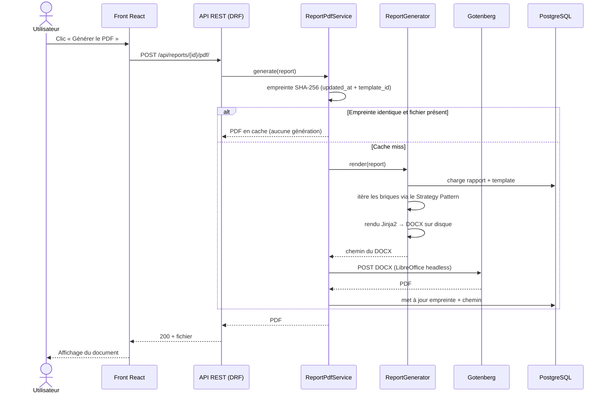
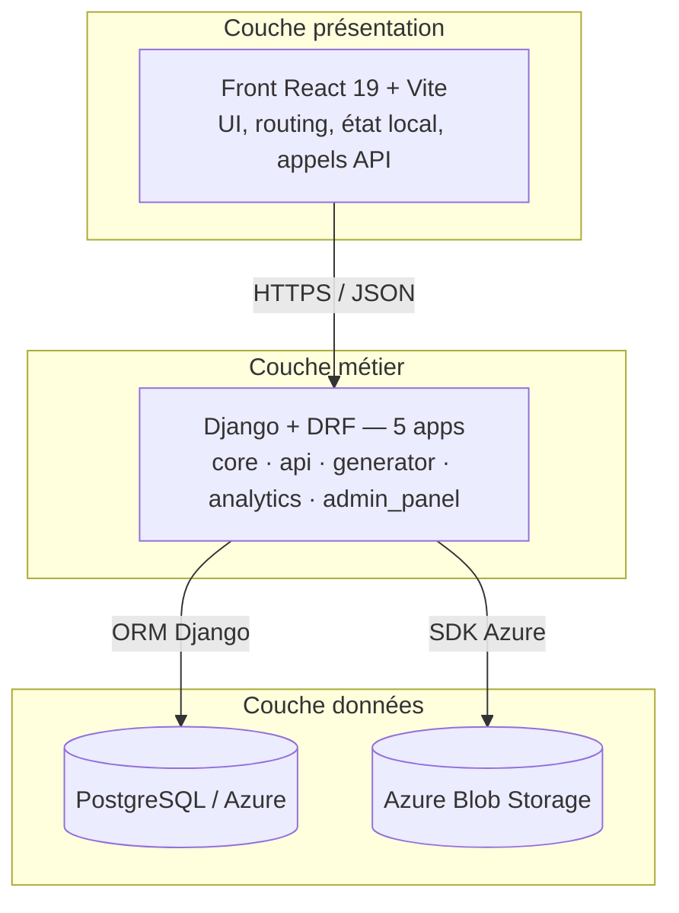
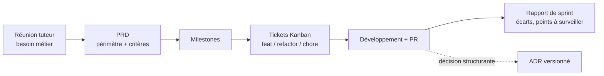

# Conception, UML et modélisation

*Fiche transversale 1/6 — ce que le jury attend sur la partie « Concevoir » du référentiel CDA (AT1).*
{: .meta }

## 0. Vocabulaire à connaître avant de lire

UML (Unified Modeling Language)
:   Langage de **modélisation** graphique, pas un langage de programmation ni une méthode. 14 types de diagrammes en UML 2.x, dont 7 structurels (classes, composants, déploiement…) et 7 comportementaux (cas d'utilisation, séquence, activité…). Norme ISO/IEC 19505.

Merise
:   Méthode d'analyse **française**, orientée bases de données, organisée en trois niveaux d'abstraction : conceptuel (MCD), logique (MLD), physique (MPD). Vient avec le formalisme entité-association. Complémentaire d'UML, pas concurrent.

MCD / MLD / MPD
:   Modèle Conceptuel de Données (entités, associations, cardinalités — indépendant de toute techno) → Modèle Logique de Données (tables, clés primaires et étrangères — encore indépendant du SGBD) → Modèle Physique de Données (types SQL réels, index, contraintes — spécifique PostgreSQL, MySQL…).

Cardinalité
:   Nombre minimum et maximum d'occurrences d'une entité participant à une association. En Merise on la lit **du côté de l'entité** (0,n / 1,1) ; en UML on note la multiplicité **du côté opposé** (0..\*, 1). C'est la principale source de confusion entre les deux notations.

Association / Agrégation / Composition
:   Trois forces de lien en UML. Association = simple lien. Agrégation (losange blanc) = « fait partie de », mais les parties survivent au tout. Composition (losange noir) = cycle de vie lié, si le tout disparaît les parties disparaissent.

Acteur
:   Rôle joué par une entité **externe** au système dans un diagramme de cas d'utilisation. Un acteur n'est pas une personne : une même personne peut endosser plusieurs rôles, et un système tiers (une API, un ordonnanceur) est un acteur.

&lt;&lt;include&gt;&gt; / &lt;&lt;extend&gt;&gt;
:   Deux relations entre cas d'utilisation. `include` = le cas inclus est **obligatoire** et toujours exécuté (flèche vers le cas inclus). `extend` = comportement **optionnel** qui vient s'ajouter dans certaines conditions (flèche vers le cas de base). Le sens des flèches est inversé entre les deux : c'est une question classique de jury.

Ligne de vie / message
:   Dans un diagramme de séquence, une ligne de vie est la représentation temporelle d'un participant (acteur, objet, service). Un message synchrone (flèche pleine) bloque l'appelant jusqu'à la réponse ; un message asynchrone (flèche ouverte) ne bloque pas.

Nœud / artefact
:   Dans un diagramme de déploiement, un **nœud** est une ressource d'exécution (serveur, service cloud, `<<device>>` ou `<<execution environment>>`) et un **artefact** est un livrable physique déployé dessus (un binaire, une image Docker, un `.war`).

PRD (Product Requirements Document)
:   Document qui fixe le **périmètre fonctionnel** d'une fonctionnalité avant développement : problème, utilisateurs, comportement attendu, critères d'acceptation, hors-scope. Il répond au « quoi » et au « pourquoi », jamais au « comment ».

ADR (Architecture Decision Record)
:   Note courte et **versionnée dans le dépôt** qui trace une décision d'architecture : contexte, décision, conséquences, alternatives écartées. Immuable une fois acceptée : on ne modifie pas un ADR, on en écrit un nouveau qui le remplace (statut `superseded`).

---

## 1. TL;DR

La conception, c'est **produire les documents qui rendent une décision explicable six mois plus tard**. Le référentiel CDA attend trois familles de livrables :

1. **Les besoins** — cas d'utilisation, maquettes, PRD. Ce que le système doit faire, du point de vue de celui qui l'utilise.
2. **La structure** — diagramme de classes, MCD/MLD/MPD, architecture applicative (N-tiers). Comment le système est organisé.
3. **Le comportement et le déploiement** — diagramme de séquence, diagramme de déploiement. Ce qui se passe à l'exécution et où ça tourne.

Sur mes projets, tous ces livrables vivent **dans le dépôt Git**, dans `docs/`, découpé en quatre répertoires (généraux, PRDs, architecture, rapports). Le principe est simple : la documentation suit le code, elle est revue dans la même Pull Request, donc elle ne dérive pas.

!!! jury "Le fil rouge à tenir"
    Chaque diagramme répond à **une** question. Cas d'utilisation : *qui fait quoi ?* Classes : *quelles données et quels comportements ?* Séquence : *dans quel ordre, entre qui et qui ?* Déploiement : *où est-ce que ça tourne ?* Si on ne sait pas dire quelle question un diagramme résout, c'est qu'il ne sert à rien.

---

## 2. Les diagrammes UML que j'ai produits

### 2.1 Diagramme de cas d'utilisation

Il délimite le **périmètre du système** : à l'intérieur du cadre, ce que le système fait ; à l'extérieur, les acteurs.

Sur Boost-Report, trois acteurs :

| Acteur | Définition | Cas propres |
|---|---|---|
| **Utilisateur** | Collaborateur Sixense authentifié via le SSO | Créer/éditer un rapport, gérer les annexes photo, générer Word/PDF |
| **Relecteur** | Utilisateur *assigné à un rapport donné* — hérite de tous les cas de l'Utilisateur (généralisation) | Commenter une section, clôturer un commentaire |
| **Administrateur** | Gère le back-office | Gérer droits, agences, templates ; consulter les analytics |

La relation `<<extend>>` entre « Annoter une photo » et « Gérer les photos » traduit que l'annotation est **optionnelle** lors de la gestion des photos.

!!! piege "Piège classique"
    La flèche de généralisation entre acteurs pointe **vers l'acteur le plus général**. Relecteur → Utilisateur signifie « un relecteur est aussi un utilisateur », donc il hérite de ses cas. Beaucoup l'inversent.

### 2.2 Diagramme de classes

Il décrit les **entités du domaine métier**, leurs attributs, leurs opérations et leurs relations — pas les tables SQL, pas les composants React.

Sur Boost-Report, deux ensembles autour de deux racines :

- `Report` — rattaché à un `ReportTemplate` (le fichier Word de mise en forme, sa version, son statut actif). Le rapport porte sa référence, son indice de révision, son statut, et un champ JSON pour le contenu saisi. Il expose quatre opérations sur ses blocs : **ajouter, mettre à jour, supprimer, réordonner**.
- `PhotoAppendix` — regroupe des `PhotoItem` **ordonnés**. Chaque photo porte son URL source, sa légende, sa rotation et d'éventuelles annotations JSON.

`Agency` sert de **pivot de visibilité** : c'est elle qui détermine ce que chaque utilisateur voit. `UserProfile` étend `User` avec le niveau de visibilité, et `UserAgency` est la table de liaison permettant d'affecter un collaborateur à **plusieurs** agences (donc une relation n-n).

!!! note "Pourquoi une table de liaison ?"
    Une relation **many-to-many** ne peut pas s'exprimer avec une simple clé étrangère : il faut une troisième table qui porte les deux clés. C'est exactement ce que fait `UserAgency`. En Django, `ManyToManyField` la crée implicitement, mais on la déclare explicitement dès qu'on veut y ajouter des attributs (date d'affectation, rôle dans l'agence…).

### 2.3 Diagramme de séquence

Il détaille **un seul cas d'utilisation** dans le temps. Sur Boost-Report, j'ai modélisé « Générer un rapport (Word/PDF) », le flux le plus complet :



Deux points à savoir défendre :

- **Le traitement est synchrone.** L'utilisateur attend pendant toute la génération. C'est assumé pour les volumes actuels ; une évolution vers une file de tâches (Celery + Redis) est identifiée pour les rapports volumineux.
- **Un throttle limite à 10 requêtes/minute/utilisateur.** La génération est coûteuse, on protège le service.

### 2.4 Diagramme de déploiement

Il répond à une question que l'architecture applicative ne traite pas : **où est-ce que ça s'exécute ?**

La notation distingue trois niveaux :

- les nœuds `<<device>>` : un par service Azure hébergeant ;
- l'`<<execution environment>>` : Docker Compose à l'intérieur de la Web App ;
- les **artefacts** : les conteneurs tels que déployés.

Chaque lien de communication porte son **protocole et son port** : HTTPS côté utilisateur, HTTP interne entre conteneurs, TCP/SSL vers la base. La liaison en pointillés vers Azure Container Registry note une **dépendance de déploiement** (la Web App tire ses images à chaque redéploiement), pas un flux d'exécution.

!!! jury "Différence architecture applicative / diagramme de déploiement"
    L'architecture applicative (N-tiers) montre les **couches logiques** et leurs responsabilités. Le diagramme de déploiement montre l'**infrastructure physique**. Le même diagramme N-tiers pourrait être déployé de dix façons différentes ; le diagramme de déploiement dit laquelle a été retenue.

---

## 3. Merise : MCD, MLD, MPD

Le référentiel CDA attend explicitement le **schéma de données** et le **script de création de la base**. Merise reste la façon la plus lisible de le présenter.

### 3.1 Les trois niveaux

| Niveau | Contenu | Indépendant de… | Exemple |
|---|---|---|---|
| **MCD** | Entités, propriétés, associations, cardinalités | tout choix technique | `RAPPORT` —(0,n)— *appartient à* —(1,1)— `AGENCE` |
| **MLD** | Tables, clés primaires, clés étrangères | du SGBD | `RAPPORT(id, titre, #agence_id)` |
| **MPD** | Types SQL réels, index, contraintes, `ON DELETE` | rien — c'est du PostgreSQL | `agency_id integer NOT NULL REFERENCES core_agency(id) ON DELETE PROTECT` |

### 3.2 Les règles de passage MCD → MLD

Il faut savoir les réciter, c'est du par-cœur qui tombe souvent :

- Association **1,1 ↔ 0,n ou 1,n** : la clé étrangère descend **du côté 1,1**. Un rapport appartient à une seule agence → `agence_id` est dans la table `rapport`.
- Association **n,n** : elle devient une **table à part entière** portant les deux clés étrangères, qui forment ensemble la clé primaire.
- Association **porteuse de données** : elle devient une table même si les cardinalités permettraient de l'éviter.
- Association **1,1 ↔ 1,1** : les deux entités fusionnent, ou la clé étrangère va du côté le plus contraint.

### 3.3 Les formes normales

Trois à connaître :

1. **1NF** — chaque attribut est atomique. Pas de « liste de légendes séparées par des virgules » dans une colonne.
2. **2NF** — 1NF + tout attribut non-clé dépend de la clé **entière** (ne concerne que les clés composites).
3. **3NF** — 2NF + aucun attribut non-clé ne dépend d'un autre attribut non-clé (pas de dépendance transitive). Si `rapport` stockait `agence_id` **et** `agence_ville`, on violerait la 3NF : la ville dépend de l'agence, pas du rapport.

!!! piege "La dénormalisation assumée"
    Boost-Report stocke le contenu des rapports dans un **champ JSON** (`data`), ce qui n'est pas normalisé au sens strict. C'est un choix : le contenu est un arbre de blocs hétérogènes, lu et écrit en bloc, jamais requêté champ par champ. Vouloir le normaliser produirait une dizaine de tables pour aucun gain. Savoir défendre une dénormalisation vaut mieux que réciter les formes normales.

---

## 4. Architecture applicative : la vue N-tiers

Boost-Report suit une architecture **N-tiers en trois couches** :



Les règles qui font que c'est vraiment du N-tiers, et pas juste trois boîtes :

- **La présentation ne contient aucune logique métier** et ne parle **jamais** directement à la base.
- **La couche métier est la seule à accéder aux données**, systématiquement via l'ORM — aucun SQL écrit à la main.
- Chaque couche ne connaît que **celle immédiatement en dessous**.

Les cinq applications Django ont des responsabilités disjointes :

| App | Responsabilité |
|---|---|
| `core` | Domaine, modèles, logique d'accès, authentification, permissions |
| `api` | Couche de présentation serveur : endpoints REST, sérialisation |
| `generator` | Moteurs de génération de documents (Word et PDF) |
| `analytics` | Collecte et agrégation des données d'usage |
| `admin_panel` | Fonctions d'administration et journal d'audit |

---

## 5. Documenter les décisions : PRD et ADR

### 5.1 Le cycle documentaire réel



Le tuteur crée les **issues métier dans GitLab** (fonctionnalité vue de l'utilisateur, sans détail technique). Je les reprends en **tâches techniques dans GitHub Projects** avec une convention de nommage `feat` / `refactor` / `chore`. Cette organisation à deux niveaux sépare les responsabilités : le tuteur garde la vision métier, je garde la liberté d'organiser le découpage technique.

### 5.2 Structure d'un ADR

```markdown
# ADR-005 — Architecture frontend feature-based

## Statut
Accepté — 2026-01-xx

## Contexte
La structure à plat (tous les composants dans `components/`) devient
difficile à maintenir : 40+ fichiers sans regroupement, imports croisés,
impossible d'ajouter une feature sans lire tout le dossier.

## Décision
Réorganiser le front en `features/<domaine>/` — chaque feature porte ses
composants, hooks, appels API et types. Pas d'import direct entre features :
uniquement via un point d'entrée `index.ts` explicite.

## Conséquences
+ Une feature s'ajoute ou se retire sans toucher aux autres.
+ Le périmètre d'un changement est visible dans le diff.
− Coût de migration ponctuel, quelques duplications assumées.

## Alternatives écartées
- Découpage par type technique (`hooks/`, `api/`, `components/`) : le
  problème d'origine, on l'aurait juste déplacé d'un cran.
- Monorepo multi-packages : sur-ingénierie pour un front de cette taille.
```

!!! jury "Pourquoi un ADR plutôt qu'un commentaire de commit ?"
    Parce qu'un ADR documente ce qui **n'est pas dans le code** : les alternatives écartées et leurs raisons. Le code montre ce qu'on a fait, l'ADR montre ce qu'on a décidé de ne pas faire — c'est ça qu'on oublie en six mois. Il sert aussi à anticiper les risques : forcer à écrire les conséquences fait remonter les problèmes avant l'implémentation, pas après.

---

## 6. Maquettage et design

- **Figma** pour les maquettes d'interface, réalisées en amont et affinées au fil des sprints.
- **Draw.io** pour les schémas UML et diagrammes d'architecture.
- Un **design system** léger (shadcn/ui sur Radix + Tailwind) plutôt qu'une grosse librairie de composants imposée : les primitives Radix apportent l'accessibilité (navigation clavier, ARIA, focus trap), Tailwind laisse la main sur le rendu.

!!! note "Wireframe / maquette / prototype"
    **Wireframe** = structure en fil de fer, pas de couleur, on valide l'agencement. **Maquette** = rendu fidèle statique, on valide le visuel. **Prototype** = maquette cliquable, on valide le parcours. Les trois répondent à des questions différentes et se font dans cet ordre.

---

## 7. Questions probables du jury

### Q1. Pourquoi UML *et* Merise, c'est redondant non ?

Non, ils ne couvrent pas la même chose. Merise est centré **données** et va jusqu'au physique : le MPD me donne directement les types SQL, les index et les stratégies de suppression. UML couvre tout le reste — le comportement (séquence), les acteurs (cas d'utilisation), l'infrastructure (déploiement). Le diagramme de classes UML et le MCD se recouvrent partiellement, mais le diagramme de classes porte en plus les **opérations** (`add_brick`, `reorder_bricks`), que le MCD ignore.

### Q2. Comment vous êtes-vous assuré que les diagrammes correspondent au code livré ?

Ils vivent dans `docs/` **dans le dépôt**, donc ils passent dans la même Pull Request que le code. Cela dit, je ne prétends pas qu'ils sont synchronisés au commit près : les diagrammes du dossier documentent l'état de l'application en production au moment de la rédaction, et je le précise. Pour la partie données, la vérification est structurelle : le schéma réel est produit par les **migrations Django** générées depuis les modèles, donc le MPD est reconstitué à partir de la source de vérité, pas écrit à la main en parallèle.

### Q3. Différence entre agrégation et composition ?

L'agrégation (losange **blanc**) exprime un « fait partie de » sans dépendance de cycle de vie : les parties existent indépendamment du tout. La composition (losange **noir**) lie les cycles de vie : détruire le tout détruit les parties. Concrètement dans mon modèle, `PhotoAppendix` → `PhotoItem` est une **composition** : supprimer une annexe supprime ses photos, ce qui se traduit en base par un `ON DELETE CASCADE`. À l'inverse `Report` → `ReportTemplate` est une simple **association** : supprimer un rapport ne doit pas toucher au template, et le template est protégé en suppression (`PROTECT`) parce que d'autres rapports en dépendent.

### Q4. Votre diagramme de séquence montre du synchrone. C'est un problème ?

C'est un choix documenté, pas un oubli. Les rapports actuels se génèrent en quelques secondes, un traitement asynchrone imposerait une file (Celery), un broker (Redis), un système de polling ou de WebSocket côté front et une gestion d'état de tâche — pour un gain nul sur les volumes réels. J'ai en revanche mis un **throttle à 10 req/min/utilisateur** pour éviter qu'un usage abusif sature les workers Gunicorn, et l'évolution asynchrone est identifiée dans les perspectives. Le déclencheur serait des rapports assez volumineux pour approcher le timeout de la Web App.

### Q5. Un PRD, ce n'est pas juste un cahier des charges ?

C'est plus resserré. Un cahier des charges couvre un projet entier et est souvent contractuel. Un PRD couvre **une fonctionnalité** et vit à l'échelle d'un sprint : le problème, qui est concerné, le comportement attendu, les critères d'acceptation, et surtout un **hors-scope explicite**. C'est cette dernière partie qui a le plus de valeur en pratique : elle protège le périmètre du sprint quand un besoin annexe remonte en cours de route.

### Q6. Comment avez-vous choisi les acteurs de votre diagramme de cas d'utilisation ?

En partant des **rôles**, pas des personnes. Chez Sixense la même personne est souvent à la fois rédactrice d'un rapport et relectrice d'un autre — ce sont deux rôles, pas deux personnes. J'ai retenu Utilisateur, Relecteur (spécialisation de l'Utilisateur, assignée au niveau d'un rapport donné) et Administrateur. Le SSO du hub n'est pas modélisé comme acteur parce qu'il n'initie aucun cas d'utilisation : il est sollicité par le système, il ne le sollicite pas.

### Q7. Vos treize tables, c'est peu pour une application en production ?

C'est proportionné au domaine. Le contenu des rapports est stocké en **JSON** plutôt qu'éclaté en tables : un rapport est un arbre de blocs hétérogènes, toujours lu et écrit intégralement, jamais requêté bloc par bloc. Le normaliser produirait une dizaine de tables et des jointures coûteuses pour aucun besoin réel. Ce que j'ai en revanche normalisé, c'est tout ce qui est **requêté ou filtré** : agences, profils de visibilité, affectations, commentaires, templates. La règle que j'applique : on normalise ce qu'on interroge, on sérialise ce qu'on transporte.

### Q8. Qu'est-ce qui vous a manqué en conception ?

La modélisation du **workflow de rédaction**. J'ai des statuts sur les rapports et des rôles éditeur/relecteur, mais je n'ai pas produit de diagramme d'états-transitions, et ça se sent : les règles de transition sont réparties entre les permissions et les vues plutôt que centralisées. Si je devais reprendre, je modéliserais explicitement la machine à états (brouillon → en relecture → validé → figé) avant de coder les permissions, plutôt que l'inverse.
