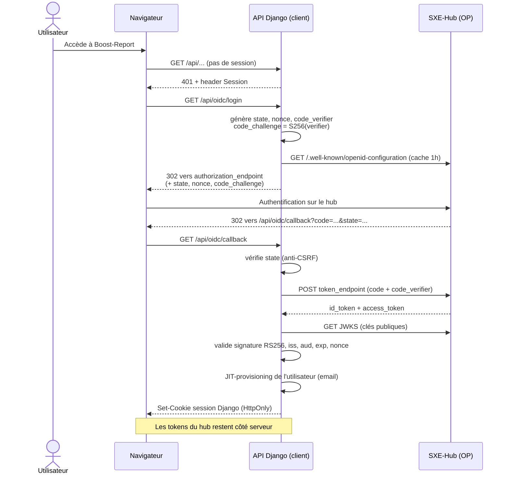

# Sécurité, authentification et RGPD

*Fiche transversale 3/6 — OWASP, OAuth2/OIDC, durcissement, données personnelles. La fiche la plus dense du lot : c'est aussi celle où le jury creuse le plus.*
{: .meta }

## 0. Vocabulaire à connaître avant de lire

Authentification / autorisation
:   **Authentification** = prouver qui on est (login). **Autorisation** = déterminer ce qu'on a le droit de faire (permissions). Deux mécanismes distincts : on peut être parfaitement authentifié et n'avoir droit à rien.

OAuth 2.0
:   Protocole d'**autorisation déléguée**. Il permet à une application d'obtenir un accès limité à une ressource au nom d'un utilisateur. Il ne dit **rien** de l'identité de l'utilisateur — c'est l'erreur la plus fréquente à l'oral.

OpenID Connect (OIDC)
:   Couche d'**identité** posée au-dessus d'OAuth 2.0. Elle ajoute l'`id_token` (un JWT décrivant l'utilisateur), l'endpoint `userinfo` et le document de découverte `/.well-known/openid-configuration`. OAuth répond « as-tu le droit ? », OIDC répond « qui es-tu ? ».

JWT (JSON Web Token)
:   Jeton en trois parties séparées par des points : `header.payload.signature`, encodées en base64url. **Signé, pas chiffré** — n'importe qui peut lire le payload. On n'y met jamais de secret.

Claim
:   Une assertion contenue dans le payload d'un JWT. Standards : `iss` (émetteur), `sub` (sujet/identifiant utilisateur), `aud` (destinataire), `exp` (expiration), `iat` (émission), `nonce`.

PKCE (Proof Key for Code Exchange)
:   Extension d'OAuth 2.0 contre l'interception du code d'autorisation. Le client tire un `code_verifier` aléatoire, en envoie le hash SHA-256 (`code_challenge`) à l'autorisation, puis présente le verifier à l'échange. Un attaquant qui vole le code ne peut pas l'échanger sans le verifier. Prononcé « pixy ».

JWKS (JSON Web Key Set)
:   Ensemble de clés **publiques** exposé par le fournisseur d'identité à une URL connue, permettant de vérifier la signature des tokens sans partager de secret. C'est ce qui rend RS256 supérieur à HS256 entre deux organisations.

RS256 / HS256
:   **HS256** = signature symétrique HMAC : le même secret signe et vérifie, donc les deux parties peuvent forger des tokens. **RS256** = signature asymétrique RSA : la clé privée signe, la clé publique (JWKS) vérifie seulement.

CSRF (Cross-Site Request Forgery)
:   Un site malveillant fait exécuter au navigateur de la victime une requête authentifiée vers un autre site, en s'appuyant sur l'envoi automatique des cookies. Parade : un jeton anti-CSRF imprévisible, et/ou `SameSite` sur le cookie.

XSS (Cross-Site Scripting)
:   Injection de JavaScript dans une page consultée par d'autres utilisateurs. Trois variantes : stockée (persistée en base), réfléchie (dans l'URL), DOM-based (côté client). Parade : échappement à l'affichage + Content Security Policy.

CORS (Cross-Origin Resource Sharing)
:   Mécanisme par lequel un serveur **autorise** un navigateur à laisser une page d'une autre origine lire sa réponse. C'est une protection **du navigateur** : CORS ne protège pas un serveur, il assouplit une restriction côté client.

Moindre privilège
:   Chaque composant ne dispose que des droits strictement nécessaires. Conteneurs non-root, tokens à portée limitée, comptes de service dédiés.

Rayon de souffle (blast radius)
:   Étendue des dégâts si un composant donné est compromis. On conçoit pour le minimiser : c'est la raison d'être des allowlists de scope.

---

## 1. TL;DR

La sécurité de Boost-Report se lit sur **quatre niveaux**, du plus bas au plus haut :

1. **Infrastructure** — conteneurs non-root, réseaux Docker isolés, un seul service exposé (Nginx), connexion base chiffrée en TLS (`sslmode=require`), secrets injectés par les paramètres Azure et jamais écrits dans les fichiers de configuration.
2. **Authentification** — SSO OpenID Connect délégué à SXE-Hub. Code flow + PKCE, `id_token` validé en RS256 via le JWKS du hub. **Les tokens du hub ne transitent jamais par le navigateur** : le modèle est un BFF, la session applicative est un cookie Django first-party.
3. **Autorisation** — visibilité à plusieurs niveaux (personnel / agence / global / admin), verrouillage des mutations au rédacteur actif, allowlist stricte pour les tokens de service, journal d'audit avec état avant/après.
4. **Applicatif** — CSRF actif sur tous les appels API, CORS restreint aux domaines autorisés, validation systématique des entrées (Pydantic + sérialiseurs DRF), vérification du **type réel** des fichiers uploadés via libmagic.

!!! jury "L'argument le plus fort du dossier"
    « L'application ne gère aucun mot de passe. » L'authentification est entièrement déléguée au fournisseur d'identité. Le meilleur moyen de ne pas fuiter des identifiants est de ne pas en stocker.

---

## 2. OAuth 2.0 et OpenID Connect

### 2.1 Les acteurs

| Rôle OAuth/OIDC | Chez moi |
|---|---|
| **Resource Owner** | Le collaborateur Sixense |
| **Client (Relying Party)** | Boost-Report (l'API Django) |
| **Authorization Server / OP** | SXE-Hub (Better-Auth + provider OIDC) |
| **Resource Server** | L'API Django elle-même |
| **User-Agent** | Le navigateur |

### 2.2 Le flow complet, tel qu'implémenté



Le code correspondant :

```python
# core/oidc.py
SCOPE = "openid profile email"   # scope minimal : identité, nom, email

def build_authorization_url(*, state: str, nonce: str, code_challenge: str) -> str:
    """URL authorization_endpoint du hub pour démarrer le code flow + PKCE."""
    cfg = get_discovery()
    params = {
        "response_type": "code",
        "client_id": settings.OIDC_CLIENT_ID,
        "redirect_uri": settings.OIDC_REDIRECT_URI,
        "scope": SCOPE,
        "state": state,
        "nonce": nonce,
        "code_challenge": code_challenge,
        "code_challenge_method": "S256",
    }
    return f"{cfg['authorization_endpoint']}?{urlencode(params)}"
```

Le client OIDC a été **écrit en Python sans librairie tierce**, pour garder la maîtrise du flux et savoir exactement ce qui est validé.

### 2.3 Les trois paramètres anti-attaque à ne pas confondre

C'est la question de jury la plus discriminante sur OIDC.

| Paramètre | Contre quoi | Comment |
|---|---|---|
| **`state`** | CSRF sur le callback | Valeur aléatoire stockée en session avant la redirection, comparée au retour. Un callback forgé n'a pas le bon `state`. |
| **`nonce`** | Rejeu de l'`id_token` | Valeur aléatoire envoyée à l'autorisation, que l'OP **réinjecte comme claim** dans l'`id_token`. On vérifie qu'elle correspond : un token capturé ailleurs ne passera pas. |
| **`code_verifier`** (PKCE) | Interception du code d'autorisation | Seul le client qui a produit le `code_challenge` peut échanger le code. |

!!! piege "Le piège du scope"
    `scope` **n'est pas** une protection : c'est une demande de périmètre. Demander `openid profile email` et rien de plus relève du moindre privilège, pas de l'anti-attaque. Confondre les deux est une erreur classique.

### 2.4 Ce qui est validé dans l'`id_token`

Cinq contrôles, tous nécessaires :

1. **Signature** — RS256 vérifiée contre le JWKS du hub (`PyJWKClient`). Sans ça, tout le reste est décoratif.
2. **`iss`** — l'émetteur est bien le hub attendu.
3. **`aud`** — le token m'était destiné à moi et pas à une autre application de la suite.
4. **`exp`** — le token n'est pas expiré.
5. **`nonce`** — il correspond à celui envoyé à l'autorisation.

!!! attention "L'attaque `alg: none`"
    Une vulnérabilité historique des bibliothèques JWT : accepter un token dont le header annonce `alg: none`, donc non signé. La parade est de **fixer l'algorithme attendu côté vérification** (`algorithms=["RS256"]`) au lieu de faire confiance au header du token. Même famille de faille : accepter HS256 alors qu'on attend RS256, ce qui permet de signer un token avec la clé **publique** de l'émetteur.

### 2.5 Pourquoi le modèle BFF plutôt qu'un token dans le navigateur

Beaucoup de SPA stockent l'`access_token` en `localStorage`. J'ai fait l'inverse :

| | Token en `localStorage` | Session cookie (mon choix) |
|---|---|---|
| Vol par XSS | Trivial — accessible en JavaScript | Impossible si `HttpOnly` |
| CSRF | Non concerné | À traiter (jeton CSRF + `SameSite`) |
| Révocation | Difficile avant expiration | Immédiate côté serveur |
| Surface d'exposition | Le token vit chez le client | Les tokens du hub restent en back |

Le compromis assumé : je réintroduis le risque CSRF, que je traite avec le CSRF natif de Django. `OIDCSessionAuthentication` hérite de `SessionAuthentication`, **donc l'enforcement CSRF s'applique sur toutes les méthodes non sûres**.

---

## 3. Le pont de service machine-to-machine

Le hub peut créer des annexes photo directement dans Boost-Report. Ce n'est pas un utilisateur qui appelle, c'est un serveur : il faut un mécanisme distinct.

```python
# core/authentication.py
SERVICE_TOKEN_ALGORITHM = "HS256"
SERVICE_TOKEN_ISSUER = "hub"
SERVICE_TOKEN_AUDIENCE = "boost-report"
SERVICE_TOKEN_SCOPE = "boost-report:annexes"
_SERVICE_TOKEN_LEEWAY = 10   # tolérance d'horloge ; TTL côté hub ~120 s
```

Le hub signe un JWT court en HS256 avec un secret partagé, qui impersonne un utilisateur **par email**. Et surtout, ce token est **borné par une allowlist stricte** :

```python
# core/permissions.py
class ServiceTokenScopePermission(BasePermission):
    """Borne le périmètre d'un token de service.

    Objectif : si le secret du pont fuit, le rayon de souffle se limite
    à « créer / lire des annexes ».
    """

    _VIEWSET_ALLOWLIST = {
        "photo-appendix": {"list", "retrieve", "create"},
        "agency": {"list", "retrieve"},
    }
    _FUNCTION_VIEW_ALLOWLIST = {"me"}

    def has_permission(self, request, view):
        if not getattr(request.user, "is_service_token", False):
            return True   # no-op pour une session utilisateur classique
        basename = getattr(view, "basename", None)
        if basename in self._VIEWSET_ALLOWLIST:
            return getattr(view, "action", None) in self._VIEWSET_ALLOWLIST[basename]
        ...
        return False   # refus par défaut
```

Quatre décisions de sécurité dans ce court extrait :

- **Refus par défaut** : tout ce qui n'est pas explicitement listé est refusé. Une nouvelle route est fermée au token de service sans qu'on ait à y penser.
- **TTL très court** (~120 s) : la fenêtre d'exploitation d'un token volé est minuscule.
- **HS256 acceptable ici** car les deux côtés sont sous mon contrôle et le secret ne quitte pas l'infrastructure — contrairement au flow utilisateur, où RS256 s'impose.
- **Tolérance d'horloge explicite** de 10 s : sans ça, une dérive NTP entre deux serveurs produit des rejets aléatoires. C'est un compromis sécurité/robustesse, pas un oubli.

!!! jury "Pourquoi HS256 ici et RS256 là ?"
    Le critère est : **qui doit pouvoir forger un token ?** En HS256, les deux parties partagent le secret, donc les deux peuvent forger — acceptable entre deux de mes services. Pour le flow utilisateur, Boost-Report ne doit **pas** pouvoir forger d'identité : il vérifie avec la clé publique du hub sans jamais détenir la clé privée. RS256 est obligatoire dès que les deux côtés n'ont pas le même niveau de confiance.

---

## 4. Le modèle d'autorisation

### 4.1 Les niveaux de visibilité

```python
# core/access.py
def filter_visible_queryset(user, qs):
    """
    - anonyme          → queryset vide
    - admin applicatif → tout
    - visibility == 3  → tout
    - visibility == 2  → ressources liées aux agences de l'utilisateur
    - autre            → ressources créées par l'utilisateur
    """
```

À quoi s'ajoute une clause de **visibilité directe** propre au modèle : un utilisateur voit toujours les rapports dont il est `editor` ou `reviewer`, quelle que soit son agence, et les annexes partagées avec lui.

!!! jury "Le point d'architecture à souligner"
    Cette fonction est la **source unique** de la règle de visibilité. Elle est consommée à la fois par le `VisibilityFilterMixin` des ViewSets DRF **et** par la `MediaAccessPolicy` qui garde les fichiers média. Sans ça, on aurait le grand classique : une liste correctement filtrée, mais des fichiers accessibles à quiconque devine l'URL. Une règle d'autorisation dupliquée finit toujours par diverger.

### 4.2 La séparation filtrage / permission

Deux mécanismes complémentaires, souvent confondus :

- **Le filtrage de queryset** décide ce qu'on **voit** (une ressource invisible produit un 404, pas un 403 — on ne révèle pas son existence).
- **Les classes de permission** décident ce qu'on peut **faire** : `CanEditReport` verrouille les mutations au rédacteur actif via `ReportPermissionPolicy.can_edit`, tout en laissant les méthodes sûres passer.

### 4.3 Traçabilité

Chaque action d'administration est écrite dans un **journal d'audit conservant l'état avant et après** modification. C'est ce qui permet de répondre à « qui a changé les droits de cet utilisateur, et vers quoi ? ».

---

## 5. OWASP Top 10 (2021) appliqué au projet

| # | Catégorie | Traitement dans Boost-Report |
|---|---|---|
| **A01** | Broken Access Control | Source unique de visibilité (`filter_visible_queryset`), `MediaAccessPolicy` sur les fichiers, allowlist de scope pour les tokens de service, refus par défaut |
| **A02** | Cryptographic Failures | TLS bout en bout : HTTPS côté utilisateur, `sslmode=require` vers PostgreSQL. Aucun mot de passe stocké |
| **A03** | Injection | ORM Django exclusivement, **aucun SQL écrit à la main**. Requêtes paramétrées par construction. Échappement React à l'affichage contre le XSS |
| **A04** | Insecure Design | ADR pour tracer les décisions, PRD pour cadrer, revue de sécurité avec le directeur technique de Sixense Digital |
| **A05** | Security Misconfiguration | `DEBUG=False` en prod, images de prod sans outils de build, conteneurs non-root, réseaux Docker isolés, un seul service exposé |
| **A06** | Vulnerable Components | Alertes de dépendances GitHub, mises à jour appliquées au fil de l'eau, CI qui vérifie l'absence de régression à chaque montée de version |
| **A07** | Identification & Auth Failures | SSO OIDC délégué, PKCE, validation complète de l'`id_token`, session `HttpOnly`, TTL court sur les tokens de service |
| **A08** | Software & Data Integrity | Images taguées par **SHA de commit**, registre privé, images tierces (Gotenberg, WeasyPrint) mirrorées dans l'ACR pour figer la version |
| **A09** | Logging & Monitoring Failures | Logging Python standard sur tout le code, journal d'audit admin, logs capturés par stdout des conteneurs et consultables depuis Azure. **Limite assumée** : centralisation et alerting Azure Monitor pas encore en place |
| **A10** | SSRF | Surface réduite : les seuls appels sortants sont vers le hub (issuer en configuration, pas en entrée utilisateur) et vers les services PDF internes |

!!! attention "Savoir citer ses limites"
    A09 est le point faible et il faut le dire avant que le jury ne le trouve : les logs existent et sont structurés, mais ils ne sont pas centralisés et il n'y a pas d'alerting. C'est identifié dans les prochaines étapes. Un candidat qui présente une sécurité sans faille est moins crédible qu'un candidat qui sait exactement où sont les siennes.

---

## 6. La sécurité des uploads

C'est le point que la veille sécurité a fait renforcer, et un excellent sujet de question.

La chaîne de contrôle sur une photo importée :

1. **Compression côté navigateur** avant envoi (limite le temps de transfert).
2. **Vérification du type réel côté serveur via libmagic** — on lit les *magic bytes* du fichier, pas son extension. Un exécutable renommé en `.jpg` est bloqué.
3. **Ré-encodage** en JPEG avec réduction de résolution et compression. Ça neutralise au passage la plupart des charges utiles cachées dans les métadonnées ou les segments non standard.
4. **Contrôle par hash MD5** pour éviter de stocker deux fois la même photo.
5. **Servi via une politique d'accès** (`MediaAccessPolicy`), jamais en accès direct au bucket.

!!! piege "MD5 ici n'est pas un choix de sécurité"
    MD5 est cryptographiquement cassé et ne doit jamais servir à un mot de passe ou une signature. Ici il sert de **clé de déduplication**, un usage où seule la vitesse compte et où une collision provoquerait au pire une photo dédupliquée à tort. Il faut savoir faire cette distinction : le jury peut tendre le piège. Pour l'empreinte de cache des PDF, c'est **SHA-256** qui est utilisé.

---

## 7. RGPD

### 7.1 Ce que l'application stocke

Un périmètre volontairement minimal : **email, nom, agence de rattachement** — provisionnés automatiquement depuis le hub à la connexion (JIT-provisioning). Rien d'autre.

- Les photos hébergées sont des clichés d'**ouvrages et d'équipements**, pas des données à caractère personnel.
- **Aucun mot de passe** n'est géré : l'authentification est déléguée au fournisseur d'identité.

### 7.2 Les principes à savoir citer

| Principe RGPD | Application concrète |
|---|---|
| **Minimisation** | Trois champs utilisateur, pas un de plus |
| **Limitation des finalités** | Les données servent à l'authentification et au filtrage de visibilité, à rien d'autre |
| **Exactitude** | Le hub est la source de vérité ; les données sont re-provisionnées à chaque connexion |
| **Intégrité et confidentialité** | TLS en transit, accès restreint par rôle, journal d'audit |
| **Responsabilité (accountability)** | Décisions tracées en ADR, revue de sécurité avec Sixense Digital |

!!! note "Traitement interne ≠ hors RGPD"
    Une application interne d'entreprise reste soumise au RGPD : les collaborateurs sont des personnes concernées, avec droit d'accès, de rectification et d'opposition. Le fait que l'employeur soit responsable de traitement change la base légale (intérêt légitime / exécution du contrat de travail plutôt que consentement), pas l'applicabilité du règlement.

---

## 8. Veille sécurité

Une pratique quotidienne, avec des sources identifiées :

- Les **annonces de sécurité de Django** et des librairies du projet ;
- Les **alertes de dépendances GitHub** ;
- Le **Top 10 OWASP** comme grille de lecture.

Cette veille a produit un résultat concret et citable : le renforcement des uploads via libmagic. Les principes qu'elle a ancrés dans le projet : **moindre privilège** (conteneurs non-root, permissions par rôle), **validation systématique des entrées** (schémas Pydantic, sérialisation DRF), **refus par défaut** sur l'accès aux fichiers, **chiffrement** des connexions à la base.

La migration vers l'OIDC a d'ailleurs été motivée en partie par la volonté de **ne plus gérer de secrets d'authentification en interne**. La suite identifiée : passage à **Keycloak** — une instance gérée par Sixense Digital — ou à un SSO Microsoft.

!!! jury "L'argument Keycloak"
    « L'enjeu est de rester souverain sur la sécurité tout en la déléguant à un outil spécialisé, plus solide qu'une gestion maison. » Le choix d'une authentification **standard OIDC** dès le départ est ce qui rend cette migration possible sans réécrire le client : on change d'issuer, pas de protocole. C'est le bénéfice direct d'avoir implémenté un standard plutôt qu'une solution propriétaire.

---

## 9. Questions probables du jury

### Q1. Quelle est la différence entre OAuth 2.0 et OpenID Connect ?

OAuth 2.0 est un protocole d'**autorisation déléguée** : il permet à une application d'obtenir un accès limité à une ressource au nom d'un utilisateur. Il ne dit rien de l'identité — l'`access_token` est opaque pour le client, c'est un droit d'accès, pas une carte d'identité. OIDC est une **couche d'identité par-dessus** : il ajoute l'`id_token`, un JWT structuré décrivant l'utilisateur, plus l'endpoint `userinfo` et la découverte automatique. Utiliser OAuth seul pour authentifier est une erreur classique, parce que rien ne garantit que l'`access_token` reçu a été émis pour votre application — c'est la faille dite de *confused deputy*.

### Q2. Pourquoi ne pas stocker le token dans le navigateur, c'est plus simple ?

Parce qu'un token en `localStorage` est lisible par n'importe quel JavaScript s'exécutant sur la page — une seule XSS et il est exfiltré, et je ne peux pas le révoquer avant son expiration. Avec une session cookie `HttpOnly`, le JavaScript ne peut pas y accéder, et je peux invalider la session côté serveur instantanément. J'assume en contrepartie le risque CSRF, que je traite avec le CSRF natif de Django : mon `OIDCSessionAuthentication` hérite de `SessionAuthentication`, donc l'enforcement s'applique automatiquement sur toutes les méthodes non sûres. C'est un compromis, mais celui qui garde le contrôle côté serveur.

### Q3. À quoi sert PKCE si vous avez déjà un `client_secret` ?

PKCE protège contre un scénario que le `client_secret` ne couvre pas : l'**interception du code d'autorisation** pendant la redirection — via un log de proxy, un historique de navigateur, un redirect_uri mal configuré. Sans PKCE, quiconque met la main sur le code peut tenter de l'échanger. Avec PKCE, l'échange exige le `code_verifier` que seul mon serveur détient. C'est de la défense en profondeur : c'est aujourd'hui recommandé pour **tous** les clients, y compris confidentiels, et plus seulement pour les clients publics comme les SPA et les applications mobiles.

### Q4. Comment protégez-vous contre les injections SQL ?

Structurellement : **je n'écris jamais de SQL**. Tout l'accès aux données passe par l'ORM Django, qui produit des requêtes paramétrées — la valeur est transmise séparément de la requête au driver, elle ne peut donc pas être interprétée comme du code. La vulnérabilité réapparaîtrait si j'utilisais `raw()` ou `extra()` avec de la concaténation de chaînes, ce que je n'ai nulle part. C'est le meilleur type de protection : celle qui ne dépend pas de la vigilance du développeur à chaque ligne écrite.

### Q5. Un utilisateur devine l'URL d'une photo dont il n'a pas les droits. Que se passe-t-il ?

Il obtient un refus. Les fichiers média ne sont pas servis en accès direct : ils passent par une `MediaAccessPolicy` qui interroge **la même fonction de visibilité** que les endpoints de liste. C'était une décision consciente, parce que c'est exactement là que se logent les failles d'access control : on filtre proprement la liste JSON, et on oublie que les fichiers eux-mêmes sont accessibles à quiconque devine l'URL. En centralisant la règle dans `filter_visible_queryset`, le fichier et la ressource répondent forcément la même chose.

### Q6. Que se passe-t-il si le secret du pont hub → Boost-Report fuite ?

C'est le scénario pour lequel `ServiceTokenScopePermission` a été écrite. Un attaquant détenant ce secret pourrait forger un token et impersonner un utilisateur, mais l'allowlist limite ce token à **lister, lire et créer des annexes photo**, plus lire les agences et `/api/me/`. Tout le reste est refusé : upload, génération, suppression, rapports, recherche d'utilisateurs, administration. Le rayon de souffle est borné par construction, et le refus est **par défaut** : une route ajoutée demain est fermée au token de service sans que j'aie à y penser. C'est ce qui distingue une allowlist d'une blocklist.

### Q7. Vos logs sont-ils suffisants pour un incident de sécurité ?

Non, et c'est la limite que j'assume le plus clairement. Le logging applicatif est en place partout via le module `logging` standard, les actions d'administration sont tracées avec état avant/après, et les logs sont capturés par la sortie standard des conteneurs et consultables depuis Azure. Mais ils ne sont **ni centralisés ni corrélés**, et il n'y a **aucun alerting** : je découvrirais un incident en regardant, pas en étant averti. La mise en place d'Azure Monitor avec agrégation et alertes fait partie des prochaines étapes identifiées. Sur un périmètre d'application interne à faible exposition c'est un risque accepté, pas un risque ignoré.

### Q8. Pourquoi avoir écrit le client OIDC à la main plutôt que d'utiliser une librairie ?

Pour garder la maîtrise du flux et savoir exactement ce qui est validé. Une librairie OIDC générique fait beaucoup de choses, et sur un sujet aussi sensible je voulais pouvoir répondre précisément à « que vérifiez-vous dans le token ? » — la réponse étant signature RS256 via le JWKS, `iss`, `aud`, `exp` et `nonce`. Je ne prétends pas que ce soit le bon choix par défaut : sur un projet d'équipe, une librairie éprouvée serait plus prudente, parce qu'elle est auditée par plus de monde que moi. Ici le périmètre était un seul flow, un seul OP, et le bénéfice pédagogique et de contrôle l'emportait.

### Q9. Vous parlez de CORS et de CSRF. Ce n'est pas la même protection ?

Non, ce sont deux mécanismes orthogonaux qu'on confond souvent. **CORS** est une décision du serveur qui autorise le navigateur à laisser une page d'une autre origine *lire une réponse* — c'est une protection du navigateur, un client non-navigateur comme curl l'ignore totalement. **CSRF** protège contre l'exécution d'une action *écrite* déclenchée depuis un autre site en exploitant l'envoi automatique des cookies. Point important : une requête CSRF peut parfaitement partir et être traitée par le serveur même si CORS empêche l'attaquant d'en lire la réponse — le dégât est déjà fait. C'est pour ça qu'il faut les deux : CORS restreint aux domaines autorisés, et le jeton anti-CSRF de Django sur toutes les méthodes non sûres.
