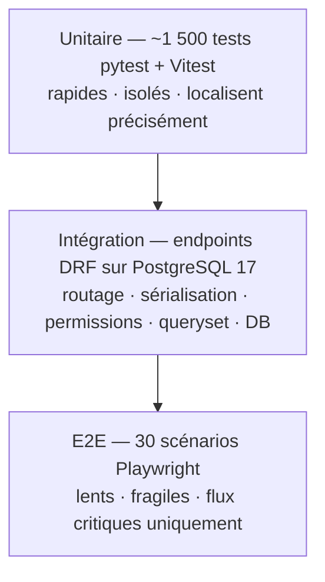

# Tests, qualité et jeu d'essai

*Fiche transversale 4/6 — la stratégie de tests, les outils, et le jeu d'essai que le référentiel CDA exige explicitement.*
{: .meta }

## 0. Vocabulaire à connaître avant de lire

Test unitaire
:   Vérifie le comportement d'**une unité isolée** — une fonction, une méthode, une classe. Ses dépendances sont remplacées par des doublures. Rapide (millisecondes), nombreux, ils localisent précisément une régression.

Test d'intégration
:   Vérifie que **plusieurs composants réels collaborent** correctement. Chez moi : un appel HTTP qui traverse le routage, la sérialisation, les permissions, le queryset et la vraie base PostgreSQL.

Test end-to-end (E2E)
:   Vérifie un **parcours utilisateur complet** dans un vrai navigateur, sur l'application assemblée. Lent, fragile, coûteux à maintenir — donc peu nombreux et réservés aux flux critiques.

Pyramide des tests
:   Heuristique de répartition : beaucoup d'unitaires à la base, moins d'intégration au milieu, très peu d'E2E au sommet. L'anti-modèle est le « cornet de glace » : beaucoup d'E2E et peu d'unitaires — une suite lente qui échoue pour de mauvaises raisons.

Doublure de test (test double)
:   Terme générique. **Dummy** (passé mais inutilisé), **stub** (renvoie une réponse figée), **spy** (enregistre les appels), **mock** (stub + assertions sur les appels), **fake** (implémentation simplifiée mais fonctionnelle, ex. une base en mémoire).

Fixture
:   État connu et reproductible mis en place avant un test. En pytest, une fonction décorée `@pytest.fixture` injectée par nom de paramètre.

Factory
:   Générateur d'objets de test réalistes en une ligne, avec des valeurs par défaut cohérentes et surchargeables. `factory_boy` côté Python. Avantage sur les fixtures statiques : un test ne déclare que **ce qui compte pour lui**.

Couverture de code (coverage)
:   Pourcentage de lignes (ou branches) exécutées par la suite de tests. C'est un indicateur d'**absence** — une ligne non couverte n'est pas testée — jamais une preuve de qualité.

TDD (Test-Driven Development)
:   Cycle red-green-refactor : écrire un test qui échoue, écrire le minimum de code pour le faire passer, refactorer sous la protection du test.

Linter / formateur
:   Un **linter** détecte les erreurs de style, les mauvaises pratiques et certains bugs (Ruff, ESLint). Un **formateur** réécrit le code selon des règles typographiques fixes (`ruff format`, Prettier). Le second supprime les débats sur la mise en forme en revue.

Jeu d'essai
:   Livrable attendu par le référentiel CDA : un tableau de cas de test avec, pour chacun, les données d'entrée, le résultat **attendu**, le résultat **obtenu** et l'écart. Il couvre trois catégories : cas passants, cas limites, cas d'erreur.

Flaky test
:   Test qui échoue de façon intermittente sans changement de code. Cause fréquente : dépendance à l'horloge, à l'ordre d'exécution, ou attente insuffisante en E2E. Un test flaky est pire qu'un test absent : il apprend à l'équipe à ignorer le rouge.

---

## 1. TL;DR

**1 591 tests automatisés** : 1 062 côté back, 529 côté front, organisés en trois niveaux.

| Niveau | Outils | Ce qui est vérifié |
|---|---|---|
| **Unitaire** | pytest (back) · Vitest + Testing Library (front) | Moteur de génération Word, Strategy Pattern, resolver de variables, traitement d'images, composants React isolés |
| **Intégration** | client DRF + **PostgreSQL 17 réel** en CI | Un endpoint de bout en bout : routage, sérialisation, permissions, queryset, base |
| **E2E** | Playwright — **30 scénarios** | Navigation, création de document, import de photos |

Les données de test sont produites par **7 factories `factory_boy`** (utilisateur, agence, rapport, template, section, annexe photo, photo).

La qualité est contrôlée par des **linters intégrés à la CI** : Ruff (Python) et ESLint (TypeScript/React). Chaque push déclenche **quatre jobs en parallèle** — tests back, lint back, tests front, lint front. **Si un seul échoue, le code ne va pas plus loin** : le workflow de déploiement ne démarre que si la CI est verte sur `main`.

!!! jury "La décision de test la plus défendable du dossier"
    La CI fait tourner les tests d'intégration sur une **vraie instance PostgreSQL 17**, pas sur une base SQLite de substitution. C'est plus lent à démarrer, mais c'est le seul moyen de tester ce qui n'existe qu'en PostgreSQL : les champs JSON, les contraintes de validation, les index partiels, les stratégies `ON DELETE`. Un test qui passe sur SQLite et casse en production ne teste rien.

---

## 2. La pyramide, en pratique



Ce que chaque niveau attrape, et **lui seul** :

- **Unitaire** — une erreur de logique dans une stratégie de rendu, un calcul de rotation d'image faux, un resolver de variable qui ne gère pas la valeur absente. Symptôme : un test échoue, on sait immédiatement quelle fonction.
- **Intégration** — un sérialiseur qui expose un champ qu'il ne devrait pas, une permission qui laisse passer, un queryset qui oublie de filtrer par agence, une migration incohérente. Symptôme : la fonction est correcte mais l'assemblage fuit.
- **E2E** — un bouton qui n'est pas branché, une route front cassée, un flux d'upload qui échoue au niveau du navigateur. Symptôme : chaque pièce marche, le parcours non.

!!! piege "L'erreur de raisonnement classique"
    « J'ai 90 % de couverture donc mon application est fiable. » Non : la couverture mesure les lignes **exécutées**, pas les lignes **vérifiées**. Un test qui appelle une fonction sans aucune assertion couvre 100 % de ses lignes et ne teste rien. Et une couverture parfaite au niveau unitaire ne dit **rien** sur l'assemblage — c'est précisément le rôle des tests d'intégration.

---

## 3. Les factories

```python
# Schéma d'une factory factory_boy
class ReportFactory(factory.django.DjangoModelFactory):
    class Meta:
        model = Report

    title = factory.Sequence(lambda n: f"Rapport de diagnostic {n}")
    template = factory.SubFactory(ReportTemplateFactory)
    agency = factory.SubFactory(AgencyFactory)
    created_by = factory.SubFactory(UserFactory)
    data = {}
```

Sept factories couvrent les entités principales. Le bénéfice est net dans les tests :

```python
def test_un_utilisateur_ne_voit_pas_les_rapports_d_une_autre_agence():
    nantes, lyon = AgencyFactory(), AgencyFactory()
    user = UserFactory(agency=nantes)
    ReportFactory(agency=lyon)             # ne doit pas être visible

    visible = filter_visible_queryset(user, Report.objects.all())

    assert visible.count() == 0
```

Le test ne déclare que ce qui le concerne : **deux agences et un rapport dans la mauvaise**. Tout le reste — titre, template, dates, champs obligatoires — est produit par la factory avec des valeurs cohérentes. C'est ce qui rend le test lisible : on voit l'intention, pas la plomberie.

!!! note "Factory contre fixture"
    Une fixture statique (un JSON de données de test) devient vite un point de couplage : tous les tests en dépendent, personne n'ose la modifier, et elle grossit indéfiniment. Une factory produit un objet **frais et personnalisable** à chaque appel. `SubFactory` construit récursivement les dépendances, `Sequence` garantit l'unicité des champs contraints.

---

## 4. Le jeu d'essai (livrable CDA)

Le référentiel attend un tableau formalisé. Celui du dossier couvre la fonctionnalité d'annexes photo, avec **douze cas répartis sur trois catégories**, et **les douze passent sans écart entre attendu et obtenu**.

### 4.1 La structure attendue

| # | Catégorie | Cas de test | Données d'entrée | Résultat attendu | Obtenu | Écart |
|---|---|---|---|---|---|---|
| 1 | Passant | Créer une annexe | Projet valide, gabarit 2 colonnes | 201, annexe créée | conforme | aucun |
| 2 | Passant | Importer un lot de photos | 20 JPEG valides | 20 `PhotoItem` ordonnés | conforme | aucun |
| 3 | Limite | Import à la borne haute | Exactement 20 fichiers | Accepté | conforme | aucun |
| 4 | Limite | Import au-delà de la borne | 21 fichiers | Refus explicite | conforme | aucun |
| 5 | Erreur | Fichier au type falsifié | `.exe` renommé `.jpg` | 400, rejet via libmagic | conforme | aucun |
| … | | | | | | |

### 4.2 Les trois catégories, et pourquoi les trois

- **Cas passants** — le comportement nominal. Ils prouvent que la fonctionnalité fait ce qu'on attend.
- **Cas limites** — les bornes exactes : 0 photo, exactement 20, une légende vide, un nom de fichier à la longueur maximale. C'est **là que se cachent les bugs** : les erreurs off-by-one, les `>` au lieu de `>=`.
- **Cas d'erreur** — les entrées invalides. Ils prouvent que le système **refuse proprement** au lieu de planter ou, pire, d'accepter silencieusement.

!!! jury "La question à anticiper"
    « Vos douze cas passent tous. Vous avez donc écrit le jeu d'essai après le code ? » La réponse honnête : oui, ce jeu d'essai formalise a posteriori une fonctionnalité déjà couverte par les tests automatisés — c'est un **livrable de documentation**, il synthétise ce que la suite vérifie en continu. Ce serait un problème si c'était mon seul filet de sécurité ; ça n'en est pas un puisqu'il double 1 591 tests exécutés à chaque push.

---

## 5. Les linters et la CI qualité

### 5.1 Ce que chaque outil vérifie

| Outil | Périmètre | Exemples de règles |
|---|---|---|
| **Ruff** (`ruff check`) | Python | PEP 8, imports inutilisés ou mal ordonnés, syntaxe modernisable, bugs courants (mutable en argument par défaut, comparaison à `None` avec `==`) |
| **Ruff** (`ruff format --check`) | Python | Formatage — la CI **échoue** si le code n'est pas formaté |
| **ESLint** | TypeScript/React | Règles des hooks (`react-hooks/rules-of-hooks`, dépendances d'effets), variables inutilisées, `any` implicites |
| **`tsc -b`** | TypeScript | Vérification de types au build : une erreur de type casse la construction |

### 5.2 Le job de CI réel

```yaml
# .github/workflows/ci.yml — extrait
jobs:
  test-backend:
    services:
      postgres:
        image: postgres:17          # vraie base, pas SQLite
        options: >-
          --health-cmd pg_isready
          --health-interval 10s
          --health-retries 5
    steps:
      - name: Run tests
        run: pytest

  lint-backend:
    steps:
      - name: Ruff check
        run: ruff check .
      - name: Ruff format check
        run: ruff format --check .

  test-frontend:   # bun run test  → Vitest
  lint-frontend:   # bun run lint  → ESLint
```

Quatre jobs **en parallèle**, déclenchés sur chaque push et chaque pull request, **sur n'importe quelle branche**. Le workflow de déploiement est chaîné en aval et ne démarre que si la CI est verte **et** qu'on est sur la branche principale.

!!! jury "Le point de contrôle qui compte"
    « Le déploiement ne se lance que si le pipeline passe. » C'est la phrase qui transforme une suite de tests en **garde-fou** plutôt qu'en documentation. Sans ce chaînage, une suite de tests est une suggestion.

### 5.3 Les hooks Git

Un fichier `lefthook.yml` permet de faire tourner lint et formatage **avant le commit**, donc de ne pas découvrir le problème trois minutes plus tard dans la CI. C'est un raccourci de confort : le hook peut se contourner (`--no-verify`), la CI non. Le hook accélère la boucle de retour, la CI fait autorité.

---

## 6. Ce que je testerais différemment

Une section qui vaut de l'or à l'oral, parce qu'elle montre du recul.

- **Pas de mutation testing.** La couverture dit quelles lignes sont exécutées ; un outil comme `mutmut` dirait si mes assertions détectent réellement un changement de comportement. C'est le vrai test de la qualité d'une suite de tests.
- **Pas de tests de charge.** Je sais que la génération est synchrone et j'ai posé un throttle, mais je n'ai pas mesuré à quel volume de rapport la Web App atteint son timeout. Le seuil est estimé, pas mesuré.
- **Pas de tests de contrat sur le pont hub → Boost-Report.** Les deux côtés partagent des constantes (`issuer`, `audience`, `scope`) alignées **par commentaire** dans le code. Une divergence ne serait détectée qu'en production. Un test de contrat partagé, ou un schéma versionné, éviterait ça.
- **Trop peu de tests de non-régression sur le rendu documentaire.** Je teste que la génération aboutit et que le contenu est présent ; je ne compare pas le rendu visuel. Un changement de style dans le template Word passerait au vert.

!!! attention "L'écueil du volume"
    1 591 tests, c'est un chiffre qui impressionne — et le jury peut le retourner : « combien de temps tourne votre suite ? », « avez-vous des tests flaky ? », « quelle est votre couverture de branches ? ». Mieux vaut annoncer le nombre **avec** ce qu'il ne prouve pas que le laisser passer pour une garantie.

---

## 7. Questions probables du jury

### Q1. Pourquoi une vraie base PostgreSQL en CI plutôt que SQLite ?

Parce que ce que je teste n'existe pas en SQLite. Boost-Report utilise des champs JSON avec les opérateurs PostgreSQL, des contraintes de validation métier, des index de performance et différentes stratégies `ON DELETE` (`CASCADE`, `PROTECT`). SQLite ignore ou émule une partie de ça : un test d'intégration qui y passe ne prouve rien sur la production. Le coût est de quelques secondes de démarrage de service dans la CI, avec un healthcheck `pg_isready` pour éviter les échecs de course. C'est un prix dérisoire pour que « vert en CI » veuille dire quelque chose.

### Q2. 1 591 tests, quel est votre taux de couverture ?

Je suis les couvertures via `pytest-cov` et `vitest --coverage`, mais je préfère ne pas mettre en avant un chiffre unique, parce qu'il se manipule trop facilement. Ce que je regarde, c'est **ce qui est couvert** : le moteur de génération, les stratégies de rendu, les règles de visibilité et les permissions le sont exhaustivement, parce que c'est là qu'un bug est coûteux — un rapport mal généré ou une donnée visible par la mauvaise personne. Le code de plomberie l'est moins. Une couverture uniforme à 85 % serait un moins bon signal qu'une couverture inégale mais concentrée sur le risque.

### Q3. Faites-vous du TDD ?

Pas systématiquement, et je préfère le dire franchement. J'ai appliqué le cycle red-green-refactor là où la spécification était claire avant l'implémentation : les règles de visibilité, le resolver de variables, les stratégies de rendu — des fonctions au contrat bien défini. Sur les parties exploratoires, en particulier l'interface et le pipeline de génération PDF où je ne savais pas encore quel serait le rendu attendu, j'ai écrit le code d'abord et les tests ensuite. Faire du TDD sur un comportement qu'on est en train de découvrir revient à figer une spécification qu'on n'a pas.

### Q4. Comment gérez-vous les tests E2E, connus pour être fragiles ?

En les limitant volontairement à **30 scénarios sur les flux critiques** : navigation, création de document, import de photos. Je ne teste pas les cas limites en E2E — ils sont couverts en unitaire et en intégration, où l'échec est rapide et précis. Playwright aide beaucoup sur la fragilité grâce à son auto-waiting : il attend qu'un élément soit réellement actionnable plutôt que de dormir un temps arbitraire, ce qui élimine la principale source de flakiness. La règle que je m'applique : si un scénario E2E échoue de manière intermittente, je le supprime ou je le réécris — un test auquel on n'accorde pas confiance est nuisible, parce qu'il apprend à ignorer le rouge.

### Q5. Votre jeu d'essai a douze cas et zéro écart. Ce n'est pas trop beau ?

C'est un jeu d'essai formalisé sur une fonctionnalité déjà stabilisée et en production, donc oui, il passe. Il documente un périmètre couvert en continu par la suite automatisée, il n'est pas mon filet de sécurité. Ce qui serait suspect, c'est de présenter douze cas verts **comme preuve** que la fonctionnalité est sans défaut. Elle a eu des défauts : la génération PDF initiale prenait 20 à 30 secondes via Gotenberg, et c'est un usage réel — pas un test — qui l'a révélé comme inacceptable. Les tests attrapent les régressions, ils n'attrapent pas les mauvaises décisions.

### Q6. Un bug arrive en production. Quelle est votre démarche ?

D'abord évaluer si la production est utilisable : si non, rollback immédiat en re-taggant l'image précédente identifiée par son SHA de commit, puis en redéclenchant le webhook — quelques minutes, sans modification de code. Ensuite, **écrire un test qui reproduit le bug et qui échoue**. Puis corriger jusqu'à ce qu'il passe. Ce test reste dans la suite définitivement, ce qui garantit que la même régression ne repassera pas. Corriger sans écrire le test, c'est accepter de refaire le travail dans six mois.

### Q7. Quelle est la différence entre un mock et un stub ?

Un **stub** fournit une réponse préprogrammée : il sert à mettre le système dans un état donné, et on n'assert rien sur lui. Un **mock** est un stub sur lequel on **vérifie les interactions** : qu'il a été appelé, combien de fois, avec quels arguments. La distinction pratique : le stub sert à l'*arrange*, le mock fait partie de l'*assert*. J'utilise principalement des stubs — pour Gotenberg et WeasyPrint, dont je ne veux pas dépendre en test unitaire — parce que vérifier les appels couple le test à l'implémentation. Un test qui assert « la méthode X a été appelée deux fois » casse au moindre refactoring qui ne change pourtant rien au comportement.

### Q8. Vos linters sont bloquants en CI. Ce n'est pas contre-productif ?

Non, c'est le seul mode qui fonctionne. Un linter non bloquant produit un avertissement que tout le monde apprend à ignorer, et la dette s'accumule silencieusement. En le rendant bloquant, le coût est payé au moment où il est le plus faible : à l'écriture. Ce que je rends bloquant est ce qui est **objectif** — formatage, imports inutilisés, règles des hooks React, erreurs de type — jamais des règles de style subjectives qui déclencheraient des débats. Et le formatage automatique (`ruff format`) supprime complètement la catégorie « discussion sur la mise en forme en revue de code », ce qui est un gain de temps net.
