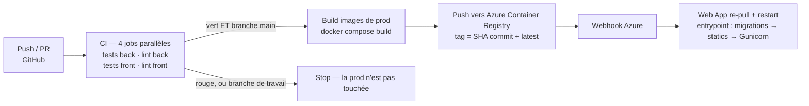
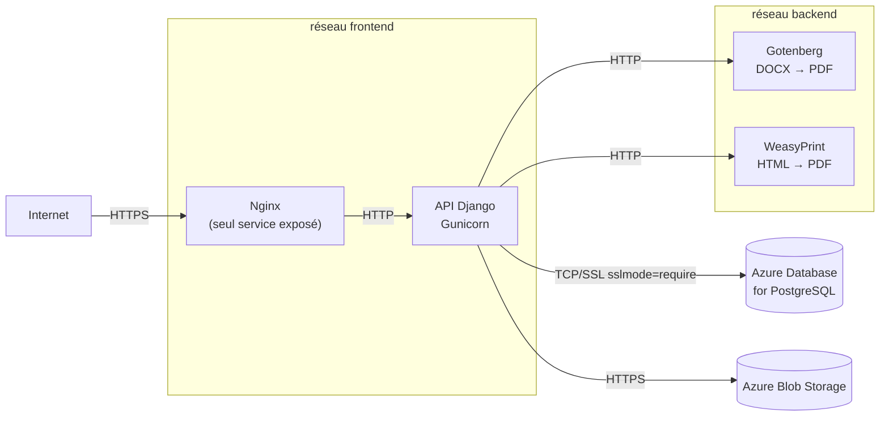

# DevOps : Docker, CI/CD et déploiement Azure

*Fiche transversale 5/6 — la spécialisation DevOps du titre. Conteneurisation, pipeline, infrastructure, rollback.*
{: .meta }

## 0. Vocabulaire à connaître avant de lire

Image / conteneur
:   Une **image** est un modèle immuable en lecture seule, composé de couches empilées. Un **conteneur** est une instance en cours d'exécution d'une image, avec une couche d'écriture par-dessus. Analogie : classe / objet.

Dockerfile
:   Recette de construction d'une image. Chaque instruction (`FROM`, `RUN`, `COPY`) crée une **couche** mise en cache : une instruction inchangée n'est pas rejouée. D'où la règle d'ordonnancement — ce qui change rarement en haut, le code en bas.

Build multi-stage
:   Un Dockerfile contenant plusieurs `FROM`. Un stage *builder* compile ou installe les dépendances ; le stage final ne **copie que le résultat**. L'image livrée ne contient donc ni compilateur, ni outils de build, ni sources intermédiaires.

Docker Compose
:   Outil de définition et d'orchestration **multi-conteneurs sur un seul hôte** : services, réseaux, volumes, variables. Ce n'est pas un orchestrateur de cluster — c'est le rôle de Kubernetes.

Volume / bind mount
:   Un **volume** est géré par Docker et persiste au-delà du conteneur. Un **bind mount** monte un dossier de l'hôte dans le conteneur — pratique en dev pour le rechargement à chaud, à proscrire en prod.

Registry
:   Dépôt d'images. Docker Hub (public), GitLab Container Registry, **Azure Container Registry** (le mien). Une image y est identifiée par `registry/repository:tag`.

Tag
:   Étiquette mobile pointant vers une image. `latest` est un **alias mouvant**, pas une version : c'est pourquoi je tague aussi par **SHA de commit**, qui est immuable et traçable.

CI (Intégration Continue)
:   Intégrer et **vérifier automatiquement** chaque changement : build, tests, lint, à chaque push. Objectif : détecter la régression en minutes plutôt qu'en semaines.

CD (Livraison / Déploiement Continu)
:   *Continuous Delivery* = chaque commit validé est **déployable** (le déclenchement reste manuel). *Continuous Deployment* = il est **déployé** automatiquement. Chez moi le staging est en déploiement continu, la production en livraison continue déclenchée par une release.

Pipeline
:   Enchaînement de jobs automatisés. Des jobs **parallèles** vont plus vite ; des jobs **chaînés** (`needs`, `workflow_run`) garantissent un ordre.

Webhook
:   Requête HTTP envoyée par un système pour notifier un événement à un autre. Chez moi : GitHub Actions notifie Azure qu'une nouvelle image est disponible, Azure re-pull et redémarre.

Healthcheck
:   Commande périodique par laquelle le runtime détermine si un conteneur est réellement opérationnel — pas seulement démarré. Sans healthcheck, un service peut être « up » et ne répondre à rien.

Rollback
:   Retour à une version antérieure fonctionnelle. Sa qualité se mesure au **temps de retour** et à l'absence de modification de code nécessaire.

IaC (Infrastructure as Code)
:   Décrire l'infrastructure dans des fichiers versionnés plutôt que de la cliquer dans une console. Mon `docker-compose` en est une forme partielle ; l'infrastructure Azure elle-même est configurée manuellement — c'est une limite que j'assume.

Utilisateur non-root
:   Un conteneur tourne par défaut en `root`. Une évasion de conteneur donnerait alors des droits élevés sur l'hôte. Déclarer un utilisateur dédié limite ce risque.

---

## 1. TL;DR

La démarche DevOps repose sur **trois piliers** : conteneurisation, intégration continue, déploiement automatisé.



Chiffres à retenir : **build + push ≈ 6 minutes**, **redéploiement ≈ quelques secondes**. Rollback = re-tagger une image identifiée par son SHA en `latest`, redéclencher le webhook, **sans modification de code**.

!!! jury "La phrase qui résume la maturité du pipeline"
    « Le déploiement est entièrement automatisé à partir du moment où le code est mergé sur `main`. » Et surtout : *un push sur une branche de travail ou une pull request ne déclenche jamais de mise en production.*

---

## 2. Docker : dev et prod séparés

### 2.1 Pourquoi deux jeux d'images

| | Développement | Production |
|---|---|---|
| Outils | TanStack DevTools, Django Debug Toolbar | aucun |
| Code | bind mount + rechargement à chaud | copié dans l'image |
| Front | serveur Vite | fichiers statiques compilés servis par Nginx |
| Back | `runserver` Django | **Gunicorn** |
| Utilisateur | root (confort) | **non-root dédié** |
| Taille | grosse, peu importe | allégée et optimisée |

!!! piege "Le piège du DEBUG"
    `DEBUG=True` en production expose la stack trace complète, les paramètres et une partie de la configuration à la moindre erreur 500. C'est la vulnérabilité de configuration la plus fréquente et la plus facile à exploiter. Elle est classée **A05 – Security Misconfiguration** dans l'OWASP Top 10.

### 2.2 Le build multi-stage

```dockerfile
# API Django — schéma du Dockerfile de production
FROM python:3.11-slim AS builder
RUN python -m venv /opt/venv
ENV PATH="/opt/venv/bin:$PATH"
COPY requirements.txt .
RUN pip install --no-cache-dir -r requirements.txt

FROM python:3.11-slim
RUN useradd --create-home --shell /bin/bash appuser   # moindre privilège
COPY --from=builder /opt/venv /opt/venv               # on ne copie QUE le venv
ENV PATH="/opt/venv/bin:$PATH"
WORKDIR /app
COPY --chown=appuser:appuser . .
USER appuser
CMD ["gunicorn", "config.wsgi:application", "--bind", "0.0.0.0:8000"]
```

```dockerfile
# Front React — schéma
FROM node:22-alpine AS builder
WORKDIR /app
COPY package*.json ./
RUN npm ci                    # ci, pas install : respecte le lockfile
COPY . .
RUN npm run build             # → dist/

FROM nginx:alpine
COPY --from=builder /app/dist /usr/share/nginx/html
COPY nginx/default.conf /etc/nginx/conf.d/
```

Trois bénéfices, à savoir énoncer dans cet ordre :

1. **Taille** — le compilateur TypeScript, `node_modules` et les outils de build ne sont pas dans l'image livrée. Un front React passe typiquement de plusieurs centaines de Mo à quelques dizaines.
2. **Sécurité** — moins de binaires dans l'image, moins de surface d'attaque et moins de CVE à suivre.
3. **Vitesse** — image plus légère = pull plus rapide au déploiement.

!!! note "`npm ci` contre `npm install`"
    `npm ci` installe **exactement** ce que décrit le lockfile et échoue si `package.json` et le lockfile divergent. `npm install` peut résoudre des versions différentes et **modifier** le lockfile. En CI et en build d'image, seul `ci` garantit la reproductibilité.

### 2.3 L'isolation réseau en production



Le principe : **les moteurs PDF n'ont aucune raison d'être joignables depuis le front**, donc ils vivent sur un réseau où le front n'est pas. Si Nginx est compromis, l'attaquant n'atteint pas directement Gotenberg. C'est de la défense en profondeur appliquée au réseau.

La base de données n'appartient à aucun des deux réseaux : elle a été sortie des conteneurs vers une **instance Azure managée**.

### 2.4 La séquence de démarrage

Au redémarrage, l'entrypoint de l'API enchaîne dans cet ordre précis :

1. **migrations** de base de données ;
2. **collecte des assets statiques** ;
3. **synchronisation des templates Word** ;
4. lancement de **Gunicorn**.

L'ordre n'est pas arbitraire : les migrations d'abord, parce qu'un code neuf sur un schéma ancien plante ; Gunicorn en dernier, parce qu'il ne doit pas accepter de trafic avant que tout soit prêt.

---

## 3. Le pipeline CI/CD

### 3.1 L'évolution — une histoire à raconter

C'est la partie la plus intéressante à l'oral, parce qu'elle montre une progression et pas une configuration tombée du ciel.

| Étape | État du pipeline | Ce que ça a résolu |
|---|---|---|
| **1. Départ** (mars) | Un workflow unique : build + push + deploy, sur `main` uniquement | A permis la première mise en production. Mélangeait tout, ne validait rien sur les branches |
| **2. Séparation** (avril) | Deux workflows : CI (toutes branches + PR) et Deploy (`main` uniquement, chaîné) | Une régression est détectée **avant** le merge, plus après |
| **3. Migration de registre** | GitLab Registry → **Azure Container Registry** | Centralisation au même endroit que le déploiement |
| **4. Allègement** | 4 images (db, auth, api, front) → **2** (api, front) | Conséquence de la migration PostgreSQL managé + passage à l'OIDC du hub |
| **5. Staging / prod** | `deploy.yml` (staging sur push `main`) + `deploy-prod.yml` (promotion à la publication d'une **release**) | La prod n'est plus touchée par chaque merge ; les images du commit taggé sont **promues sans rebuild** |

!!! jury "Le point le plus fin de la chaîne"
    En production, les images ne sont **pas reconstruites** : celles déjà validées en staging sont **re-taguées** `:prod`. Reconstruire produirait potentiellement un binaire différent (dépendances transitives, horodatages) — donc on ne déploierait pas ce qui a été testé. Promouvoir l'artefact plutôt que le rebuilder est un principe de base de la livraison continue.

### 3.2 Le chaînage — le point de contrôle

Deux mécanismes selon les dépôts :

```yaml
# Chaînage par workflow réutilisable (boost-reports)
jobs:
  ci:
    uses: ./.github/workflows/ci.yml    # la CI devient un job du déploiement
  deploy:
    needs: ci                            # ne démarre que si ci a réussi
    environment: staging
```

```yaml
# Chaînage par workflow_run (variante)
on:
  workflow_run:
    workflows: ["CI"]
    types: [completed]
    branches: [main]
# + condition : conclusion == 'success'
```

Les deux garantissent la même chose : **pas de déploiement sans CI verte sur la branche principale**.

### 3.3 La stratégie de tags

```bash
TAG=$(git rev-parse --short HEAD)
for IMG in api-django frontend; do
  docker push $REGISTRY/$IMG:$TAG          # immuable, traçable
  docker tag  $REGISTRY/$IMG:$TAG $REGISTRY/$IMG:latest
  docker push $REGISTRY/$IMG:latest        # alias mouvant, pullé par la Web App
done
```

Deux tags, deux rôles :

- **SHA de commit** — identité immuable. Permet de dire précisément *quelle version tourne* et sert de base au rollback.
- **`latest`** — ce que la Web App tire par défaut. C'est un pointeur, pas une version.

!!! attention "Ne jamais déployer par `latest` seul"
    Sans le tag SHA, on ne peut ni identifier la version en production, ni y revenir. « Ça marchait hier » devient invérifiable. Le tag immuable est la condition d'un rollback fiable.

### 3.4 Les secrets

Les identifiants de registre et l'URL du webhook vivent dans les **secrets GitHub Actions** : rien ne transite en clair dans le dépôt. Côté application, les variables d'environnement sensibles ne sont jamais écrites dans les fichiers de configuration — elles sont **injectées par les paramètres Azure**.

### 3.5 Les workflows manuels de mirroring

Deux workflows déclenchés à la main répliquent les images officielles de **Gotenberg** et **WeasyPrint** vers l'ACR. Cela **fige la version** des services tiers utilisée en production et évite de dépendre de la disponibilité d'un registre public au moment du déploiement. C'est une réponse directe à la catégorie **A08 – Software and Data Integrity Failures** de l'OWASP.

---

## 4. L'infrastructure Azure

### 4.1 Les services et leur rôle

| Service | Rôle | Pourquoi |
|---|---|---|
| **Azure Web App for Containers** | Héberge les 4 conteneurs (Nginx, API, Gotenberg, WeasyPrint) | Le service le plus adapté pour démarrer avec un budget faible — plan B2, sans staging séparé au départ |
| **Azure Database for PostgreSQL Flexible Server** | Base de données managée | Sauvegardes, migrations et maintenance simplifiées ; centralise les bases de plusieurs applications |
| **Azure Blob Storage** | Photos et documents générés | Mieux adapté au volume de photos que les volumes Docker, et moins cher |
| **Azure Container Registry** | Images de production | Centralisé au même endroit que le déploiement |
| **Azure Static Web Apps** | Plateforme boost-apps | Hébergement statique + authentification OIDC intégrée |

### 4.2 Les deux migrations et leur motivation

Ce sont des décisions **motivées par l'exploitation**, pas par la mode :

1. **PostgreSQL en conteneur → service managé.** Le conteneur imposait de gérer les sauvegardes et la maintenance à la main, et redémarrait avec l'application. Le service managé apporte les sauvegardes automatiques et permet de **mutualiser** les bases de plusieurs applications.
2. **Volumes Docker → Azure Blob Storage.** Les annexes photo génèrent un volume important d'images. Un volume local sur une Web App est fragile (perdu à certains redémarrages) et ne scale pas. Le Blob est conçu pour ça et coûte moins cher.

!!! jury "L'état d'esprit à montrer"
    « Sortir l'état des conteneurs. » Un conteneur doit être **éphémère et remplaçable** : tout ce qui doit survivre à son redémarrage — base de données, fichiers uploadés, sessions — doit vivre en dehors. Ces deux migrations, c'est l'application progressive de ce principe, apprise en exploitation.

### 4.3 Ce que je gère

Configuration des services, déploiement, sécurisation, surveillance. L'environnement est un « bac à sable de production » mis à disposition par la DSI, que j'ai dû configurer **de bout en bout** pour qu'il soit conforme côté sécurité.

---

## 5. La procédure de déploiement et le rollback

### 5.1 En fonctionnement normal

Aucune action d'infrastructure n'est nécessaire :

1. Push sur la branche principale via une **pull request relue** ;
2. la CI valide, le déploiement s'enchaîne ;
3. suivi de l'exécution dans l'onglet Actions de GitHub ;
4. après le webhook, Azure re-pull et redémarre ; l'entrypoint rejoue migrations → statics → templates → Gunicorn ;
5. **vérification manuelle en production** : l'application répond, la connexion via le hub passe, une génération de document aboutit.

Ce point 5 est ce qu'on appelle un *smoke test* : trois vérifications qui couvrent les trois dépendances critiques (l'application, l'IdP, la chaîne de génération).

### 5.2 En cas de problème

| Moment de la défaillance | Conséquence | Action |
|---|---|---|
| **Avant le webhook** (CI ou build échoue) | La production **n'est pas touchée**, l'ancienne version continue de tourner | Corriger et repousser |
| **Après le déploiement** | La nouvelle version est en ligne et défectueuse | Re-tagger l'image précédente (identifiée par son SHA) en `latest`, redéclencher le webhook |

Le rollback ramène l'application à l'état antérieur **en quelques minutes, sans modification de code**. C'est exactement ce que le tag par SHA rend possible.

!!! attention "La limite du rollback : les migrations"
    Re-taguer une image ne défait **pas** une migration de base déjà appliquée. Si le déploiement fautif a modifié le schéma, revenir au code précédent peut le laisser face à un schéma qu'il ne connaît pas. La parade est de rendre les migrations **rétro-compatibles** : ajouter une colonne nullable plutôt que renommer, déployer le code qui la lit avant celui qui l'exige, supprimer l'ancienne dans un second temps. C'est une limite connue de mon pipeline et un excellent sujet de question — savoir la nommer vaut mieux que de prétendre que le rollback est total.

---

## 6. Ce qui manque, et je le sais

- **Pas d'IaC pour Azure.** Les services sont configurés à la main dans le portail. Un Bicep ou un Terraform rendrait l'environnement reproductible et versionné. Sur un environnement unique le coût dépassait le gain ; ça deviendrait bloquant dès qu'il faut un vrai staging isolé.
- **Pas de centralisation des logs ni d'alerting.** Les logs sortent sur stdout et sont consultables depuis Azure, mais rien n'agrège ni n'alerte. Azure Monitor est identifié comme prochaine étape.
- **Pas de déploiement blue/green ou canary.** Le redémarrage des conteneurs implique une courte indisponibilité. Sur un outil interne utilisé en journée c'est acceptable ; ça ne le serait pas sur un service public.
- **Pas de scan de vulnérabilité d'images en CI.** Un `trivy` ou le scan intégré à l'ACR sur chaque build serait le complément naturel des alertes de dépendances GitHub, qui ne couvrent que les paquets applicatifs — pas les paquets système de l'image de base.

---

## 7. Questions probables du jury

### Q1. Pourquoi Docker plutôt qu'un déploiement classique ?

Pour la reproductibilité. L'image embarque le runtime, les dépendances système et le code : ce qui tourne sur mon poste tourne à l'identique sur le serveur. Sans conteneur, il faut aligner une version de Python, des bibliothèques système — WeasyPrint et python-docx en ont plusieurs — et une configuration serveur, à la main et sans garantie. Le second bénéfice est le **déploiement atomique** : je livre un artefact unique, immuable et identifié, plutôt qu'une séquence de commandes dont chacune peut échouer à mi-parcours.

### Q2. Pourquoi Docker Compose et pas Kubernetes ?

Parce que je n'ai aucun des problèmes que Kubernetes résout. K8s apporte l'orchestration multi-nœuds, l'auto-scaling, le rolling update et l'auto-réparation — pour un coût opérationnel considérable : cluster à maintenir, manifests, RBAC, ingress, observabilité. J'ai quatre conteneurs sur un seul hôte, une charge modeste et prévisible, et je suis seul à maintenir tout ça. Compose répond exactement au besoin. Et la contrainte de fond du contexte est explicite : le projet doit être **reprenable avec une maintenance réduite au minimum** après mon départ — un cluster K8s irait à l'inverse.

### Q3. Que se passe-t-il si vous poussez du code cassé sur `main` ?

Rien n'arrive en production. Le déploiement est **chaîné** à la CI : il ne démarre que si les quatre jobs — tests back, lint back, tests front, lint front — sont verts, et uniquement sur la branche principale. Si un seul échoue, le workflow s'arrête avant le build d'images et l'ancienne version continue de tourner. Si malgré tout un bug passe les tests et atteint la production, le rollback consiste à re-tagger l'image précédente par son SHA de commit et à redéclencher le webhook : quelques minutes, sans toucher au code. La nuance à apporter est que ce rollback ne défait pas une migration de base déjà appliquée.

### Q4. Pourquoi taguer par SHA de commit plutôt que par version sémantique ?

Le SHA est **automatique et sans ambiguïté** : il lie l'image exactement au commit qui l'a produite, sans décision humaine ni risque d'oubli. Une version sémantique a du sens quand on publie un produit versionné pour des tiers, avec un changelog et un contrat de compatibilité — ce n'est pas le cas d'une application interne déployée en continu. Cela dit les deux coexistent : depuis l'introduction du workflow de production, une **release** GitHub marque les versions destinées à la prod, et ce sont les images du commit taggé qui sont promues. Le SHA reste l'identité technique, la release porte l'identité produit.

### Q5. Votre CI prend combien de temps ? C'est un problème ?

Le build et le push d'images prennent environ six minutes, le redéploiement lui-même quelques secondes. La CI seule est plus courte grâce aux **quatre jobs en parallèle** — la durée totale est celle du job le plus long, pas la somme. C'est acceptable pour une boucle merge → production. Sur la boucle de développement, ce qui compte c'est le retour local : les hooks Git (lefthook) font tourner lint et formatage avant le commit, donc je découvre la plupart des problèmes en secondes, pas en minutes.

### Q6. Comment gérez-vous les secrets ?

À trois niveaux, sans jamais de secret dans le dépôt. Les identifiants de registre et l'URL du webhook sont dans les **secrets GitHub Actions**, masqués dans les logs d'exécution. Les variables d'environnement d'exécution sont injectées par les **paramètres de configuration Azure**, jamais écrites dans les fichiers de configuration ni dans les images. Et l'application ne gère aucun mot de passe utilisateur, puisque l'authentification est déléguée à l'IdP. La faiblesse résiduelle est que les secrets Azure sont saisis à la main dans le portail : un Azure Key Vault avec identité managée serait plus propre, ça élimine complètement le secret partagé.

### Q7. Le déploiement provoque-t-il une coupure ?

Oui, quelques secondes : Azure re-pull les images et redémarre les conteneurs, et l'entrypoint rejoue les migrations et la collecte des statics avant de lancer Gunicorn. Il n'y a ni blue/green ni rolling update. Sur un outil interne utilisé en journée par une population connue, c'est un compromis assumé — le coût d'un déploiement sans coupure sur ce plan d'hébergement dépasse largement le bénéfice. Sur un service public ou soumis à un SLA, ce serait un défaut à corriger, et la solution la plus simple serait les *deployment slots* d'Azure avec bascule après vérification.

### Q8. Vous parlez d'Infrastructure as Code. En faites-vous vraiment ?

Partiellement, et il faut être précis là-dessus. Ce qui est réellement en code et versionné, c'est la **définition applicative** : les Dockerfiles, les fichiers `docker-compose` pour le dev, la prod et Azure, les workflows GitHub Actions, la configuration Nginx. Ce qui **ne l'est pas**, c'est l'infrastructure Azure elle-même — Web App, base, storage, registry — configurée à la main dans le portail. Un Bicep ou un Terraform la rendrait reproductible et auditable. Je ne l'ai pas fait parce qu'il n'y a qu'un seul environnement à ce jour ; ça deviendrait bloquant dès qu'il faudrait recréer l'ensemble ou monter un staging isolé, et c'est le genre de dette qu'il vaut mieux payer avant d'en avoir besoin en urgence.
