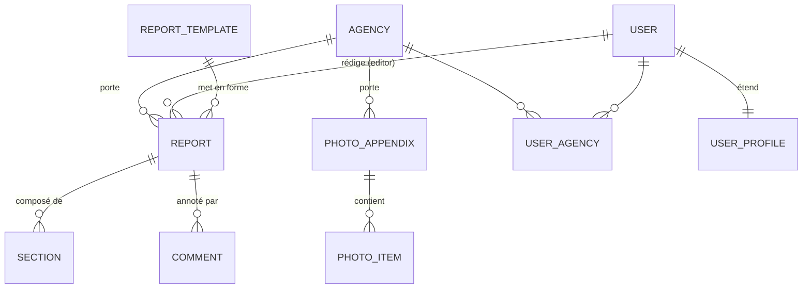

# Bases de données, SQL et ORM

*Fiche transversale 6/6 — PostgreSQL, l'ORM Django, les migrations, et le SQL qu'il faut savoir lire même quand on n'en écrit pas.*
{: .meta }

## 0. Vocabulaire à connaître avant de lire

SGBD / SGBDR
:   Système de Gestion de Base de Données. Le **R** ajoute « relationnel » : les données sont organisées en tables liées par des clés, et manipulées en SQL. PostgreSQL, MySQL, SQL Server, Oracle.

Clé primaire / clé étrangère
:   La **clé primaire** identifie de façon unique une ligne (non nulle, immuable). La **clé étrangère** est une colonne référençant la clé primaire d'une autre table — c'est elle qui matérialise une relation et garantit l'**intégrité référentielle**.

Index
:   Structure annexe (B-tree le plus souvent) qui accélère la recherche sur une ou plusieurs colonnes. Coût : espace disque et ralentissement des écritures, puisqu'il faut le maintenir à jour.

ACID
:   Les quatre garanties d'une transaction. **Atomicité** (tout ou rien), **Cohérence** (les contraintes restent respectées), **Isolation** (les transactions concurrentes ne se voient pas mutuellement à mi-parcours), **Durabilité** (une fois validée, elle survit à une panne).

Transaction
:   Groupe d'opérations traité comme une unité indivisible : `BEGIN` … `COMMIT` (validation) ou `ROLLBACK` (annulation).

ORM (Object-Relational Mapping)
:   Couche qui fait correspondre des classes à des tables et des objets à des lignes. Django ORM, SQLAlchemy, Hibernate, Drizzle. On manipule des objets Python, l'ORM produit le SQL.

Migration
:   Fichier versionné décrivant une **modification de schéma** (créer une table, ajouter une colonne, poser un index). Rejouable et ordonné, il permet de reconstruire ou de faire évoluer une base de façon déterministe.

Requête N+1
:   Anti-pattern majeur des ORM : une requête pour récupérer N objets, puis **une requête par objet** pour charger une relation. 100 rapports = 101 requêtes. Se corrige avec `select_related` (jointure) ou `prefetch_related` (seconde requête groupée).

Lazy loading
:   Chargement différé d'une relation, déclenché au premier accès. C'est pratique et c'est **exactement la cause** du N+1.

Jointure
:   Combinaison de lignes de plusieurs tables. `INNER` (uniquement les correspondances), `LEFT` (toutes celles de gauche, `NULL` à droite si absent), `RIGHT`, `FULL`.

`ON DELETE`
:   Comportement d'une clé étrangère quand la ligne référencée est supprimée. `CASCADE` (supprimer aussi), `PROTECT`/`RESTRICT` (interdire), `SET NULL`, `SET DEFAULT`, `DO NOTHING`.

Pooling de connexions
:   Réutilisation d'un jeu de connexions ouvertes plutôt que d'en ouvrir une par requête. Une connexion PostgreSQL est coûteuse (un processus côté serveur).

JSONB
:   Type PostgreSQL stockant du JSON sous forme binaire décomposée : requêtable, indexable (GIN), avec des opérateurs dédiés. À distinguer du type `json`, qui stocke le texte brut.

---

## 1. TL;DR

- **PostgreSQL** partout, sur **Azure Database for PostgreSQL Flexible Server**, connexion chiffrée `sslmode=require`.
- **Treize tables** réparties sur trois applications Django pour Boost-Report.
- **Aucun SQL écrit à la main** : tout l'accès passe par l'ORM Django. Le SQL est produit par Django à partir des modèles Python.
- Le schéma est géré par le **système de migrations** : chaque modification du modèle génère un fichier versionné dans le dépôt.
- Les fichiers (photos, documents générés) **ne sont pas en base** : ils vivent sur Azure Blob Storage, la base ne stocke que les références.

!!! jury "Pourquoi PostgreSQL et pas MySQL ou SQLite ?"
    Trois raisons, à donner dans cet ordre. C'est une **référence solide** en open source, mature sur les transactions et les contraintes. Il gère nativement le **JSONB**, indispensable puisque le contenu des rapports est stocké en JSON. Et il ouvre la porte à l'extension **pgvector** pour les fonctionnalités d'IA prévues sur le projet — c'était un critère explicite au moment du choix. SQLite a servi au tout début pour démarrer sans configurer de base, puis a été abandonné pour la mise en production.

---

## 2. Le modèle de données

### 2.1 Vue d'ensemble



Les entités et leur rôle :

| Entité | Rôle | Point notable |
|---|---|---|
| `ReportTemplate` | Le fichier Word de mise en forme, sa version, son statut actif | Référencé en `PROTECT` : on ne supprime pas un template utilisé |
| `Report` | Référence, indice de révision, statut, **champ JSON** de contenu | Lié à un `editor` et à plusieurs `reviewers` |
| `Section` | Partie ordonnée d'un rapport, typée `FORM` ou `FREE` | Contenu JSON propre + indicateur de progression |
| `PhotoAppendix` | Annexe photo | Composition avec `PhotoItem` (`CASCADE`) |
| `PhotoItem` | URL source, légende, rotation, annotations JSON | Ordonné dans l'annexe |
| `Agency` | Clé unique, nom, ville | **Pivot de visibilité** de toute l'application |
| `UserProfile` | Étend `User` avec le niveau de visibilité et le périmètre | Relation 1-1 |
| `UserAgency` | Table de liaison user ↔ agences | Permet l'affectation **multi-agences** (n-n) |
| `Comment` | Fils de discussion sur les sections | Relecture collaborative |

### 2.2 Les trois stratégies de suppression, et pourquoi

C'est un excellent sujet de question, parce que ça montre qu'on a réfléchi au cycle de vie.

| Relation | Stratégie | Raison |
|---|---|---|
| `PhotoAppendix` → `PhotoItem` | **CASCADE** | Composition : une photo n'a aucun sens sans son annexe |
| `Report` → `ReportTemplate` | **PROTECT** | Supprimer un template casserait la régénération de tous les rapports qui s'en servent. On doit être empêché |
| `Report` → `User` (created_by) | **SET_NULL** ou conservation | Le départ d'un collaborateur ne doit pas effacer ses livrables |

!!! piege "CASCADE est dangereux par défaut"
    `CASCADE` supprime en chaîne, potentiellement très loin. La question à se poser pour chaque clé étrangère : *« si je supprime le parent, l'enfant a-t-il encore un sens ? »* Si oui, jamais de CASCADE. Django oblige à déclarer `on_delete` explicitement depuis la version 2 — précisément parce que le défaut implicite causait des pertes de données.

### 2.3 La dénormalisation assumée : le champ JSON

Le contenu des rapports est stocké dans un **champ JSON** (`data`), et les sections ont chacune leur propre contenu JSON.

**Pourquoi ce n'est pas une paresse :**

- Le contenu est un **arbre de blocs hétérogènes** (titres, paragraphes, listes, images, tableaux, encadrés, formules), chacun avec ses propres propriétés. Le normaliser demanderait une table par type, ou une table générique avec des colonnes nullables — deux mauvaises options.
- Il est **toujours lu et écrit intégralement**, jamais bloc par bloc. Aucune requête ne dit « trouve tous les rapports contenant un tableau de plus de 5 lignes ».
- Le format évolue avec l'éditeur (V1 par briques, V2 BlockNote). Une migration de schéma à chaque évolution du format de bloc serait ingérable.

**Ce qui est normalisé, en revanche :** tout ce qui est **requêté, filtré ou agrégé** — agences, profils de visibilité, affectations, commentaires, templates, statuts.

!!! jury "La règle à énoncer"
    « On normalise ce qu'on interroge, on sérialise ce qu'on transporte. » Et la limite à reconnaître : le jour où il faudra chercher **dans** le contenu des rapports, il faudra soit indexer le JSONB en GIN, soit extraire les champs concernés dans des colonnes dédiées.

---

## 3. L'ORM Django

### 3.1 Ce qu'il apporte

```python
# Ce que j'écris
reports = Report.objects.filter(agency__in=agency_ids).select_related("template")

# Ce que PostgreSQL reçoit (schématiquement)
SELECT r.*, t.*
FROM core_report r
INNER JOIN core_reporttemplate t ON r.template_id = t.id
WHERE r.agency_id IN (%s, %s);
```

Quatre bénéfices :

1. **Sécurité par construction** — les requêtes sont **paramétrées** : la valeur est transmise séparément au driver, elle ne peut donc pas être interprétée comme du SQL. C'est la protection contre l'injection qui ne dépend pas de la vigilance à chaque ligne.
2. **Portabilité** — le même code fonctionne sur SQLite en local et PostgreSQL en prod. (À nuancer : c'est précisément pour ça que je teste sur PostgreSQL réel — voir la fiche Tests.)
3. **Migrations automatiques** — le schéma dérive des modèles, il n'est pas maintenu en parallèle.
4. **Composabilité** — les querysets sont **paresseux** : on les construit par étapes, ils ne s'exécutent qu'à l'itération. C'est ce qui rend possible `filter_visible_queryset(user, qs)`, une fonction qui reçoit un queryset, ajoute une clause et le rend, sans jamais toucher la base.

### 3.2 Le queryset paresseux, en pratique

```python
qs = Report.objects.all()          # aucune requête
qs = qs.filter(agency=nantes)      # aucune requête
qs = qs.exclude(status="draft")    # aucune requête
qs = qs.order_by("-created_at")    # aucune requête
list(qs)                           # ← ICI la requête part, une seule
```

C'est exactement ce qui permet à ma logique de visibilité d'être **composable** :

```python
def filter_visible_queryset(user, qs):
    """Restreint `qs` aux ressources visibles par `user`."""
    if not getattr(user, "is_authenticated", False):
        return qs.none()
    if getattr(user, "is_app_admin", False):
        return qs
    ...
    if visibility == 2:
        agency_ids = UserAgency.objects.filter(user=user).values_list("agency_id", flat=True)
        base_q = Q(agency__in=agency_ids)
    else:
        base_q = Q(created_by=user)
    if extra_q is not None:
        return qs.filter(base_q | extra_q).distinct()
    return qs.filter(base_q)
```

Les objets `Q` permettent de composer des conditions avec `|` (OU), `&` (ET) et `~` (NON) avant de les appliquer. Le `.distinct()` est nécessaire parce que le OR sur une relation many-to-many (`reviewers`) produit des doublons de jointure.

!!! piege "Le `.distinct()` oublié"
    Filtrer sur une relation n-n **duplique** les lignes : un rapport avec trois relecteurs apparaît trois fois. C'est un bug silencieux — la liste est juste, mais les compteurs et la pagination sont faux. Toute clause `Q` traversant un `ManyToManyField` doit finir par `.distinct()`.

### 3.3 Le problème N+1

```python
# Mauvais : 1 + N requêtes
for report in Report.objects.all():      # 1 requête
    print(report.template.name)          # 1 requête PAR rapport

# Bon : 1 requête avec jointure
for report in Report.objects.select_related("template"):
    print(report.template.name)

# Pour les relations n-n ou inverses : 2 requêtes au total
Report.objects.prefetch_related("reviewers")
```

| Méthode | Type de relation | SQL produit |
|---|---|---|
| `select_related` | ForeignKey, OneToOne (vers l'avant) | Une requête avec `JOIN` |
| `prefetch_related` | ManyToMany, relations inverses | Deux requêtes, jointes en Python |

!!! note "Comment le détecter"
    Django Debug Toolbar (présent dans l'image de dev, absent en prod) affiche le nombre de requêtes par page et signale les requêtes similaires répétées. C'est l'outil qui rend le N+1 visible — sans lui, il ne se manifeste que par une lenteur inexpliquée qui grandit avec le volume de données.

---

## 4. Les migrations

### 4.1 Le principe

```bash
python manage.py makemigrations   # génère le fichier depuis les modèles
python manage.py migrate          # applique ce qui n'est pas encore appliqué
```

Chaque migration est un fichier Python **versionné dans le dépôt**, avec ses dépendances explicites (`dependencies = [...]`) qui garantissent l'ordre d'application. Django tient une table `django_migrations` recensant ce qui a déjà été joué sur cette base.

En production, les migrations sont rejouées **automatiquement au démarrage** du conteneur, en première étape de l'entrypoint, avant la collecte des statics et le lancement de Gunicorn.

### 4.2 Les pièges des migrations en production

| Piège | Conséquence | Parade |
|---|---|---|
| Ajouter une colonne `NOT NULL` sans défaut | La migration échoue s'il y a des lignes | Ajouter en `null=True`, remplir, puis contraindre |
| Renommer une colonne | Le code ancien casse pendant le déploiement | Ajouter la nouvelle, écrire dans les deux, migrer les lectures, supprimer l'ancienne |
| Migration lourde sur une grosse table | Verrou long, indisponibilité | `CREATE INDEX CONCURRENTLY`, migration hors heures |
| Rollback de code après migration appliquée | Le code ancien face à un schéma neuf | Rendre les migrations **rétro-compatibles** |

!!! attention "Le lien direct avec le rollback"
    Re-tagger une image précédente ramène le **code**, pas le **schéma**. C'est la limite structurelle de ma procédure de rollback, et c'est pourquoi le principe « une migration ne doit jamais casser le code de la version précédente » n'est pas théorique : c'est ce qui rend le rollback réellement sûr.

### 4.3 Le livrable « script de création de la base »

Le référentiel CDA l'attend. Chez moi, le SQL n'est **jamais écrit à la main** : il est produit par Django à partir des modèles. Le script présenté en annexe est **reconstitué** pour les trois tables principales, et il faut savoir y lire :

- les **clés étrangères** avec leurs différentes stratégies de suppression ;
- les **contraintes de validation métier** (`CHECK`) ;
- les **index de performance**.

On peut d'ailleurs obtenir le SQL exact d'une migration donnée :

```bash
python manage.py sqlmigrate core 0001_initial
```

---

## 5. Le SQL qu'il faut savoir lire

Même sans en écrire, le jury peut demander de lire ou d'expliquer une requête.

### 5.1 Les jointures

```sql
-- Les rapports avec le nom de leur agence (uniquement ceux qui en ont une)
SELECT r.reference, a.name
FROM core_report r
INNER JOIN core_agency a ON r.agency_id = a.id;

-- Tous les rapports, avec le nom d'agence si présent (NULL sinon)
SELECT r.reference, a.name
FROM core_report r
LEFT JOIN core_agency a ON r.agency_id = a.id;
```

### 5.2 Agrégation et filtrage

```sql
-- Nombre de rapports par agence, uniquement les agences en ayant plus de 5
SELECT a.name, COUNT(r.id) AS nb
FROM core_agency a
LEFT JOIN core_report r ON r.agency_id = a.id
GROUP BY a.id, a.name
HAVING COUNT(r.id) > 5
ORDER BY nb DESC;
```

!!! piege "`WHERE` contre `HAVING`"
    `WHERE` filtre les **lignes avant** le regroupement. `HAVING` filtre les **groupes après** agrégation. On ne peut pas utiliser `COUNT(...)` dans un `WHERE` : au moment où il s'applique, le groupe n'existe pas encore. C'est une question de jury très fréquente.

### 5.3 L'ordre d'exécution logique

Ce n'est **pas** l'ordre d'écriture, et c'est ce qui explique le piège précédent :

```
FROM → JOIN → WHERE → GROUP BY → HAVING → SELECT → DISTINCT → ORDER BY → LIMIT
```

`SELECT` s'exécute tard : c'est pourquoi un alias défini dans le `SELECT` n'est pas utilisable dans le `WHERE`, mais l'est dans le `ORDER BY`.

### 5.4 Requêter du JSONB

```sql
-- Opérateurs PostgreSQL sur JSONB
SELECT data -> 'blocks'  FROM core_report;   -- -> renvoie du JSON
SELECT data ->> 'title'  FROM core_report;   -- ->> renvoie du texte
SELECT * FROM core_report WHERE data @> '{"version": 2}';  -- contient
```

Équivalent Django :

```python
Report.objects.filter(data__version=2)
Report.objects.filter(data__blocks__contains=[{"type": "table"}])
```

Un index **GIN** sur la colonne JSONB rendrait ces requêtes performantes — c'est la voie de sortie le jour où il faudra chercher dans le contenu.

---

## 6. Performance : ce qui a été fait et ce qui ne l'a pas été

| Levier | État | Détail |
|---|---|---|
| Index sur les colonnes de filtrage | ✅ | Index de performance présents dans le schéma |
| `select_related` / `prefetch_related` | ✅ | Sur les listes de rapports et d'annexes |
| Cache applicatif | ✅ | Empreinte **SHA-256** du rapport : si elle est inchangée et que le fichier existe, le PDF est renvoyé sans aucune génération |
| Fichiers hors base | ✅ | Azure Blob Storage ; la base ne stocke que les références |
| Pooling de connexions | ⚠️ | `CONN_MAX_AGE` de Django ; pas de PgBouncer |
| Réplicas de lecture | ❌ | Aucun besoin au volume actuel |
| Index GIN sur le JSONB | ❌ | Pas nécessaire tant qu'on ne cherche pas dans le contenu |
| Mesure de performance | ❌ | **Limite assumée** : pas de tests de charge, les seuils sont estimés et non mesurés |

!!! note "Le cache par empreinte, en détail"
    Le `ReportPdfService` calcule un SHA-256 à partir de la **date de dernière modification** du rapport et de l'**identifiant du template**. Si cette empreinte correspond à celle stockée en base **et** que le fichier PDF existe sur disque, le PDF en cache est retourné directement. Sinon, cache miss : génération complète, puis mise à jour de l'empreinte et du chemin. C'est simple, ça tient en quelques lignes, et ça supprime la quasi-totalité des générations redondantes.

---

## 7. Questions probables du jury

### Q1. Vous dites ne jamais écrire de SQL. Savez-vous en écrire ?

Oui, et c'est nécessaire ne serait-ce que pour lire ce que l'ORM produit et diagnostiquer une lenteur. Le choix de tout passer par l'ORM est délibéré : les requêtes sont paramétrées par construction, donc l'injection SQL n'est pas un risque qui dépend de ma vigilance ligne par ligne. Django permet de descendre en SQL brut avec `raw()` ou `connection.cursor()` si un besoin l'exige — une requête analytique complexe, par exemple. Je n'en ai pas eu besoin : l'agrégation dont j'avais besoin pour les analytics s'exprime avec `annotate` et `aggregate`, qui produisent le `GROUP BY` attendu.

### Q2. Stocker du JSON en base, ce n'est pas contraire à la normalisation ?

Si, au sens strict de la 1NF. C'est une **dénormalisation assumée**, justifiée par la nature de la donnée : le contenu d'un rapport est un arbre de blocs hétérogènes, toujours lu et écrit intégralement, jamais requêté bloc par bloc. Le normaliser demanderait soit une table par type de bloc, soit une table générique pleine de colonnes nullables — et une migration de schéma à chaque évolution du format d'éditeur. Ce que j'ai normalisé, c'est tout ce qui est filtré ou agrégé : agences, profils, affectations, commentaires, statuts. La limite est réelle : le jour où il faudra chercher dans le contenu, il faudra un index GIN sur le JSONB ou extraire les champs concernés en colonnes.

### Q3. Comment gérez-vous les migrations en production ?

Elles sont appliquées **automatiquement au démarrage du conteneur**, en première étape de l'entrypoint, avant la collecte des statics et le lancement de Gunicorn. C'est simple et ça garantit que le code ne démarre jamais sur un schéma périmé. Le risque connu est qu'une migration défaillante bloque le démarrage — je préfère ça à une application qui démarre sur un schéma incohérent. La vraie précaution est en amont : je fais en sorte que les migrations soient **rétro-compatibles**, parce que mon rollback re-tague une image ancienne sans défaire le schéma. Concrètement : ajouter une colonne nullable plutôt que renommer, et supprimer l'ancienne dans un déploiement ultérieur.

### Q4. Qu'est-ce qu'une requête N+1 et en avez-vous eu ?

C'est le cas où l'ORM émet une requête pour charger N objets puis une requête supplémentaire par objet pour accéder à une relation — 100 rapports affichés avec leur template produisent 101 requêtes. J'en ai eu sur les listes de rapports, détectées avec Django Debug Toolbar qui affiche le compte de requêtes par page. La correction est `select_related("template")` pour les clés étrangères, qui produit une jointure unique, et `prefetch_related("reviewers")` pour les relations many-to-many, qui produit deux requêtes jointes en Python. C'est le premier réflexe de performance à avoir avec un ORM, parce que le symptôme — une lenteur qui grandit avec le volume — n'apparaît qu'en production.

### Q5. Pourquoi ne pas stocker les photos en base ?

Parce qu'une base de données n'est pas un système de fichiers. Stocker des binaires en `BYTEA` gonfle la base, ralentit les sauvegardes et les restaurations, sature le cache mémoire avec des données jamais requêtées, et impose de passer par le serveur applicatif pour chaque téléchargement. Les fichiers vivent donc sur **Azure Blob Storage**, la base ne conserve que les références. C'est d'ailleurs une migration que j'ai faite en cours de route : au départ les fichiers étaient sur des volumes Docker locaux, ce qui ne survivait pas proprement aux redémarrages de la Web App et ne passait pas à l'échelle avec le volume de photos des annexes.

### Q6. Que se passe-t-il si deux utilisateurs modifient le même rapport en même temps ?

Le dernier qui écrit gagne — je n'ai **pas** de verrouillage optimiste. C'est une limite réelle que j'assume, atténuée par le modèle métier : un rapport a un **rédacteur actif** unique, et `CanEditReport` verrouille les mutations à cet utilisateur via `ReportPermissionPolicy.can_edit`. Les relecteurs peuvent commenter mais pas éditer le contenu. Le conflit d'écriture simultanée est donc structurellement peu probable. Si le besoin d'édition réellement collaborative apparaissait, la réponse ne serait pas un verrou mais un CRDT ou de l'*operational transformation* — c'est ce que fait l'outil Docs de La Suite numérique dont je me suis inspiré pour l'éditeur V2.

### Q7. Qu'est-ce qu'une transaction et où en utilisez-vous ?

C'est un groupe d'opérations traité comme une unité indivisible : soit tout est validé, soit tout est annulé. Django enveloppe chaque requête HTTP dans une transaction si `ATOMIC_REQUESTS` est activé, et permet un contrôle fin avec `transaction.atomic()`. Le cas où ça compte chez moi est la **création d'une annexe avec son lot de photos** : créer l'annexe puis échouer à mi-parcours sur la dixième photo laisserait une annexe partielle en base. L'atomicité garantit qu'on revient à l'état d'avant. Le point d'attention est que les opérations sur le **stockage Blob ne sont pas transactionnelles** : un rollback SQL ne supprime pas les fichiers déjà uploadés, ce qui peut laisser des blobs orphelins. C'est une réconciliation à traiter séparément.

### Q8. Treize tables, comment avez-vous validé que le modèle était correct ?

Par trois moyens complémentaires. D'abord la modélisation en amont — MCD puis diagramme de classes — qui force à expliciter les cardinalités avant de coder : c'est là qu'on découvre qu'un collaborateur peut appartenir à plusieurs agences, donc qu'il faut une table de liaison. Ensuite les **contraintes en base** : clés étrangères avec les bonnes stratégies de suppression, contraintes de validation métier, unicité. Une contrainte est une validation que le modèle ne peut pas contourner, contrairement à une vérification applicative qu'on peut oublier d'appeler. Enfin les **tests d'intégration sur PostgreSQL réel**, qui exercent ces contraintes : un test qui tente de supprimer un template utilisé doit échouer, et c'est vérifié.
