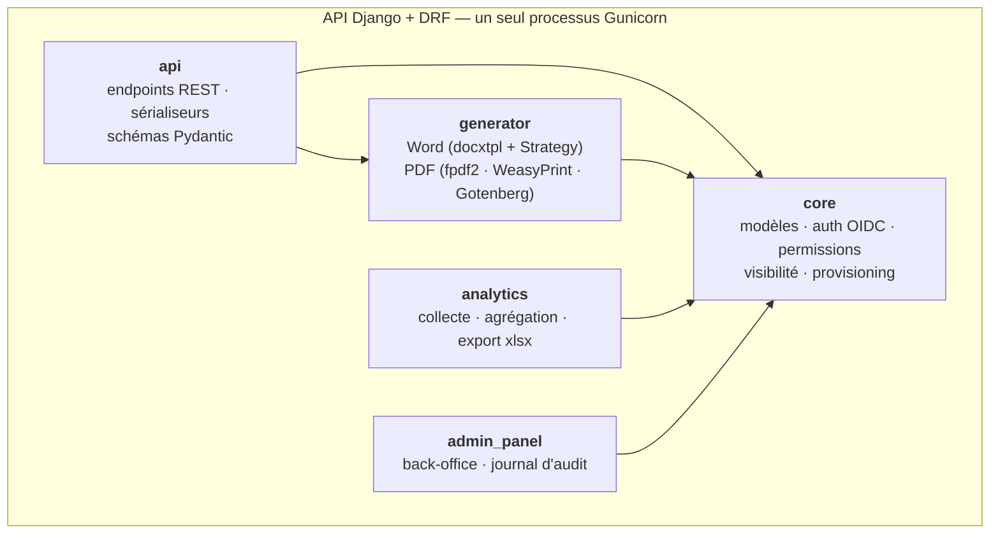
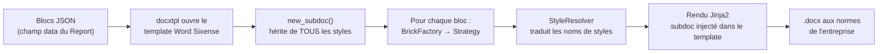

# Boost-Report — Backend Django

*Fiche projet 1/5 — dépôt `boost-reports`, dossier `generationrapports/`. Le cœur métier : cinq applications Django, deux moteurs de génération documentaire, le client OIDC.*
{: .meta }

## 0. Vocabulaire à connaître avant de lire

Application Django (« app »)
:   Module autonome dans un projet Django, avec ses modèles, ses vues et ses migrations. Un projet est un assemblage d'apps. Ce n'est **pas** un service : les cinq apps de Boost-Report tournent dans un seul processus.

DRF (Django REST Framework)
:   Surcouche de Django pour construire des API REST : sérialiseurs, ViewSets, routeurs, classes de permission, pagination, throttling.

Sérialiseur
:   Objet DRF qui convertit un modèle en JSON (sortie) et valide un JSON entrant avant de le transformer en modèle (entrée). Il porte à la fois la représentation et la validation.

ViewSet / routeur
:   Un **ViewSet** regroupe les actions CRUD d'une ressource (`list`, `retrieve`, `create`, `update`, `destroy`) plus des actions personnalisées. Le **routeur** en dérive automatiquement les URLs.

`docxtpl` / `python-docx`
:   `python-docx` manipule un document Word par programmation. `docxtpl` ajoute la logique de **template** : on part d'un vrai `.docx` contenant les styles de l'entreprise et on y injecte du contenu via des balises **Jinja2**.

Subdoc
:   Sous-document `docxtpl` qui **hérite des styles du template** parent. C'est le mécanisme qui permet de construire du contenu programmatiquement tout en restant dans la charte graphique.

Gotenberg
:   Service conteneurisé qui convertit des documents (DOCX, HTML…) en PDF en s'appuyant sur LibreOffice en arrière-plan.

WeasyPrint
:   Moteur Python qui convertit **HTML + CSS** en PDF, avec support des règles d'impression CSS (`@page`, sauts de page, en-têtes et pieds répétés).

`fpdf2`
:   Librairie Python générant un PDF **directement**, sans moteur de rendu intermédiaire. Beaucoup plus rapide, mais tout le placement est à écrire à la main.

Pydantic
:   Bibliothèque de validation de données par annotations de type Python. Utilisée ici pour valider la structure des blocs de contenu avant rendu.

Gunicorn
:   Serveur d'application WSGI qui exécute Django en production, avec plusieurs processus workers. Le `runserver` de Django n'est jamais destiné à la production.

Throttling
:   Limitation du débit de requêtes. Ici : 10 générations par minute et par utilisateur.

JIT-provisioning
:   Création automatique du compte utilisateur local à sa **première connexion** SSO, à partir des claims du fournisseur d'identité. Pas d'import préalable d'annuaire.

---

## 1. TL;DR



| Élément | Valeur |
|---|---|
| Stack | Python 3.11 · Django · Django REST Framework · Gunicorn |
| Base | PostgreSQL 17 (Azure Flexible Server), **13 tables** |
| Stockage | Azure Blob Storage (photos, documents générés) |
| Auth | Client **OIDC** vers SXE-Hub, écrit à la main + pont de service HS256 |
| Génération | Word via `docxtpl` + Strategy Pattern · PDF via `fpdf2`, WeasyPrint et Gotenberg selon le pipeline |
| Tests | ~1 062, sur PostgreSQL 17 réel en CI |
| Lint | Ruff (`check` + `format --check`), bloquants |

!!! jury "Le point de départ à raconter"
    Tout ça vient d'un **`views.py` de 586 lignes** qui mélangeait routage API, logique métier et génération de documents, plus un moteur de rendu de ~500 lignes construit en cascade de conditions. Le découpage en cinq apps et le Strategy Pattern sont la réponse à cette douleur — pas une architecture posée a priori.

---

## 2. Les cinq applications

### 2.1 `core` — le domaine

C'est l'app la plus dense, et c'est voulu : tout ce qui touche à **qui a le droit de voir quoi** y est centralisé.

| Fichier | Rôle |
|---|---|
| `models.py` | Les 13 entités du domaine |
| `oidc.py` | Client OIDC : découverte, code flow + PKCE, validation d'`id_token` |
| `oidc_views.py` | Endpoints `/api/oidc/login` et `/api/oidc/callback` |
| `authentication.py` | `OIDCSessionAuthentication` (session first-party) et `ServiceTokenAuthentication` (pont hub) |
| `permissions.py` | `IsAppAdmin`, `CanEditReport`, `ServiceTokenScopePermission` |
| `access.py` | **`filter_visible_queryset`** — la source unique de la règle de visibilité |
| `media_access.py` / `media_views.py` | Garde d'accès aux fichiers, adossée à la même règle |
| `provisioning.py` | JIT-provisioning depuis les claims OIDC |
| `services/` | Policies métier : `report_permission_policy`, `photo_appendix_permission_policy`, `comment_service`, `section_service`, `ai_reformulation_service`, `editor_assignment` |

!!! jury "Le principe « fat models » de Django"
    La convention Django est de garder la logique métier **au plus près des modèles**, et les vues fines (routage HTTP + sérialisation). C'est le raisonnement qui a guidé le refactoring. Nuance à apporter : quand la règle métier ne concerne pas un seul modèle — comme « qui a le droit d'éditer ce rapport », qui dépend de l'utilisateur, du rapport et du profil — elle sort dans un **objet policy** (`ReportPermissionPolicy`) plutôt que d'être écrasée dans un modèle. Fat models, oui, mais pas fourre-tout.

### 2.2 `api` — la couche de présentation

Les vues sont découpées **par ressource**, pas dans un fichier unique : `reports.py`, `photo_appendix.py`, `sections.py`, `comments.py`, `users.py`, `ai.py`. Idem pour les sérialiseurs.

`schemas.py` porte les **schémas Pydantic** qui valident la structure des blocs de contenu — une seconde ligne de validation, en amont du rendu, distincte de celle des sérialiseurs DRF qui valide les champs de l'API.

### 2.3 `generator` — la production documentaire

C'est l'app la plus riche techniquement, avec **trois pipelines coexistants**.

| Pipeline | Chaîne | Usage |
|---|---|---|
| **Rapport V1** | blocs JSON → `docxtpl` + Strategy → DOCX → **Gotenberg** (LibreOffice) → PDF | Rapports créés en V1 |
| **Rapport V2** | BlockNote → **HTML sémantique** → template Jinja2 + CSS charte → **WeasyPrint** → PDF | Nouveaux rapports |
| **Annexes photo** | photos + gabarit → **`fpdf2`** directement → PDF | Annexes photo |

Fichiers notables : `blocknote_html_converter.py`, `html_pdf_renderer.py`, `weasyprint_adapter.py`, `photo_appendix_direct_pdf.py`, `report_pdf_service.py`, `variable_resolver.py`, `caption_formatter.py`, `cover_context.py`, `exceptions.py`, et le paquet `brick_strategies/`.

### 2.4 `analytics` — le suivi d'adoption

Un tableau de bord **réservé aux administrateurs** : utilisateurs actifs par jour, semaine et mois, documents créés et finalisés, activité par agence et par template. Données **exportables en `.xlsx`** pour le reporting.

La collecte est passive : `OIDCSessionAuthentication` enregistre l'activité du jour à chaque requête authentifiée.

```python
@staticmethod
def _track_activity(user) -> None:
    """Enregistre l'activité du jour (analytics). Échec silencieux + log."""
    try:
        DailyActivity.objects.get_or_create(user=user, date=timezone.localdate())
    except Exception as e:
        logger.warning(f"Analytics tracking failed for {user.email}: {e}")
```

!!! jury "Le détail qui montre du métier"
    L'échec est **silencieux et loggué**. Une erreur d'analytics ne doit jamais faire échouer la requête de l'utilisateur : c'est une fonctionnalité secondaire, elle ne peut pas dégrader la fonctionnalité principale. C'est une décision consciente sur la **criticité** d'un composant, pas un `try/except` paresseux.

### 2.5 `admin_panel` et `admin_audit`

Le back-office gère utilisateurs, rôles et agences de rattachement. **Chaque action d'administration est tracée dans un journal d'audit conservant l'état avant et après modification** — c'est ce qui permet de répondre à « qui a changé ces droits, et depuis quoi ? ».

---

## 3. La chaîne de génération Word

### 3.1 Le mécanisme complet



Le point clé à savoir expliquer : **le template Word embarque déjà tout**. La charte graphique, la page de garde, le tableau de suivi des indices, l'ensemble des styles de Sixense Engineering. L'application vient **y injecter du contenu sans toucher à la mise en forme**. L'utilisateur n'a manipulé aucun style et le document sort directement aux normes.

### 3.2 Le `StyleResolver` — l'Adapter à ne pas oublier

Chaque template Word peut nommer ses styles différemment (« Titre 1 », « Heading 1 », « SXE Titre 1 »…). Le `StyleResolver` fait le lien entre les noms **attendus par l'application** et ceux **réellement présents** dans le template, via une table d'alias.

C'est une couche d'abstraction qui permet de **supporter plusieurs templates sans modifier le code de génération** — et c'est ce qui rend possible l'objectif de multi-template administrable par les lignes métier.

### 3.3 Le cache par empreinte

```python
# Principe du ReportPdfService
empreinte = sha256(f"{report.updated_at}{report.template_id}")
if empreinte == report.pdf_fingerprint and os.path.exists(report.pdf_path):
    return report.pdf_path          # cache hit : aucune génération
# cache miss → génération complète, puis mise à jour de l'empreinte et du chemin
```

Deux conditions, pas une : l'empreinte correspond **et** le fichier existe. La seconde protège du cas où le fichier a disparu (nettoyage, redémarrage, migration de stockage) alors que la base pense encore qu'il est là.

### 3.4 La migration du moteur PDF — la meilleure histoire technique du dossier

| | Avant | Après |
|---|---|---|
| Moteur | **Gotenberg** (DOCX → LibreOffice → PDF) | **`fpdf2`** (génération directe) |
| Temps | **20–30 secondes** | **~3 secondes** |
| Fidélité charte | Correcte | Page de garde, footer, mise en page respectées |
| Dépendance | Un conteneur tiers | Une librairie Python |

Le déclencheur n'est pas venu d'un test mais d'un **usage réel** : 20 à 30 secondes est inacceptable quand on veut simplement vérifier rapidement un aperçu.

!!! jury "Ce que cette migration prouve"
    Que la performance perçue est un critère fonctionnel, pas un raffinement. La chaîne DOCX → LibreOffice → PDF fonctionnait, passait les tests, et rendait la fonctionnalité pénible à utiliser. Aucune suite de tests n'aurait signalé ça. Le contrepoids honnête : `fpdf2` demande d'écrire tout le placement à la main, donc le gain de vitesse se paie en code de mise en page — un compromis acceptable ici parce que le gabarit d'annexe est très contraint (2, 4 ou 6 photos par page).

---

## 4. L'authentification, côté serveur

Le détail complet du flow OIDC est dans la [fiche Sécurité](03-securite-auth.html). Les points spécifiques au backend :

- Le **client OIDC est écrit en Python sans librairie tierce** (`core/oidc.py`), pour garder la maîtrise du flux : découverte avec cache 1 h, code flow + PKCE S256, validation RS256 via `PyJWKClient` sur le JWKS du hub, contrôle de `iss` / `aud` / `exp` / `nonce`.
- La session applicative est un **cookie Django first-party**. `OIDCSessionAuthentication` hérite de `SessionAuthentication`, donc **l'enforcement CSRF s'applique** sur toutes les méthodes non sûres.
- `authenticate_header` est surchargée pour renvoyer `"Session"`, ce qui force DRF à répondre **401** (et non 403) aux requêtes anonymes — c'est ce que le SPA intercepte pour relancer le login OIDC.
- Le rôle applicatif est **ré-appliqué à chaque requête** depuis la session, sans toucher au modèle `User` de Django.
- Le **pont de service** (`ServiceTokenAuthentication`) accepte un JWT HS256 court émis par le hub, borné par `ServiceTokenScopePermission` à une allowlist stricte.

---

## 5. Ce qui a changé depuis la rédaction du dossier

Une section à connaître : si le jury regarde le dépôt, il verra des choses que le dossier ne décrit pas.

- **Un pipeline staging + production.** `deploy.yml` déploie le staging à chaque push sur `main` ; `deploy-prod.yml` promeut les images du commit taggé **sans rebuild** à la publication d'une release GitHub. Le dossier décrit l'état antérieur, où chaque merge partait directement en production.
- **Un domaine dédié** pour la production.
- Des services supplémentaires : `ai_reformulation_service` (aide à la reformulation), `portal_notifications` (notifications vers le hub), `share_appendix` (partage d'annexes), `templates_registry`.
- Le registre est **Azure Container Registry** (`sxehubcr.azurecr.io`), plus le registre GitLab.

!!! attention "Comment le présenter"
    Ne pas cacher l'écart : « le dossier documente l'état à sa rédaction, le projet a continué d'évoluer depuis, voici ce qui a bougé ». Un projet figé au moment du dossier serait un moins bon signal qu'un projet qui vit.

---

## 6. Code essentiel à savoir expliquer

### 6.1 La règle de visibilité — source unique

```python
# core/access.py
def filter_visible_queryset(user, qs):
    """
    - anonyme          → queryset vide
    - admin applicatif → tout
    - visibility == 3  → tout
    - visibility == 2  → ressources liées aux agences de l'utilisateur
    - autre            → ressources créées par l'utilisateur
    """
    if not getattr(user, "is_authenticated", False):
        return qs.none()
    if getattr(user, "is_app_admin", False):
        return qs

    extra_q = _extra_visibility_q(qs.model, user)   # editor/reviewer, shared_with
    ...
    if visibility == 2:
        agency_ids = UserAgency.objects.filter(user=user).values_list("agency_id", flat=True)
        base_q = Q(agency__in=agency_ids)
    else:
        base_q = Q(created_by=user)

    if extra_q is not None:
        return qs.filter(base_q | extra_q).distinct()
    return qs.filter(base_q)
```

À souligner : consommée **à la fois** par le `VisibilityFilterMixin` des ViewSets **et** par la `MediaAccessPolicy` des fichiers. Une seule source de vérité pour la liste JSON et pour le fichier binaire.

### 6.2 Le verrouillage des mutations

```python
# core/permissions.py
class CanEditReport(BasePermission):
    """Verrouille les mutations sur un Report au rédacteur actif."""

    def has_object_permission(self, request, view, obj):
        if request.method in SAFE_METHODS:
            return True
        return ReportPermissionPolicy.can_edit(user=request.user, report=obj)
```

La règle métier n'est **pas** dans la classe de permission : elle est déléguée au policy object, donc testable seule et réutilisable ailleurs.

### 6.3 L'interface des stratégies de rendu

```python
# generator/brick_strategies/base.py
class AbstractStrategy(ABC):
    def __init__(self, data: dict[str, Any]):
        self.data = data

    @abstractmethod
    def execute(self, subdoc, resolver: StyleResolver) -> None:
        """Insère le contenu de la brique dans le sous-document Word."""
```

### 6.4 Le runner, qui ne connaît aucun type de bloc

```python
# generator/brick_strategies/runner.py
def render_bricks(tpl, bricks: Sequence[dict[str, Any]]):
    sd = tpl.new_subdoc()
    resolver = StyleResolver(sd.part.document)
    for brick_data in bricks:
        strategy = BrickFactory.create(brick_data)
        if strategy:
            strategy.execute(sd, resolver)
    return sd
```

---

## 7. Questions probables du jury

### Q1. Pourquoi Django plutôt que FastAPI ou Flask ?

Trois raisons, dans l'ordre où elles ont compté. C'est un framework que je connais bien, ce qui comptait pour démarrer vite sur un projet où j'étais seul. Il apporte **l'ORM, les migrations, l'admin et l'authentification** en standard, là où Flask demande d'assembler tout ça et où FastAPI n'a pas d'ORM intégré. Et il a un écosystème mature pour ce que je devais faire, notamment DRF pour l'API. À noter que sur SXE-Hub j'ai choisi **FastAPI**, parce que le besoin était différent : beaucoup d'asynchrone, un bus temps réel, pas d'admin à générer. Le choix de framework dépend du problème, pas d'une préférence.

### Q2. Cinq applications Django, ce n'est pas de la sur-découpe ?

Chacune a une raison de changer distincte. `generator` change quand le format de sortie évolue — c'est arrivé trois fois : Gotenberg, `fpdf2`, WeasyPrint. `core` change quand le domaine ou les règles d'accès évoluent. `analytics` change quand on veut suivre une nouvelle métrique. Ces trois évolutions sont indépendantes et se sont produites à des moments différents. Le test que j'applique : si deux modules changent toujours ensemble, ils devraient n'en faire qu'un. Ce n'est le cas d'aucune de ces cinq apps.

### Q3. Trois moteurs PDF dans la même application, ce n'est pas beaucoup ?

C'est le prix d'une migration progressive, et je l'assume. `fpdf2` couvre les annexes photo — gabarit contraint, vitesse critique, gain de 20-30 s à 3 s. WeasyPrint couvre l'éditeur V2, parce que le contenu part de HTML et que le rendu doit être fidèle à ce que l'utilisateur voit dans l'éditeur. Gotenberg ne subsiste que pour les rapports **créés en V1**, qui doivent rester régénérables à l'identique : chaque rapport reste sur la version avec laquelle il a été créé. La dette est réelle et bornée : Gotenberg disparaîtra quand plus aucun rapport V1 actif n'existera. Casser la régénération de documents déjà livrés à des clients aurait été inacceptable.

### Q4. Comment le contenu d'un rapport est-il structuré en base ?

Chaque bloc est un objet JSON avec un `type` et des propriétés, et l'ensemble du contenu est un **tableau de ces objets** stocké dans un champ JSON du modèle `Report`. Les sections ont chacune leur propre contenu JSON, typées `FORM` ou `FREE` avec un indicateur de progression. Le choix de ne pas normaliser est délibéré : le contenu est un arbre de blocs hétérogènes, toujours lu et écrit intégralement, et son format évolue avec l'éditeur — une migration de schéma à chaque évolution de format serait ingérable. La validation de ce JSON est faite en amont par des **schémas Pydantic**, ce qui compense l'absence de contrainte structurelle en base.

### Q5. Votre génération est synchrone. Que se passe-t-il si elle échoue à mi-parcours ?

Les erreurs métier sont isolées dans des **exceptions dédiées** (`generator/exceptions.py`) et remontent en réponse HTTP explicite plutôt qu'en 500 opaque. Le rapport en base n'est pas modifié tant que la génération n'a pas abouti : l'empreinte de cache et le chemin ne sont écrits qu'après succès, donc un échec ne laisse pas la base en état incohérent. Ce qui peut rester, c'est un fichier partiel sur le stockage — un déchet, pas une corruption, et le prochain cache miss l'écrase. Le vrai risque du synchrone n'est pas la cohérence mais le **timeout** de la Web App sur un rapport très volumineux ; c'est ce qui justifierait le passage à Celery.

### Q6. Comment testez-vous la génération de documents ?

À plusieurs niveaux. Chaque **stratégie de rendu** est testée isolément : on lui donne un bloc, on vérifie ce qu'elle produit dans le sous-document — c'est précisément ce que le Strategy Pattern a rendu possible, l'ancienne cascade de conditions n'était testable qu'en entier. Le `StyleResolver` et le `variable_resolver` ont leurs propres tests. Le traitement d'images aussi. Et des tests d'intégration tapent les vrais endpoints et vérifient qu'un document sort. Ce que je **ne** teste pas, c'est le **rendu visuel** : je vérifie que le contenu est présent, pas qu'il est joliment placé. Un changement de style dans le template Word passerait au vert — c'est une limite que j'ai identifiée, et un test de comparaison d'image serait la réponse.

### Q7. Le pont de service permet au hub d'impersonner un utilisateur. Ce n'est pas risqué ?

Si, c'est le mécanisme le plus sensible du projet, et il est conçu en conséquence. Le token est signé HS256 avec un secret partagé, a un **TTL d'environ 120 secondes**, et surtout il est borné par `ServiceTokenScopePermission` à une allowlist stricte : lister, lire et créer des annexes photo, lire les agences, lire `/api/me/`. Tout le reste — upload, génération, suppression, rapports, administration — est refusé, et le refus est **par défaut** : une route ajoutée demain est fermée sans que j'aie à y penser. Le raisonnement explicite était : si le secret fuite, quel est le rayon de souffle ? La réponse est « créer et lire des annexes », ce qui est acceptable. Ce serait inacceptable sans l'allowlist.

### Q8. Qu'est-ce que vous referiez différemment sur ce backend ?

Deux choses. D'abord, j'aurais modélisé le **workflow de rédaction** comme une machine à états explicite dès le départ : les transitions brouillon → relecture → validé sont aujourd'hui réparties entre les permissions, les vues et le modèle, ce qui les rend difficiles à vérifier d'un coup d'œil. C'est exactement le même raisonnement qui m'a fait sortir `ReportPermissionPolicy`, appliqué à un domaine que je n'ai pas encore traité. Ensuite, j'aurais posé le **contrat du pont hub → Boost-Report** dans un schéma partagé et testé, plutôt que dans des constantes alignées par commentaire dans les deux dépôts. Aujourd'hui une divergence d'`audience` ou de `scope` ne serait détectée qu'en production.
