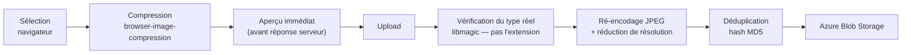

# Boost-Report — Frontend React

*Fiche projet 2/5 — dépôt `boost-reports`, dossier `generationrapports_front/`. Architecture feature-based, éditeur V1 et V2, annexes photo, tests.*
{: .meta }

## 0. Vocabulaire à connaître avant de lire

SPA (Single Page Application)
:   Application où une seule page HTML est chargée, le routage et le rendu se faisant ensuite côté navigateur. Avantage : pas de rechargement complet. Inconvénients : premier chargement plus lourd, référencement à traiter, état client à gérer.

Vite
:   Outil de build moderne. En développement il sert les modules ES natifs (démarrage quasi instantané, rechargement à chaud) ; en production il empaquette via Rollup.

Hot reload / HMR
:   Remplacement à chaud des modules modifiés **sans perdre l'état** de l'application. C'est la différence avec un simple rafraîchissement de page.

TanStack Query
:   Bibliothèque de gestion de l'**état serveur** : cache, invalidation, revalidation, gestion des états de chargement et d'erreur, mutations optimistes. Elle ne gère pas l'état purement local.

État serveur / état client
:   L'**état serveur** est une copie locale d'une donnée dont la source de vérité est ailleurs (le back) — il peut être périmé. L'**état client** n'existe que dans le navigateur (un panneau ouvert, un brouillon non envoyé). Les confondre est la principale source de complexité dans un front.

Optimistic UI
:   Afficher immédiatement le résultat attendu d'une action **avant** la confirmation du serveur, et revenir en arrière en cas d'échec. La perception de vitesse est très supérieure.

TanStack Router
:   Routeur React **typé de bout en bout**, avec chargement de données au niveau de la route (`loader`), contexte typé et gardes.

ProseMirror / TipTap / BlockNote
:   Trois couches empilées. **ProseMirror** est le moteur d'édition de texte riche bas niveau (modèle de document, transactions, historique). **TipTap** est une surcouche ergonomique. **BlockNote** est une surcouche de TipTap, orientée **blocs** avec commandes slash — c'est ce que j'utilise.

Slash command
:   Menu contextuel ouvert en tapant `/` dans l'éditeur, proposant les types de blocs insérables. Popularisé par Notion.

Radix UI / shadcn/ui
:   **Radix** fournit des primitives d'interface **non stylées mais accessibles** (navigation clavier, ARIA, piège de focus). **shadcn/ui** est un ensemble de composants construits dessus, **copiés dans le projet** plutôt qu'installés en dépendance — on garde la main sur le code.

dnd-kit
:   Bibliothèque de glisser-déposer pour React, accessible au clavier.

Vitest / Testing Library
:   **Vitest** est le lanceur de tests, aligné sur Vite. **Testing Library** encourage à tester du point de vue de l'utilisateur — on cherche un élément par son rôle ou son texte, pas par sa classe CSS.

Playwright
:   Outil de test end-to-end pilotant un vrai navigateur, avec **auto-waiting** : il attend qu'un élément soit réellement actionnable au lieu de dormir un temps arbitraire.

---

## 1. TL;DR

| Élément | Valeur |
|---|---|
| Stack | **React 19** · **Vite 7** · **TypeScript 5.9** · **Tailwind 4** |
| Routage | TanStack Router (typé, avec `loader` et gardes) |
| État serveur | TanStack Query |
| Composants | shadcn/ui sur primitives **Radix** |
| Éditeur V2 | **BlockNote** (sur TipTap / ProseMirror) |
| Glisser-déposer | dnd-kit |
| Annotation photo | Konva / react-konva |
| Formulaires | react-hook-form + **Zod** |
| Onboarding | react-joyride |
| Tests | Vitest + Testing Library (~529) · **Playwright** (30 scénarios E2E) |
| Lint | ESLint 9 + typescript-eslint, bloquant en CI |
| Runtime CI | **Bun** |

L'architecture est **feature-based** (ADR-005) : chaque domaine métier isolé sous `features/`, avec ses composants, hooks, appels API et types.

!!! jury "Pourquoi ce front compte autant"
    « L'outil ne sert à rien si les ingénieurs le trouvent plus pénible que Word. » Tout le raisonnement technique du front découle de cette phrase : Vite pour un rechargement immédiat pendant le développement, Tailwind pour styliser sans se battre avec une librairie imposée, BlockNote pour une expérience de rédaction fluide, l'optimistic UI pour supprimer l'attente perçue.

---

## 2. L'organisation du code

```
src/
├── app/                       # pages, groupées par layout
│   ├── (main)/                # dashboard, admin/analytics, admin/users
│   └── (standalone)/          # editor/[id], editor-v2/[id], photo-appendix/[id]
├── features/                  # 8 domaines métier isolés
│   ├── auth/  editor/  editor-v2/  reports/
│   ├── photo-appendix/  onboarding/  admin/  analytics/
├── components/
│   ├── ui/                    # primitives shadcn — aucune logique métier
│   └── common/
├── lib/                       # api-client, download, logger, utils
├── router.tsx                 # arbre de routes typé
└── main.tsx                   # providers et bootstrap
```

Chaque feature porte sa pile complète :

```
features/photo-appendix/
├── api/          queries.ts · mutations.ts (+ mutations.test.ts)
├── components/   photo-gallery · photo-card · annotation-* · upload-zone · wizard/
├── hooks/
├── types/
├── utils/
└── index.ts      ← point d'entrée public, la seule surface exposée
```

!!! jury "La règle, et sa limite"
    « Les composants d'une feature n'importent pas ceux d'une autre, sauf à travers un point d'entrée explicite. » C'est ce qui fait tenir la modularité. La limite honnête : la règle est aujourd'hui tenue par la **convention et la revue**, pas par l'outillage. Une règle ESLint `no-restricted-imports` interdisant les chemins profonds dans `features/*/` ferait échouer la CI — c'est le garde-fou qui manque, et j'aurais dû l'ajouter en même temps que l'ADR.

Les tests sont **colocalisés** avec le code qu'ils testent (`photo-card.tsx` / `photo-card.test.tsx`), et non regroupés dans un dossier `tests/` parallèle. Le fichier de test se déplace avec son composant, et son absence se voit immédiatement.

---

## 3. L'éditeur : de la V1 à la V2

### 3.1 La V1 — éditeur maison par briques

Le parcours passe par un **wizard en trois étapes** : type de document → informations projet (nom, ouvrage, client, agence, rédacteur, qui alimentent directement la page de garde) → éditeur.

L'éditeur repose sur un **système de blocs** : un panneau de droite propose les types disponibles (titres, paragraphes, listes, images, tableaux, encadrés, sauts de page), l'utilisateur les ajoute un par un et les réordonne par glisser-déposer. Chaque bloc est éditable dans le canvas central.

**Ce qui n'allait pas** : l'utilisateur manipule des blocs un par un, avec un panneau de propriétés, et **ne peut pas taper en continu** dans le document. Pour un outil censé simplifier la rédaction au quotidien, c'est le mauvais modèle d'interaction.

### 3.2 La V2 — BlockNote

| | V1 | V2 |
|---|---|---|
| Édition | Blocs ajoutés un par un | **Frappe continue**, comme un traitement de texte |
| Insertion | Panneau de droite | **Commandes slash** (`/` ouvre le menu) |
| Mise en forme | Panneau de propriétés | Barre d'outils **contextuelle** |
| Base technique | Composants maison | BlockNote → TipTap → ProseMirror |
| Sortie PDF | DOCX → LibreOffice | **HTML sémantique** → Jinja2 + CSS charte → WeasyPrint |

Le changement de pipeline de sortie est la conséquence directe du changement d'éditeur : puisque le contenu est du HTML, générer le PDF **depuis ce HTML** donne un rendu fidèle à ce que l'utilisateur voit, sans les écarts qu'introduisait la conversion Word → PDF.

Le développement s'est organisé en **quatorze phases livrées progressivement**. La V2 **coexiste** avec la V1 : chaque rapport reste sur la version avec laquelle il a été créé.

!!! jury "Défendre la coexistence des deux éditeurs"
    C'est de la dette assumée, avec une raison métier. Des rapports V1 ont été livrés à des clients et doivent rester **régénérables à l'identique**. Migrer leur contenu vers le format V2 impliquerait un risque de dérive de rendu sur des documents déjà validés. La dette est bornée dans le temps : elle disparaît quand plus aucun rapport V1 actif n'existe.

### 3.3 Les fonctionnalités de la V2

- **Modèle de sections** — le rapport s'organise en parties distinctes avec suivi de progression.
- **Sommaire interactif** avec glisser-déposer pour réordonner les sections.
- **Variables insérables** dans le texte, résolues automatiquement à la génération du PDF.
- **Commentaires ancrés au texte** pour la relecture collaborative.
- **Aide à la reformulation par IA** pour assister les ingénieurs.
- **Autosave** avec indicateur d'état (`autosave-indicator.tsx`).
- **Notepad** — bloc-notes latéral.

!!! note "L'inspiration"
    L'orientation vers un éditeur par blocs avec commandes slash vient de la **veille technologique** : la découverte de **La Suite numérique de l'État** et de son outil **Docs**, un éditeur collaboratif open source. Ce n'est pas un détail anecdotique — c'est un exemple concret et vérifiable de veille qui débouche sur une décision technique.

---

## 4. Les annexes photo — la fonctionnalité en production

C'est la **première fonctionnalité livrée**, celle qui tourne quotidiennement.

### 4.1 Le parcours

1. Même wizard, type « Annexe » ;
2. galerie photo : import par **glisser-déposer** depuis l'explorateur ou zone d'upload, par lots de **20 maximum** ;
3. légende par photo, réordonnancement par glisser-déposer ou en modifiant directement l'index ;
4. choix du **gabarit** : 1 colonne / 2 photos par page, 2 colonnes / 4 par page, 2 colonnes / 6 par page ;
5. **aperçu PDF intégré** dans un panneau redimensionnable, sans téléchargement ;
6. génération du Word ou du PDF, à la charte, avec page de garde et numérotation automatique.

### 4.2 La chaîne de traitement d'une image



Deux compressions successives, et c'est voulu : celle du navigateur limite le **temps de transfert**, celle du serveur optimise pour la **génération du document**.

### 4.3 Les évolutions issues des retours utilisateurs

Toutes viennent de sprint reviews ou d'usages réels sur de vraies missions :

| Besoin remonté | Réponse |
|---|---|
| Photos prises en orientation différente | **Rotation** avec rendu immédiat (optimistic UI) |
| Remplacer une photo sans perdre son travail | Remplacement **conservant légende et position** |
| Insérer des photos à un endroit précis | Dépôt **directement dans la galerie**, avec indicateur visuel de position (`drop-indicator.tsx`) |
| Pointer un désordre sur une photo | **Éditeur d'annotations** — dessin direct sur l'image (Konva) |
| « Figure » ne convient pas à tous les cas | **Préfixes personnalisables** : Figure, Photo, personnalisé, aucun — modifiable photo par photo |
| Aperçu trop long à obtenir | Migration Gotenberg → `fpdf2` : **20-30 s → ~3 s** |

### 4.4 L'optimistic UI sur la rotation

```tsx
// Principe — TanStack Query
useMutation({
  mutationFn: rotatePhoto,
  onMutate: async (vars) => {
    await queryClient.cancelQueries({ queryKey })      // évite qu'un refetch écrase
    const previous = queryClient.getQueryData(queryKey) // snapshot pour le rollback
    queryClient.setQueryData(queryKey, applyRotation)   // affichage immédiat
    return { previous }
  },
  onError: (_e, _v, ctx) => queryClient.setQueryData(queryKey, ctx.previous), // rollback
  onSettled: () => queryClient.invalidateQueries({ queryKey }),               // resync
})
```

Les quatre temps sont tous nécessaires : annuler les requêtes en vol, **capturer l'état pour pouvoir revenir en arrière**, appliquer le changement, et resynchroniser à la fin quel que soit le résultat. Sans le snapshot, un échec laisse l'interface dans un état faux — c'est l'erreur classique de l'optimistic UI mal implémenté.

---

## 5. L'onboarding intégré

**Le problème** : les utilisateurs avaient besoin d'être guidés, surtout à chaque nouvelle fonctionnalité. Multiplier les présentations individuelles ne passe pas à l'échelle.

**La solution** : un tutoriel interactif en plusieurs étapes (react-joyride) qui guide l'utilisateur à sa première visite, avec un **mécanisme de versioning** — chaque tour porte un numéro de version stocké dans le profil utilisateur. Quand une mise à jour ajoute des étapes, la version est incrémentée et **le tour se relance automatiquement** pour ceux qui avaient déjà vu l'ancienne.

!!! jury "Pourquoi c'est plus qu'un gadget"
    Ça répond à un problème d'**adoption**, qui est le vrai risque d'un outil interne : un outil que personne n'utilise n'a aucune valeur, quelle que soit sa qualité technique. Et le versioning est le détail qui fait la différence entre un tutoriel vu une fois et un mécanisme qui accompagne réellement l'évolution du produit.

---

## 6. Le routage et l'authentification côté client

```tsx
// router.tsx — le contexte typé du routeur
interface RouterContext {
  auth: {
    user: SessionUser | null | undefined
    isAuthenticated: boolean
  }
  queryClient: QueryClient
}
```

Points à savoir expliquer :

- **Aucun token n'est manipulé côté client.** L'utilisateur de session est dérivé de `/api/me/`, la session est un cookie `HttpOnly` que le JavaScript ne voit pas.
- Le SPA intercepte les réponses **401** pour relancer le login OIDC — c'est pour ça que le backend surcharge `authenticate_header`, afin de répondre 401 et non 403.
- Les gardes (`ensureAdmin`) s'appliquent au niveau de la route, **avant** le rendu.
- Les **devtools** (TanStack Router et Query) sont chargés en `lazy` et **uniquement si `import.meta.env.DEV`** — ils ne sont pas dans le bundle de production.

!!! attention "La garde client n'est pas une sécurité"
    `ensureAdmin` masque une route dans l'interface ; elle ne protège rien. N'importe qui peut appeler l'API directement. La sécurité réelle est **côté serveur** : `IsAppAdmin` sur les endpoints, et `filter_visible_queryset` sur les données. La garde client est de l'ergonomie — ne jamais la présenter comme un contrôle d'accès.

---

## 7. Les tests front

| Niveau | Outil | Volume |
|---|---|---|
| Composants et hooks | **Vitest** + Testing Library + jsdom | ~529 tests, colocalisés |
| Parcours utilisateur | **Playwright** | 30 scénarios |

Ce que Testing Library change dans la façon d'écrire un test :

```tsx
// On cherche ce que l'utilisateur voit, pas la structure du DOM
const bouton = screen.getByRole("button", { name: /générer le pdf/i })
await userEvent.click(bouton)
expect(await screen.findByText(/document généré/i)).toBeInTheDocument()
```

Chercher par **rôle et texte accessible** rend le test insensible au refactoring de structure ou de classes CSS, et vérifie au passage que l'élément est accessible. Un test qui utilise `container.querySelector(".btn-primary")` casse au moindre changement de style sans que le comportement ait bougé.

---

## 8. Questions probables du jury

### Q1. Pourquoi React plutôt que Vue ou Angular ?

C'est l'environnement où j'étais le plus à l'aise, ce qui comptait beaucoup sur un projet où j'étais seul développeur avec des délais courts. Au-delà de ça, l'écosystème a pesé : les briques dont j'avais besoin — un éditeur de texte riche par blocs, du glisser-déposer accessible, de l'annotation sur canvas, un tutoriel interactif — existaient toutes et étaient matures en React. Sur un outil dont l'adoption dépendait entièrement de la qualité de l'interface, ne pas avoir à réinventer ces briques était décisif. Ce n'est pas un argument technique absolu : Vue aurait probablement fonctionné, mais avec plus de composants à écrire moi-même.

### Q2. Vous stockez l'état serveur dans TanStack Query et pas dans Redux. Pourquoi ?

Parce que ce sont deux problèmes différents et que la plupart des projets les confondent. L'essentiel de ce qu'un front manipule n'est pas de l'état applicatif : c'est une **copie locale de données dont la source de vérité est le serveur** — elle peut être périmée, doit être revalidée, mise en cache, invalidée après une mutation. TanStack Query traite exactement ça. Redux traite l'état client complexe et partagé, dont je n'ai presque pas : quelques préférences d'interface, gérées par des contextes React. Mettre des données serveur dans Redux revient à réécrire à la main un cache, une invalidation et une gestion d'états de chargement, moins bien.

### Q3. Pourquoi être passé de votre éditeur maison à BlockNote ? C'est jeter du travail.

La V1 a rempli son rôle : elle a prouvé que le concept fonctionnait et permis de valider la chaîne complète jusqu'au Word généré. Mais son modèle d'interaction était le mauvais : on ajoute des blocs un par un via un panneau, on ne peut pas taper en continu. Pour un outil dont l'argument est « c'est plus simple que Word », c'est rédhibitoire. Maintenir un éditeur de texte riche maison est par ailleurs un puits sans fond — la gestion du curseur, des sélections, de l'historique, du copier-coller, des cas limites de ProseMirror représente des années de travail chez ceux qui le font bien. BlockNote apporte tout ça, et je reste concentré sur ce qui a de la valeur pour Sixense : le rendu à la charte et l'intégration métier.

### Q4. Quel est l'impact du bundle sur les performances ?

Vite fait du code splitting par route, et les devtools sont chargés en `lazy` conditionnellement à `import.meta.env.DEV` — ils ne sont pas dans le bundle de production. Cela dit, je dois être honnête : **je n'ai pas mesuré**. Pas de budget de bundle, pas de Lighthouse en CI, pas de suivi de la taille dans le temps. Sur une application **interne**, accédée depuis le réseau d'entreprise sur des postes de bureau, la latence de chargement n'est pas le facteur limitant — ce qui l'était, c'était le temps de génération PDF, que j'ai mesuré et traité. Mais l'absence de mesure reste une limite : je ne saurais pas dire si une dépendance ajoutée a doublé le bundle.

### Q5. Comment gérez-vous les erreurs côté client ?

À trois niveaux. Les erreurs de requête sont portées par TanStack Query, qui expose un état d'erreur par requête, permettant d'afficher un message ciblé plutôt qu'une page blanche. Un `ErrorComponent` au niveau du routeur attrape ce qui remonte plus haut. Et les erreurs utilisateur — validation de formulaire — sont traitées en amont par **Zod** via react-hook-form, donc affichées au champ concerné sans aller-retour serveur. Le retour visuel passe par des toasts (sonner). Ce qui manque : je n'ai **pas** de remontée d'erreurs côté serveur type Sentry — une erreur JavaScript chez un utilisateur ne m'est pas signalée, je ne la connais que s'il me la rapporte.

### Q6. 30 scénarios E2E, comment choisissez-vous ce que vous testez ?

Par le coût d'une régression, pas par la couverture. Les trois flux couverts sont ceux dont la panne rend l'outil inutilisable : la navigation générale, la création d'un document, et l'import de photos — qui est le cœur de la fonctionnalité en production. Je ne teste **pas** les cas limites en E2E : ils sont couverts en unitaire et en intégration, où l'échec est rapide et localisé. Un E2E est lent et sa panne indique seulement « quelque chose est cassé quelque part ». La règle que je m'applique : si un scénario E2E devient intermittent, je le réécris ou je le supprime, parce qu'un test auquel on n'accorde pas confiance apprend à ignorer le rouge.

### Q7. L'optimistic UI, que se passe-t-il si le serveur refuse ?

Le rollback est explicite et fait partie du code, pas d'un espoir. Dans `onMutate`, j'annule les requêtes en vol pour éviter qu'un refetch écrase mon changement, je **capture l'état précédent** dans le contexte de la mutation, puis j'applique le changement dans le cache. Si le serveur refuse, `onError` restaure ce snapshot et un toast informe l'utilisateur. Et `onSettled` invalide la requête dans tous les cas, ce qui resynchronise avec la vérité serveur qu'on ait réussi ou échoué. C'est le snapshot qui est le point critique : sans lui, un échec laisse une interface qui affiche quelque chose qui n'existe pas en base.

### Q8. TypeScript vous a-t-il réellement servi ?

Oui, principalement sur deux points. D'abord la frontière avec l'API : les types des réponses sont déclarés par feature, donc une évolution de contrat backend — un champ renommé, un champ devenu nullable — casse la compilation plutôt que de produire un `undefined` silencieux à l'exécution. Ensuite le routeur : TanStack Router est typé de bout en bout, donc les paramètres de route et le contexte sont vérifiés à la compilation. La limite honnête est que ces types sont **déclarés à la main** et non générés depuis le schéma OpenAPI de l'API. Rien ne garantit qu'ils correspondent : si le backend change et que je ne mets pas le type à jour, TypeScript valide une fiction. Générer les types depuis le schéma OpenAPI de DRF est l'amélioration qui rendrait cette garantie réelle.
