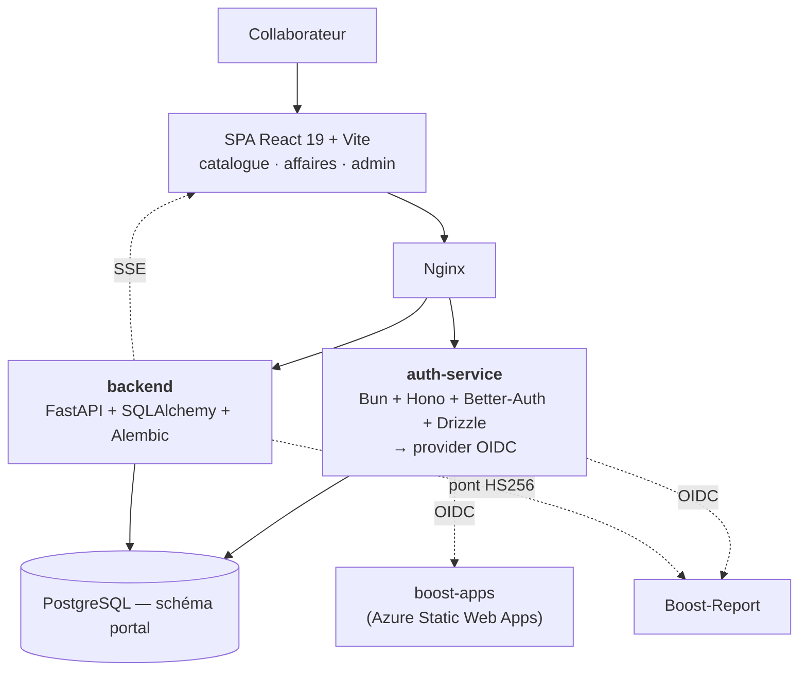

# SXE-Hub — le portail applicatif

*Fiche projet 3/5 — dépôt `boost-tools`. Le hub qui catalogue les outils métier et sert de fournisseur d'identité à toute la suite.*
{: .meta }

## 0. Vocabulaire à connaître avant de lire

Fournisseur d'identité (IdP / OP)
:   Le service qui **authentifie** l'utilisateur et émet les jetons d'identité. En terminologie OIDC : *OpenID Provider*. Les applications qui le consomment sont des *Relying Parties*. SXE-Hub joue ce rôle pour Boost-Report et boost-apps.

SSO (Single Sign-On)
:   L'utilisateur s'authentifie **une fois** et accède à l'ensemble des applications de la suite sans se ré-identifier.

FastAPI
:   Framework Python asynchrone pour API, basé sur les annotations de type. Validation par **Pydantic**, documentation OpenAPI générée automatiquement, injection de dépendances native.

SQLAlchemy
:   ORM Python. Contrairement à Django, ce n'est **pas** un framework complet : il ne fournit que la couche données. Style « déclaratif » : des classes annotées correspondant aux tables.

Alembic
:   Outil de migration de schéma pour SQLAlchemy. Équivalent des migrations Django, mais **explicite** : la migration est générée par comparaison entre les modèles et la base (`autogenerate`), puis relue à la main.

Bun
:   Runtime JavaScript alternatif à Node.js — plus rapide au démarrage, avec gestionnaire de paquets, exécuteur de tests et bundler intégrés.

Hono
:   Framework web minimaliste pour Bun / Deno / Node / Workers. Rôle équivalent à Express, mais typé et beaucoup plus léger.

Better-Auth
:   Bibliothèque d'authentification TypeScript. Gère sessions, comptes, providers sociaux — et, via un plugin, expose un **provider OIDC** complet : c'est ce qui fait du hub un IdP.

Drizzle
:   ORM TypeScript typé, proche du SQL. `drizzle-kit` génère les migrations, Drizzle Studio permet d'inspecter les données.

SSE (Server-Sent Events)
:   Canal HTTP **unidirectionnel** serveur → client, sur une connexion longue. Plus simple que les WebSockets quand le client n'a rien à envoyer. Reconnexion automatique gérée par le navigateur.

Pub/Sub
:   Modèle de diffusion où des émetteurs publient sur un canal et des abonnés reçoivent, sans se connaître. Ici : Redis pub/sub pour partager les événements entre plusieurs workers.

Schéma PostgreSQL
:   Espace de noms **à l'intérieur** d'une base, regroupant des tables. Le hub utilise le schéma `portal`, ce qui permet de cohabiter avec d'autres applications dans la même base Azure.

Fail-fast
:   Refuser de démarrer plutôt que de tourner dans une configuration silencieusement incorrecte. Deux occurrences dans ce dépôt, détaillées plus bas.

---

## 1. TL;DR

SXE-Hub est un **portail** : catalogue d'applications métier, identité centralisée, lanceur, et suivi des affaires.



| Élément | Valeur |
|---|---|
| SPA | React 19 · Vite · TypeScript |
| IdP | **Bun + Hono + Better-Auth + Drizzle** — expose le provider OIDC |
| API | **FastAPI + SQLAlchemy + Alembic** |
| Base | PostgreSQL, schéma `portal` |
| Temps réel | **SSE**, bus en mémoire ou **Redis** selon la configuration |
| Déploiement | Azure App Service multi-conteneurs, images sur `sxehubcr.azurecr.io` |
| CI/CD | `ci.yml` (lint + build + tests des 3 composants sur PR) · `deploy.yml` (build + push ACR + webhook au merge) |

!!! jury "Le changement d'échelle, à raconter"
    Le hub n'était pas prévu. Il est né d'un **séminaire en comité restreint avec le directeur de l'innovation** : le travail sur Boost-Report a montré qu'un outil interne pouvait répondre aux besoins des équipes, et l'idée est devenue de mutualiser des applications métier sur un portail unique. Je suis responsable de la partie technique et développement. Boost-Report en est devenu la **première application intégrée**.

---

## 2. Les trois composants

### 2.1 `auth-service` — l'IdP

Bun + Hono + Better-Auth + Drizzle. C'est l'héritier direct du service d'authentification initial de Boost-Report : la même stack, **promue** au rang de fournisseur d'identité de toute la suite au lieu de servir une seule application.

Ce qu'il expose :

- l'authentification des collaborateurs (Better-Auth) ;
- un **provider OIDC** complet : discovery, autorisation, token, JWKS, endsession — c'est ce qui permet à Boost-Report et boost-apps d'être de simples clients OIDC ;
- un pont de **notification** (`/api/notifications/email`), utilisé par Boost-Report pour envoyer des emails via le portail.

Deux décisions de sécurité visibles dès l'entrée :

```ts
// auth-service/src/index.ts
// Fail-fast au boot : signer des JWT avec un fallback hardcodé ("password")
// reviendrait à accepter n'importe quel token forgé. On refuse de démarrer.
const BETTER_AUTH_SECRET = requireEnv("BETTER_AUTH_SECRET");
// CLIENT_URL = origine du SPA hub, requise par la CORS ET par trustedOrigins
// Better-Auth. Un fallback "" rendait la stack silencieusement inaccessible.
const CLIENT_URL = requireEnv("CLIENT_URL");

// Secret partagé HS256 DÉDIÉ au pont de notification. Vide = pont éteint
// (l'endpoint répond 503). Pas de fail-fast : la notification est best-effort,
// l'auth doit démarrer sans.
const NOTIFY_SERVICE_SECRET = process.env.NOTIFY_SERVICE_SECRET || "";
```

!!! jury "Le raisonnement à expliquer sur ces trois lignes"
    Le secret de signature et l'origine cliente sont en **fail-fast** : sans eux le service est soit dangereux, soit inutilisable, donc il refuse de démarrer. Le secret du pont de notification est en **dégradation gracieuse** : sans lui l'endpoint répond 503 et l'authentification continue de fonctionner. C'est la question à se poser pour chaque configuration : *cette absence rend-elle le service dangereux, ou seulement diminué ?* Un fail-fast partout rendrait le service fragile ; une valeur par défaut sur un secret de signature serait une faille béante.

Le seeding des administrateurs (`SEED_ADMIN_EMAIL`) est **non bloquant** : un échec de seed ne doit pas empêcher le service de démarrer, et il est gardé sous `import.meta.main` pour qu'un import du module en test ne le déclenche pas.

### 2.2 `backend` — l'API FastAPI

Structure : `routes/` (admin, hub), `models/`, `schemas/`, `services/`, `integrations/`, plus les modules transverses `auth.py`, `config.py`, `db.py`, `storage.py`, `realtime.py`, `middleware.py`, `logging_config.py`, `migration_lock.py`, `seed.py`.

Les entités du domaine :

| Modèle | Rôle |
|---|---|
| `Pole` / `Category` | Organisation du catalogue par pôle et par **ligne** métier |
| `Application` | Une application du catalogue : nom, description, url, statut actif, `is_public`, ordre |
| `ApplicationChangelog` | Historique des versions d'une application |
| `ApplicationPreview` | Images d'aperçu (upload admin vers Azure Blob + SAS) |
| `Affaire` / `AffaireMember` / `AffaireOutil` | Les affaires, leurs membres et les outils qui y sont rattachés |
| `ToolSession` | Une session de travail sur un outil dans une affaire |
| `UserApplicationAccess` | Whitelist d'accès explicite à une application |
| `UserProfile` / `Agence` | Profil et agence de rattachement |
| `BetterAuthUser` | Vue sur la table `user` gérée par Better-Auth |

### 2.3 La SPA

React 19 + Vite. Organisation : `features/` (admin, bibliothèque, projets), `routes/`, `shell/`, `shared/`, `components/`, `context/`, `styles/`.

Vocabulaire d'interface à connaître : **« Ligne »** dans l'interface correspond à **`category`** dans le code et en base. Même entité, deux noms — l'interface a été unifiée sur « Ligne », le code a gardé `category`.

---

## 3. Le modèle de visibilité du catalogue

C'est la partie la plus intéressante du backend, parce qu'elle a évolué en trois temps et que le code documente cette évolution.

```python
# backend/app/apps_registry.py
"""Accès en lecture au catalogue d'applications (schéma `portal`).

Phase 3 : `/api/apps` lit la table `portal.application`. Le launcher était
permissif (toute personne authentifiée voyait toutes les apps actives).

Phase 6 : whitelist via `portal.user_application_access`. Un user ne voit que
les apps qui lui sont explicitement assignées. L'admin (`role=admin` dans le
JWT) voit tout le catalogue actif (vision opérationnelle). Le contrôle d'accès
réel à Boost-Report reste appliqué par boost-report lui-même.

Phase 6+ (« app publique ») : une app marquée ``is_public=true`` est visible
par tous les users authentifiés sans grant explicite. La whitelist reste
utilisée pour les apps restreintes (is_public=false)."""
```

La règle finale combine trois conditions :

1. l'application est **active** ;
2. elle a une **`url`** — « un outil n'est publié que s'il a un lien », pour éviter un catalogue aspirationnel listant des outils inexistants ; cette règle vaut **aussi pour l'admin** ;
3. elle est **publique** (`is_public`) **ou** l'utilisateur a un **grant explicite** — sauf s'il est admin, qui voit tout le catalogue actif.

!!! jury "Le point de défense en profondeur"
    « Le contrôle d'accès réel à Boost-Report reste appliqué par Boost-Report lui-même. » Le hub décide de la **visibilité dans le catalogue** — de l'ergonomie. Il ne décide **pas** du droit d'accès à l'application cible. Si le hub se trompait et affichait une application à quelqu'un qui n'y a pas droit, cette personne se ferait refuser l'entrée par l'application elle-même. Ne jamais faire dépendre une autorisation d'un service dont le rôle est de présenter une liste.

---

## 4. Le temps réel : SSE et le bus d'événements

Le hub pousse aux clients qui regardent une affaire les changements la concernant — sessions créées ou validées, outils rattachés ou détachés, patch d'affaire — via **Server-Sent Events** sur `/api/affaires/{ref}/stream`.

**Pourquoi SSE plutôt que du polling** : une seule connexion longue par client, le serveur n'émet **que sur événement réel**. Le polling ferait re-fetcher chaque client en boucle, la plupart du temps pour rien.

**Pourquoi SSE plutôt que WebSocket** : le flux est **unidirectionnel** (serveur → client). Le client n'a rien à envoyer sur ce canal, il utilise l'API REST pour ses actions. SSE passe sur HTTP standard, traverse les proxys sans configuration particulière, et le navigateur gère la reconnexion automatiquement.

### 4.1 Le contrat et ses deux implémentations

```python
# backend/app/realtime.py — principe
class EventBusInterface(ABC):
    async def publish(...)
    async def subscribe(...)
    async def presence_heartbeat(...)

# InMemoryEventBus : présence et events en mémoire.
#   → correct uniquement en un seul worker / une seule instance
# RedisEventBus   : PUBLISH + boucle abonnée de fond + présence en HINCRBY
#   → sélectionné par make_bus() dès que redis_url est renseignée
```

Les appelants ne dépendent que de l'**interface** : ils importent le singleton `bus` typé `EventBusInterface`. C'est de l'inversion de dépendance appliquée — passer de la mémoire à Redis ne modifie aucun appelant.

### 4.2 Le garde-fou de démarrage

```python
# Fail-fast : plusieurs workers sans Redis fragmenteraient le bus en mémoire
# (présence + events). Le multi-worker n'est cohérent qu'adossé à Redis.
assert_realtime_scaling_safe(...)
```

C'est le second fail-fast du projet, et le plus subtil. Avec plusieurs workers uvicorn et un bus en mémoire, un événement publié par le worker 1 ne parviendrait **jamais** aux clients connectés au worker 2. La panne serait intermittente, dépendante du worker touché, et pratiquement impossible à diagnostiquer. Le service **refuse de démarrer** dans cette configuration.

!!! jury "L'exemple parfait de garde-fou"
    C'est le meilleur exemple de « fail-fast » à donner à l'oral, parce que le mode de défaillance qu'il empêche est **silencieux et non déterministe** — la pire catégorie de bug. Le coût est une ligne de vérification au démarrage ; le bénéfice est de ne jamais passer une journée à chercher pourquoi « parfois les notifications n'arrivent pas ».

### 4.3 La présence anti-fantôme

Chaque champ de présence Redis porte un **TTL**, rafraîchi périodiquement par tout flux SSE vivant (`presence_heartbeat`). Si un process meurt, son flux cesse de rafraîchir et l'entrée expire d'elle-même : pas de fantôme. Une déconnexion propre retire la présence immédiatement sans attendre le TTL.

C'est le pattern **heartbeat + TTL**, et il faut savoir dire pourquoi le nettoyage à la déconnexion ne suffit pas : un process tué net (OOM, redéploiement, panne) n'exécute aucun code de nettoyage. Le TTL est le filet qui ne dépend d'aucune exécution.

---

## 5. L'intégration avec Boost-Report

Deux ponts, dans les deux sens :

| Sens | Mécanisme | Rôle |
|---|---|---|
| Hub → Boost-Report | **OIDC** (le hub est l'OP) | SSO : l'utilisateur se logue une fois sur le hub |
| Hub → Boost-Report | **JWT HS256** court, secret partagé | Le hub crée des annexes photo directement dans Boost-Report |
| Boost-Report → Hub | **JWT HS256**, `NOTIFY_SERVICE_SECRET` | Boost-Report demande au portail d'envoyer un email |

Côté Boost-Report, les constantes du pont (`issuer`, `audience`, `scope`) sont **alignées par commentaire** avec l'émetteur côté hub (`app/integrations/boost_report.py`). C'est la fragilité que j'identifie : une divergence ne serait détectée qu'en production.

---

## 6. Les particularités opérationnelles

| Sujet | Détail |
|---|---|
| **Schéma `portal`** | Le hub vit dans un schéma dédié de la base Azure, ce qui permet de mutualiser une instance PostgreSQL entre plusieurs applications |
| **Migrations** | Alembic, avec un `migration_lock.py` pour éviter que deux instances appliquent les migrations en parallèle au démarrage |
| **Seed** | `python -m app.seed`, lancé **manuellement** — pas d'auto-seed au démarrage |
| **Registre** | `sxehubcr.azurecr.io` — Azure Container Registry, pas le registre GitLab |
| **Stockage** | `storage.py` gère l'upload vers Azure Blob avec **SAS**, et expose `StorageUnavailableError` avec un `Retry-After` |
| **Observabilité** | `RequestIDMiddleware` — un identifiant de corrélation par requête dans les logs |

!!! note "Pourquoi le seed est manuel"
    Un seed automatique au démarrage s'exécuterait à **chaque redéploiement**, avec un risque d'écrasement de données modifiées en production. Le rendre manuel force à décider explicitement quand on le lance. C'est le même raisonnement que pour les migrations, avec une différence : une migration est **idempotente et versionnée** (Alembic sait ce qui a déjà été appliqué), un seed ne l'est pas nécessairement.

---

## 7. Questions probables du jury

### Q1. Pourquoi FastAPI ici alors que Django sur Boost-Report ?

Les besoins ne sont pas les mêmes. Boost-Report est très **CRUD et documentaire** : Django apporte l'ORM, les migrations, l'admin générée et l'authentification en standard, ce qui couvre l'essentiel du travail. Le hub a besoin d'**asynchrone** — des flux SSE maintenus ouverts en permanence pour le temps réel — et Django, historiquement synchrone, s'y prête moins naturellement. FastAPI est asynchrone par construction, apporte la validation Pydantic et l'OpenAPI généré, et je n'avais pas besoin d'une admin générée puisque j'ai construit un back-office sur mesure dans la SPA. Utiliser deux frameworks a un coût de contexte réel, mais chacun est aligné avec son problème.

### Q2. Faire du hub un fournisseur d'identité, ce n'est pas risqué pour un développeur seul ?

Si, et c'est pour ça que je ne l'ai **pas** écrit moi-même. Le provider OIDC vient de **Better-Auth**, une bibliothèque dédiée : je n'implémente ni la cryptographie, ni la gestion des sessions, ni le flow. Mon travail est la configuration et l'intégration. Et surtout, le choix d'un **standard OIDC** dès le départ est ce qui rend la suite possible : la prochaine étape identifiée est le passage à **Keycloak**, une instance gérée par Sixense Digital. Les clients — Boost-Report, boost-apps — changeront d'issuer et de configuration, pas de protocole. L'enjeu est de rester souverain sur la sécurité tout en la déléguant à un outil spécialisé, plus solide qu'une gestion maison.

### Q3. Pourquoi SSE plutôt que WebSocket ?

Parce que le flux est unidirectionnel. Le serveur pousse des changements d'affaire aux clients qui regardent son détail ; le client n'a rien à envoyer sur ce canal, il passe par l'API REST pour ses actions. WebSocket apporterait un canal bidirectionnel dont je n'ai pas l'usage, avec un protocole de handshake, une gestion de reconnexion à écrire, et des proxys parfois à configurer. SSE est du HTTP standard : il traverse l'infrastructure sans réglage particulier et le navigateur gère la reconnexion automatiquement. La règle que j'applique : prendre le mécanisme le plus simple qui couvre le besoin, pas le plus capable.

### Q4. Vous avez un bus en mémoire et un bus Redis. Pourquoi les deux ?

Pour ne pas imposer Redis en développement. Le bus en mémoire suffit en local et en configuration mono-worker, ce qui allège l'environnement de développement — pas de service supplémentaire à lancer pour travailler sur une fonctionnalité qui n'a rien à voir avec le temps réel. Le bus Redis est nécessaire dès qu'on passe en multi-worker, parce qu'un état en mémoire serait fragmenté entre les process. Les deux implémentent la même interface `EventBusInterface`, donc aucun appelant ne change, et `make_bus()` sélectionne l'un ou l'autre selon que `redis_url` est renseignée. Le point critique est le garde-fou : le service **refuse de démarrer** en multi-worker sans Redis, parce que la panne serait sinon silencieuse et intermittente.

### Q5. Comment gérez-vous les migrations avec deux services qui touchent la même base ?

Par séparation des périmètres. Better-Auth gère ses propres tables via **Drizzle**, le backend FastAPI gère les siennes via **Alembic**, et chacun n'applique de migration que sur son domaine. Le backend accède à la table `user` de Better-Auth en **lecture seule**, via un modèle `BetterAuthUser` qui la mappe sans jamais la migrer. Le point d'attention supplémentaire est le multi-instance : `migration_lock.py` empêche deux instances d'appliquer les migrations en parallèle au démarrage, ce qui produirait au mieux une erreur, au pire un schéma incohérent. C'est une contrainte réelle du déploiement conteneurisé, où plusieurs instances peuvent démarrer simultanément.

### Q6. « Ligne » dans l'interface et `category` dans le code, ce n'est pas déroutant ?

Si, et c'est une dette de nommage que j'assume. Le vocabulaire métier s'est stabilisé sur « Ligne » après que le code ait été écrit avec `category` ; l'interface a été unifiée, le code non. Renommer proprement impliquerait une migration de schéma, la mise à jour des routes API, des types front et des tests — un chantier sans aucun bénéfice fonctionnel. La règle que je m'impose est que le décalage soit **documenté** et que le vocabulaire soit cohérent **à l'intérieur de chaque couche** : jamais « Catégorie » dans l'interface, jamais « ligne » dans le code. Le pire cas serait un mélange des deux dans la même couche.

### Q7. Le hub décide qui voit quoi dans le catalogue. C'est votre contrôle d'accès ?

Non, et la distinction est importante. Le hub gère la **visibilité dans le catalogue** : une application publique est visible de tous les authentifiés, une application restreinte demande un grant explicite dans `user_application_access`, un admin voit tout le catalogue actif. Mais c'est de l'**ergonomie** — ne pas présenter des outils inaccessibles. Le contrôle d'accès réel reste appliqué par l'application cible : Boost-Report vérifie lui-même le profil Django de l'utilisateur. Si le hub se trompait et affichait une application à quelqu'un qui n'y a pas droit, cette personne se ferait refuser à l'entrée. Faire porter l'autorisation par un service dont le rôle est d'afficher une liste serait une erreur d'architecture.

### Q8. Qu'est-ce qui vous inquiète le plus sur ce projet ?

La **reprise**. Je pars en septembre 2026 et le hub est devenu le point d'entrée de la suite : s'il tombe, plus personne ne se connecte nulle part. Deux réponses en cours. La documentation de passation, écrite sur chaque projet, avec une contrainte explicite de maintenance réduite au minimum. Et la collaboration avec le directeur technique de Sixense Digital, qui intervient sur les questions de sécurité et d'intégration et assurera la reprise. Le passage à Keycloak s'inscrit exactement là-dedans : sortir la brique la plus critique de mon périmètre pour la confier à une instance gérée par une équipe qui restera. La question à se poser sur ce genre de projet n'est pas « est-ce que ça marche », c'est « est-ce que ça marchera sans moi ».
