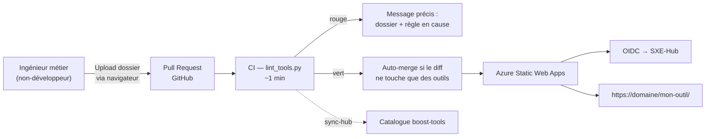

# boost-apps — la plateforme d'hébergement

*Fiche projet 4/5 — dépôt `boost-apps`. Des ingénieurs non-développeurs publient leurs propres outils, derrière le SSO, sans intervention de ma part.*
{: .meta }

## 0. Vocabulaire à connaître avant de lire

Azure Static Web Apps (SWA)
:   Service Azure d'hébergement de sites statiques, avec CDN, certificat TLS, déploiement depuis GitHub et **authentification intégrée** — y compris via un provider OIDC personnalisé. C'est cette dernière capacité qui a déterminé le choix.

`staticwebapp.config.json`
:   Fichier de configuration de SWA : routes, rôles requis, providers d'identité, redirections, en-têtes. C'est **lui** qui rend la plateforme privée : le casser la rendrait publique.

Front-only
:   Une application sans backend et sans secret : uniquement HTML, CSS et JavaScript exécutés dans le navigateur. Contrainte structurelle ici, pas une limitation temporaire.

Linter de convention
:   Ici, un script Python qui vérifie qu'un dossier déposé respecte le contrat de la plateforme (nommage, structure, taille, sécurité). Il ne vérifie **pas** la qualité du code, mais le respect du contrat de dépôt.

Liste blanche (allowlist)
:   Liste de ce qui est **autorisé**, tout le reste étant refusé. Opposé d'une blocklist, qui liste l'interdit et laisse passer tout ce qu'on n'a pas anticipé.

Auto-merge
:   Fusion automatique d'une pull request quand des conditions objectives sont réunies. Ici, uniquement si le diff ne touche **que** des dossiers d'outils.

JSON Schema
:   Standard de description et de validation de structures JSON. `tool.schema.json` décrit les métadonnées d'un outil, ce qui permet la validation en CI **et** l'autocomplétion dans l'éditeur.

Quota SWA
:   Azure Static Web Apps limite le contenu publié (500 Mo sur ce plan). Le linter vérifie des plafonds avec marge, pour que la limite se manifeste en CI plutôt qu'au déploiement.

kebab-case
:   Convention de nommage en minuscules avec tirets (`cartographie-potentiel`). Ici, le nom du dossier **devient la route URL**.

---

## 1. TL;DR

Le problème : les ingénieurs métier produisent des maquettes HTML — souvent générées avec une IA — et voudraient les mettre à disposition de leurs collègues. Sans plateforme, ces outils circulent par email ou finissent en production sauvage, sans authentification.

La réponse : un dépôt GitHub où **un dossier = un outil**, servi par Azure Static Web Apps **derrière le SSO du hub**, avec une CI qui valide automatiquement le contrat de dépôt.



!!! jury "L'objectif, en une phrase"
    « Réduire la distance entre les besoins terrain et les solutions, cette fois en donnant aux équipes les moyens de faire leurs outils elles-mêmes. » C'est l'aboutissement logique de la démarche : Boost-Report résout un besoin identifié, le hub les rassemble, boost-apps supprime l'intermédiaire.

---

## 2. Le contrat de dépôt

```
boost-apps/
├─ <mon-outil>/          → https://<domaine>/mon-outil/
│   ├─ index.html        (obligatoire — structure)
│   ├─ styles.css        (recommandé — mise en forme)
│   ├─ app.js            (recommandé — comportement)
│   ├─ tool.json         (métadonnées catalogue, optionnel)
│   └─ assets/…
├─ exemple/              ← gabarit à dupliquer
├─ index.html            ← page d'accueil (fiche « publier mon outil »)
├─ tool.schema.json      ← schéma des métadonnées
├─ staticwebapp.config.json
└─ scripts/, docs/, tests/
```

Cinq règles fondatrices :

1. **Un dossier = un outil**, le nom en kebab-case devient la route URL.
2. **Point d'entrée standardisé** : `index.html` à la racine du dossier.
3. **Structure, style et comportement séparés** — un non-développeur peut éditer chaque aspect isolément.
4. **Tout est derrière le login** : aucun outil n'est accessible sans authentification.
5. **Front-only, sans secret** : ni clé d'API, ni backend.

---

## 3. La configuration qui rend la plateforme privée

```json
{
  "trailingSlash": "auto",
  "auth": {
    "identityProviders": {
      "customOpenIdConnectProviders": {
        "sso": {
          "registration": {
            "clientIdSettingName": "OIDC_CLIENT_ID",
            "clientCredential": { "clientSecretSettingName": "OIDC_CLIENT_SECRET" },
            "openIdConnectConfiguration": {
              "wellKnownOpenIdConfiguration":
                "https://sxe-hub.azurewebsites.net/api/auth/sso/boost-apps/.well-known/openid-configuration"
            }
          },
          "login": { "nameClaimType": "name", "scopes": ["openid", "profile", "email"] }
        }
      }
    }
  },
  "routes": [{ "route": "/*", "allowedRoles": ["authenticated"] }],
  "responseOverrides": {
    "401": { "statusCode": 302, "redirect": "/.auth/login/sso?post_login_redirect_uri=.referrer" }
  }
}
```

Ce qu'il faut savoir expliquer ligne par ligne :

- `"route": "/*"` avec `allowedRoles: ["authenticated"]` — **tout** est protégé, sans exception à maintenir. C'est un refus par défaut : un outil ajouté demain est protégé sans qu'on ait rien à faire.
- Le provider OIDC **personnalisé** pointe vers un endpoint de découverte **dédié à boost-apps** sur le hub. Chaque client a le sien, ce qui permet des politiques distinctes.
- Les identifiants sont référencés par **nom de paramètre** (`clientIdSettingName`), jamais en clair — les valeurs vivent dans la configuration Azure.
- L'override 401 → 302 transforme un refus en **redirection vers le login**, avec retour à la page demandée. Sans ça, un utilisateur non connecté verrait une erreur brute.

!!! attention "Le fichier le plus critique du dépôt"
    Casser ce fichier rendrait **toute la plateforme publique**. C'est exactement pour ça que le linter en vérifie le contenu à chaque PR : présent, JSON valide, règle `/*` → `authenticated`, provider OIDC `sso` déclaré, override 401 → redirection. Une régression de sécurité par erreur de copier-coller est un scénario réaliste quand les contributeurs ne sont pas développeurs — le protéger par un contrôle automatique, pas par la vigilance, est la seule réponse tenable.

---

## 4. Le linter — la pièce maîtresse

`scripts/lint_tools.py` (~33 Ko) est ce qui rend l'autonomie possible sans supervision. Ses règles :

| Règle | Vérifie | Bloquant |
|---|---|---|
| `[route]` | Nom de dossier en kebab-case | ✅ |
| `[réservé]` | Pas de collision avec les routes réservées par SWA (`api`) | ✅ |
| `[index]` | `index.html` présent à la racine du dossier | ✅ |
| `[tool.json]` | Conforme à `tool.schema.json` s'il est présent | ✅ |
| `[liens]` | Aucun 404 interne sur les liens et ressources de l'`index.html` | ✅ |
| `[taille]` | Plafond unitaire et plafond global, **avec marge sous le quota SWA de 500 Mo** | ✅ |
| **R1** `[découpage]` | Le JS/CSS **en ligne** d'un `.html` ne dépasse pas le budget d'amorçage | ✅ |
| **R2** `[sécurité]` | Aucun fichier exécutable, binaire ou de code serveur — la plateforme reste front-only | ✅ |
| **R3** `[externe]` | Les ressources **exécutables** distantes (`<script src>`, `<link rel=stylesheet>`, `<iframe src>`) pointent vers un domaine en **liste blanche** | ✅ |
| — | `staticwebapp.config.json` conforme au contrat de sécurité | ✅ |

Et des **avertissements non bloquants**, qui orientent la revue sans casser la CI :

- un `index.html` trop long → suggestion de découpage en sous-pages ;
- un motif de code à risque (`eval(`, `document.write(`, `.innerHTML =`) → orienté revue, **non bloquant car de faux positifs sont possibles** (bibliothèques minifiées) ;
- une ressource distante **non exécutable** (image, média) ou un appel réseau JS (`fetch`, `WebSocket`) hors liste blanche → la revue tranche, d'autant qu'une URL construite dynamiquement échappe de toute façon à l'analyse statique ;
- un `pole` inconnu dans `tool.json`.

!!! jury "La distinction bloquant / avertissement, c'est le cœur du sujet"
    Est **bloquant** ce qui est objectif et dont le faux positif est improbable : un `index.html` absent, un lien mort, un exécutable déposé, un script tiers hors liste blanche. Est **avertissement** ce qui est heuristique : un `.innerHTML =` peut être parfaitement légitime, et une bibliothèque minifiée en contient toujours. Rendre bloquant un contrôle à faux positifs, sur une plateforme destinée à des non-développeurs, produirait des blocages incompréhensibles — et le résultat serait qu'on viendrait me demander de débloquer, ce qui détruit exactement l'autonomie recherchée.

Et le linter **a ses propres tests** : `pytest tests/ -q` tourne en CI **avant** le lint. Un linter faux serait pire qu'aucun linter.

---

## 5. Le pipeline

### 5.1 CI (`ci.yml`)

1. Installe les dépendances Python ;
2. **teste le linter** (`pytest tests/`) ;
3. lance le lint **sans faire échouer l'étape immédiatement** (`set +e`) — la sortie et le code de retour sont capturés ;
4. **poste le rapport en commentaire de la PR**, avec un marqueur HTML pour mettre à jour le même commentaire au lieu d'en empiler ;
5. **puis** fait échouer le job si le lint est rouge.

```yaml
- name: Lint des outils
  id: lint
  run: |
    # On ne fait pas échouer l'étape tout de suite : la sortie et le code du
    # lint sont capturés pour être postés en commentaire de la PR avant que
    # le job ne passe au rouge.
    set +e
    python scripts/lint_tools.py 2>&1 | tee lint_sortie.txt
    echo "code=${PIPESTATUS[0]}" >> "$GITHUB_OUTPUT"
```

!!! jury "Pourquoi cet ordre est une décision d'ergonomie"
    Si le job échouait immédiatement, l'étape suivante ne s'exécuterait pas et le contributeur devrait aller fouiller les logs d'exécution GitHub Actions — ce qu'un ingénieur non-développeur ne fera pas. En reportant l'échec, le message d'erreur arrive **là où il regarde** : en commentaire sur sa pull request, indiquant le dossier et la règle en cause. C'est ce détail qui fait la différence entre une plateforme utilisable en autonomie et une plateforme où l'on vient me demander de traduire.

Le job est aussi un exemple de **permissions minimales** : `contents: read` sur tout le dépôt, `pull-requests: write` uniquement pour poster le commentaire.

### 5.2 Les autres workflows

| Workflow | Rôle |
|---|---|
| `auto-merge.yml` | Approuve et fusionne automatiquement **si le diff ne touche que des dossiers d'outils** |
| `deploy.yml` / `deploy-prod.yml` | Déploiement vers Azure Static Web Apps |
| `sync-hub.yml` | Référence automatiquement les outils dans le catalogue de `boost-tools` |
| `changelog.yml` | Tenue du changelog |

### 5.3 L'auto-merge — la règle qui le rend sûr

```python
# scripts/auto_merge_eligible.py
"""Éligibilité d'une PR à l'auto-merge : le diff ne touche que des outils ?

Sort en code 0 si tout le diff tient dans des dossiers d'outils — la PR peut
alors être approuvée et fusionnée automatiquement. Sort en code 1 sinon :
toute PR touchant l'infrastructure exige une revue humaine.
"""

def est_hors_outils(path: str) -> bool:
    if "/" not in path:
        return True                      # fichier racine → infrastructure
    premier = path.split("/", 1)[0]
    return premier in EXCLUDED_DIRS or premier.startswith(".")
```

La logique est **conservatrice par construction** : tout ce qui n'est pas manifestement un dossier d'outil est considéré comme de l'infrastructure, donc exige une revue humaine. Un fichier à la racine (`staticwebapp.config.json`, `index.html`), un dossier commençant par un point (`.github/`), un dossier d'infrastructure — tous sortent de l'éligibilité.

Et la définition d'« outil » est **importée du linter** (`from lint_tools import EXCLUDED_DIRS`), pas redéfinie. Deux définitions divergentes créeraient exactement la faille : un chemin que le linter ignore mais que l'auto-merge accepte.

!!! attention "Le scénario que cette règle empêche"
    Une PR qui modifie `staticwebapp.config.json` — pour supprimer `allowedRoles: ["authenticated"]`, par exemple — ne peut **jamais** être auto-mergée. Sans cette règle, l'auto-merge deviendrait un vecteur pour ouvrir la plateforme au public sans qu'aucun humain n'ait rien vu.

---

## 6. La contrainte de fond : zéro maintenance

Ce projet est construit autour d'une contrainte explicite : **je pars en septembre 2026**, et la plateforme doit continuer de fonctionner sans moi.

Chaque choix en découle :

| Choix | Ce qu'il évite |
|---|---|
| Azure Static Web Apps | Aucun serveur à maintenir, aucun conteneur à mettre à jour, TLS et CDN gérés |
| Front-only, sans secret | Aucune rotation de clé, aucune base à sauvegarder, aucune dépendance backend |
| Convention validée par un linter | Aucune revue technique de ma part pour publier un outil |
| Auto-merge sur les outils | Aucune intervention humaine sur le chemin nominal |
| Publication par le navigateur | Aucun prérequis Git ni installation côté contributeur |
| Documentation dans le dépôt | Le mode d'emploi vit avec ce qu'il décrit |

Le parcours de publication ne demande **ni Git ni installation** : préparer le dossier en dupliquant le gabarit `exemple/`, le déposer via « Add file → Upload files » de GitHub, choisir « Create a new branch » et « Propose changes », attendre la CI (~1 min), et l'outil est en ligne environ une minute après la fusion.

!!! jury "L'argument qui porte"
    « Une plateforme qui a besoin de moi pour fonctionner n'a pas résolu le problème, elle l'a déplacé. » Tout l'effort technique — le linter de 33 Ko, ses propres tests, l'auto-merge conservateur, le rapport en commentaire de PR — sert à ce que la boucle publication → mise en ligne ne me traverse jamais.

---

## 7. Questions probables du jury

### Q1. Laisser des non-développeurs déployer du code, ce n'est pas dangereux ?

Ce serait dangereux sans garde-fous, et c'est pour ça qu'ils sont la majeure partie du travail sur ce dépôt. Le périmètre est structurellement borné : **front-only, sans secret**, donc aucun outil ne peut accéder à une base, à une clé d'API ou à un système de fichiers. Le linter bloque les fichiers exécutables et le code serveur, et les ressources exécutables distantes doivent venir d'un domaine en liste blanche — un outil ne peut pas charger un script arbitraire. Tout est derrière le SSO, donc la surface d'exposition est interne. Le pire cas réaliste est un outil qui fonctionne mal, visible seulement des collaborateurs authentifiés — pas une compromission.

### Q2. Pourquoi Azure Static Web Apps et pas un simple GitHub Pages ?

Pour l'authentification. GitHub Pages sert des fichiers statiques publiquement, sans aucun moyen d'imposer un login — et « tout est derrière le SSO » est la contrainte non négociable du projet. SWA intègre nativement un **provider OpenID Connect personnalisé** : je le pointe vers le hub, je déclare `"route": "/*"` avec `allowedRoles: ["authenticated"]`, et toute la plateforme est protégée sans une ligne de backend. Sans cette capacité, il aurait fallu un reverse proxy authentifiant devant l'hébergement statique — donc un serveur à maintenir, exactement ce que la contrainte de reprise interdit.

### Q3. Votre linter fait 33 Ko. Ce n'est pas disproportionné pour valider des dossiers ?

C'est le composant qui porte toute la valeur du projet, donc il est proportionné à ce qu'il remplace : ma revue manuelle de chaque contribution. Il ne fait pas que vérifier une structure — il parse le HTML pour détecter les liens internes morts, mesure le JS et le CSS en ligne, classe les ressources distantes en exécutables et non exécutables, valide `tool.json` contre un JSON Schema, calcule les tailles avec marge sous le quota Azure, et vérifie le contrat de sécurité de la configuration SWA. Chacune de ces règles répond à un problème réel que j'aurais dû attraper à la main. Et il a **ses propres tests** en CI, parce qu'un linter faux est pire qu'aucun linter : il donnerait une confiance injustifiée.

### Q4. L'auto-merge, comment évitez-vous qu'il fusionne quelque chose de dangereux ?

Par une règle unique et conservatrice : le diff ne doit toucher **que** des dossiers d'outils. Tout fichier à la racine, tout dossier commençant par un point, tout dossier d'infrastructure sort de l'éligibilité et exige une revue humaine. Le scénario que ça empêche est précis : une PR modifiant `staticwebapp.config.json` pour retirer l'exigence d'authentification rendrait toute la plateforme publique — elle ne peut jamais être auto-mergée. Le détail qui compte est que la définition d'« outil » est **importée du linter** plutôt que redéfinie : deux définitions qui divergeraient créeraient exactement la faille, un chemin ignoré par l'un et accepté par l'autre.

### Q5. Comment un outil se retrouve-t-il dans le catalogue du hub ?

Par le workflow `sync-hub.yml`, qui référence automatiquement les outils dans le catalogue de `boost-tools`. Les métadonnées viennent du `tool.json` optionnel — et s'il est absent, elles sont dérivées du `<title>` et de la `<meta name="description">` de l'`index.html`, ce qui permet de publier sans rien apprendre de plus. Les champs de `tool.json` sont volontairement **alignés sur le modèle `Application` de boost-tools**, ce qui rend le référencement direct. Deux plateformes, deux rôles complémentaires : `boost-apps` héberge, `boost-tools` catalogue.

### Q6. Que se passe-t-il si un outil déposé est de mauvaise qualité ?

Le linter valide le **contrat de dépôt**, pas la qualité du code — et c'est délibéré. Juger la qualité d'un outil métier demanderait une expertise que le linter n'a pas, et surtout ce n'est pas le bon niveau de contrôle : un outil mal fait mais utile à son auteur a plus de valeur qu'un outil parfait qui n'existe pas. Ce que le linter garantit, c'est que l'outil ne peut pas **nuire** : pas de code serveur, pas de script tiers non maîtrisé, pas de dépassement de quota, pas de brèche dans l'authentification. La qualité fonctionnelle relève de l'usage et de la fusion, où un responsable approuve — étape qui est d'ailleurs prévue pour devenir automatique.

### Q7. Vous parlez de « maquettes HTML produites avec une IA ». C'est du code que personne ne comprend ?

C'est le contexte réel et je préfère le nommer : le métier pousse des maquettes générées par IA, parfois directement en production sauvage avant que cette plateforme existe. Mon rôle n'a pas été de l'interdire — ça n'aurait pas marché et ça n'aurait pas eu d'intérêt — mais de **canaliser**. La plateforme donne un cadre où ce code ne peut faire aucun dégât : front-only, sans secret, derrière le SSO, validé par une CI. Le dépôt embarque même des skills Claude Code qui automatisent la mise en conformité et la publication en s'appuyant sur le **vrai linter** du dépôt. C'est un choix pragmatique : le besoin existait déjà et s'exprimait de façon risquée, autant lui donner un chemin sûr.

### Q8. Cette plateforme, c'est du DevOps ou du développement ?

Les deux, et c'est précisément ce que je trouve intéressant. Il n'y a presque pas de code applicatif — l'essentiel est de la **plateforme** : un contrat de dépôt, un linter qui le fait respecter, un pipeline qui l'applique, une configuration d'hébergement qui garantit la sécurité, une documentation qui rend le tout utilisable par des non-développeurs. C'est de l'ingénierie de plateforme au sens propre : construire l'outillage qui permet à d'autres de livrer en autonomie. Et c'est probablement le projet où la contrainte « zéro maintenance après mon départ » a le plus dicté les choix techniques — chaque décision se justifie par ce qu'elle évite d'avoir à maintenir.
