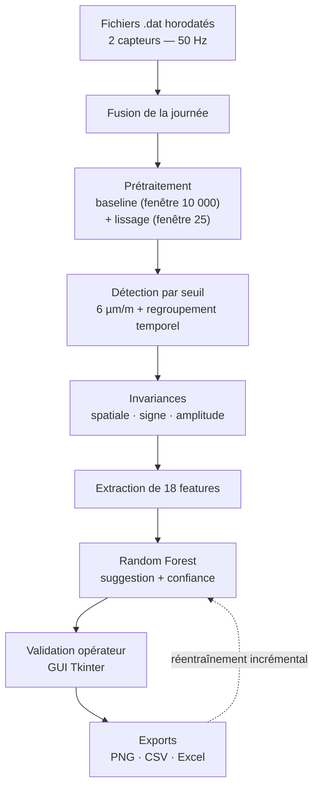

# Pont Gaubourd — traitement du signal et Random Forest

*Fiche projet 5/5 — dépôt `shm-bridge-traffic-ml`. Détection de passages de poids lourds sur un pont instrumenté, du signal brut au modèle de classification.*
{: .meta }

## 0. Vocabulaire à connaître avant de lire

SHM (Structural Health Monitoring)
:   Surveillance de l'état de santé d'un ouvrage par instrumentation permanente. Métier historique de Sixense.

Extensomètre / jauge de déformation
:   Capteur mesurant la **déformation** d'une structure, exprimée en µm/m (micromètre par mètre) — un allongement relatif. Ce n'est pas une mesure de poids, mais de réponse mécanique.

Échantillonnage / fréquence (Hz)
:   Nombre de mesures par seconde. **50 Hz** ici : cinquante points par seconde et par capteur. Sur une journée, cela représente des millions de points, dont l'immense majorité ne correspond à aucun passage.

Ligne de base (baseline) / dérive
:   Composante lente du signal, qui s'éloigne du zéro au fil du temps (température, fluage, dérive du capteur). Il faut la retirer pour que les événements soient comparables entre eux.

Fenêtre glissante
:   Traitement appliqué sur une fenêtre de N points qui se déplace le long du signal. Une **grande** fenêtre (10 000 points ici) estime la tendance lente ; une **petite** (25 points) lisse le bruit.

Lissage / moyenne mobile
:   Remplacement de chaque point par la moyenne de ses voisins, pour atténuer le bruit haute fréquence. Le compromis : trop de lissage écrase aussi les vrais événements.

SNR (Signal-to-Noise Ratio)
:   Rapport signal sur bruit. Mesure à quel point l'événement se détache du fond. C'est la **feature la plus importante** du modèle.

Feature
:   Valeur numérique décrivant un événement, donnée en entrée au modèle. Un modèle n'apprend jamais sur un signal brut : il apprend sur des caractéristiques.

Feature engineering
:   Le travail de conception de ces caractéristiques. Sur un jeu de données modeste, sa qualité compte **autant que le choix du modèle**.

Invariance
:   Propriété d'un traitement qui rend le modèle insensible à ce qui ne devrait pas influencer sa décision (la voie empruntée, le sens de la déformation, le tonnage).

Random Forest
:   Ensemble d'arbres de décision entraînés chacun sur un sous-échantillon aléatoire des données et des features, dont on **agrège les votes**. Le vote de nombreux arbres réduit fortement la variance et donc le surapprentissage.

Surapprentissage (overfitting)
:   Le modèle apprend le bruit et les particularités de son jeu d'entraînement au lieu de la règle générale. Symptôme : excellent sur l'entraînement, mauvais sur des données nouvelles.

Validation croisée (k-fold)
:   Découpage du jeu en k parts ; on entraîne k fois sur k-1 parts et on teste sur la restante. La moyenne des k scores ne dépend pas d'un tirage favorable. **Stratifiée** : chaque part conserve la proportion des classes.

Précision / rappel / F1
:   **Précision** = parmi les événements que le modèle valide, quelle proportion est réellement valide (contre les faux positifs). **Rappel** = parmi les vrais passages, quelle proportion le modèle retrouve (contre les faux négatifs). **F1** = moyenne harmonique des deux.

Matrice de confusion
:   Tableau croisant classe réelle et classe prédite : vrais positifs, faux positifs, vrais négatifs, faux négatifs. Elle montre **où** sont les erreurs, pas seulement combien.

Déséquilibre de classes / `class_weight`
:   Quand une classe est bien plus fréquente que l'autre, un modèle non corrigé apprend à toujours prédire la majoritaire. `class_weight="balanced"` pondère l'erreur en faveur de la minoritaire.

---

## 1. TL;DR

Un outil Python **autonome, en local**, sans interface web ni cloud. La chaîne complète va du fichier brut de capteur au rapport client.



| Élément | Valeur |
|---|---|
| Capteurs | 2 extensomètres dynamiques (Nord / Sud), **50 Hz** |
| Stack | Python 3.10+ · pandas · NumPy · SciPy · Matplotlib · scikit-learn · Tkinter |
| Seuil de détection | **6 µm/m** sur le signal lissé |
| Features | **18** — 8 scalaires + 10 de forme |
| Modèle | **Random Forest** — 300 arbres, profondeur max 10, `class_weight="balanced"` |
| Jeu d'entraînement | **~1 150 événements** labellisés à la main sur 30 jours |
| Résultats (5-fold) | Exactitude **0,814 ± 0,032** · Précision **0,677** · Rappel **0,706** · F1 **0,690** |

!!! jury "La phrase qui cadre le projet"
    « Le modèle ne décide pas seul. Il propose, l'opérateur tranche. » Ce n'est pas une limitation temporaire mais une décision de conception : sur des données de terrain où une part des événements reste ambiguë, tout valider automatiquement laisserait passer des erreurs sans contrôle.

---

## 2. La démarche : quatre étapes, chacune ouvrant la suivante

Contrairement à Boost-Report, ce projet n'a **pas suivi de cycle de sprints**. C'est de la R&D, menée au rythme des besoins et des disponibilités des ingénieurs pour valider les directions.

| Étape | Ce qui a été fait | Ce que ça a débloqué |
|---|---|---|
| **1. Appropriation** | Comprendre la physique de la déformation d'un pont sous charge, l'allure du signal, la signature d'un passage au milieu du bruit | Sans ça, impossible de concevoir des features pertinentes. Cette phase a beaucoup reposé sur les échanges avec le **référent métier**, qui apportait la lecture physique |
| **2. Script d'automatisation** | Concaténer les fichiers d'une journée, nettoyer le signal, détecter par seuil, sortir des résultats exploitables | **Pas encore d'IA** — juste un traitement qui fait gagner du temps sur une tâche manuelle. L'outil est déjà utile |
| **3. Interface de validation** | L'opérateur passe en revue chaque événement détecté et le valide ou le rejette | Double bénéfice : l'outil devient directement utilisable **et** il constitue le jeu de données labellisé, indispensable pour la suite |
| **4. Modèle + réentraînement** | Random Forest sur ~1 150 événements triés à la main, puis chaque validation devient un nouvel exemple | Le modèle propose une pré-validation et **continue de progresser** après son entraînement initial |

!!! jury "L'enchaînement le plus intelligent du projet"
    L'étape 3 est ce qui rend l'étape 4 possible. Construire l'interface de validation **avant** d'avoir un modèle a produit le jeu de données labellisé — et le labelling est le goulot d'étranglement de tout projet supervisé. Ce n'est pas un détour, c'est le chemin le plus court : livrer un outil utile qui génère au passage la donnée dont on aura besoin.

---

## 3. Le traitement du signal

### 3.1 Le problème

Deux capteurs à 50 Hz sur une journée : plusieurs millions de points, dont l'immense majorité ne correspond à **aucun** passage. Tout l'enjeu est d'isoler les quelques instants qui comptent.

Et ce sont des **données de terrain** : du bruit de mesure et une fiabilité variable des capteurs. Composer avec cette réalité a représenté une part importante du travail.

### 3.2 Le prétraitement — deux corrections successives

```python
# config.py
FENETRE_BASELINE = 10000   # fenêtre glissante pour la baseline [samples]
FENETRE_LISSAGE  = 25      # fenêtre de lissage [samples]
SEUIL_DETECTION  = 6.0     # seuil de détection [µm/m]
```

1. **Retrait de la ligne de base** — une baseline estimée sur une **large** fenêtre glissante (10 000 points ≈ 200 secondes) est soustraite. Elle capture la dérive lente (température, fluage) sans absorber les événements, qui durent quelques secondes.
2. **Lissage** — une moyenne glissante sur une **petite** fenêtre (25 points = 0,5 s) atténue le bruit haute fréquence, pour éviter que des micro-variations soient prises pour des événements.

!!! jury "Pourquoi ces deux tailles de fenêtre ?"
    C'est le point technique le plus fin du prétraitement, et il repose sur une **séparation d'échelles de temps**. La dérive est lente (minutes), l'événement est court (secondes), le bruit est rapide (fractions de seconde). Une fenêtre de baseline **trop courte** absorberait les événements eux-mêmes — on les soustrairait du signal. Une fenêtre de lissage **trop longue** écraserait la forme du pic, qui est justement ce que le modèle apprend. Les valeurs sont dans `config.py` et ajustables, mais leur ordre de grandeur découle directement de la physique du phénomène.

### 3.3 La détection

Quand l'amplitude du signal lissé dépasse **6 µm/m** sur l'un des deux capteurs, on est en présence d'un événement. Comme un même passage génère une **série** de points au-dessus du seuil, les points proches dans le temps sont **regroupés** pour ne compter qu'un seul événement.

Le seuil est **volontairement élevé** : il ne cherche pas à tout attraper, mais à ne retenir que les déformations importantes.

### 3.4 Les premières informations extraites

- **Vitesse du véhicule** — estimée à partir de la durée de la déformation et de la **longueur d'influence** de l'ouvrage (`LONGUEUR_INFLUENCE = 18.72 m`).
- **Sens de circulation** — déduit du rapport des amplitudes entre les deux capteurs.
- **Amplitudes, extrema, forme du signal.**

Chaque événement est ensuite **tracé** : les deux courbes de capteurs superposées, avec le pic et les extrema repérés. C'est ce graphique que l'opérateur regarde pour trancher.

### 3.5 La validation physique

Un **essai contrôlé**, réalisé lors d'une fermeture ponctuelle du pont, a permis de vérifier le lien entre passage réel et signature dans le signal. La déformation mesurée correspondait à ce qu'on attendait.

!!! jury "L'argument le plus solide du projet"
    C'est une validation **par la physique**, pas seulement par la statistique. Un modèle peut afficher de bons scores en apprenant un artefact du jeu de données. L'essai contrôlé établit que la chaîne de détection mesure bien le phénomène qu'elle prétend mesurer. C'est la question qu'un jury technique posera : « comment savez-vous que vous détectez des camions et pas du bruit corrélé ? »

---

## 4. Les 18 features

### 4.1 La composition

| Famille | Features | Ce qu'elles décrivent |
|---|---|---|
| **Scalaires** (8) | `Vitesse_kmh`, `Max_P`, `Max_Sec`, `Min_P`, `Min_Sec`, `Ratio_P`, `Ratio_Sec`, `Ratio_PrimSec` | Intensité et rapports entre capteurs |
| **Forme** (10) | `n_samples`, `symetrie_P/Sec`, `snr_P/Sec`, `n_pics_P`, `pente_montee_P/Sec`, `pente_descente_P/Sec` | Allure de la signature : symétrie autour du pic, rapport signal/bruit, pics secondaires, pentes |

L'idée : **traduire en chiffres l'allure générale de la déformation**.

### 4.2 Le résultat le plus intéressant

Les features qui pèsent le plus dans les décisions du modèle ne sont **pas les amplitudes brutes**, mais le **rapport signal sur bruit du capteur principal** et la **forme de la descente du signal**.

Autrement dit : ce qui distingue un vrai passage, c'est moins son **intensité** que la **netteté et l'allure de sa signature**.

!!! jury "Pourquoi c'est cohérent avec la physique"
    Un poids lourd laisse une empreinte franche et régulière — il charge et décharge l'ouvrage de façon continue. Un artefact (choc, perturbation électrique, dérive de capteur) a une allure plus confuse. Le fait que le modèle ait convergé **tout seul** vers les descripteurs de forme, alors qu'on pourrait naïvement penser que le tonnage — donc l'amplitude — est le critère, est un bon signe : il a appris le phénomène et pas une corrélation fortuite.

---

## 5. Les trois invariances

C'est le point sur lequel j'ai le plus travaillé : **rendre le modèle indépendant de tout ce qui ne devrait pas influencer sa décision**. Un passage reste un passage, quelle que soit la voie, le sens ou le tonnage.

| # | Invariance | Transformation | Ce qu'elle neutralise |
|---|---|---|---|
| 1 | **Spatiale** | Le capteur ayant enregistré le pic le plus fort devient « **principal** », l'autre « **secondaire** » | La voie de circulation. Le modèle voit toujours un principal et un secondaire, peu importe le côté d'où vient le véhicule |
| 2 | **De signe** | Si le pic absolu est négatif, le signal est multiplié par −1 | Le sens de la déformation (compression ou traction) |
| 3 | **D'amplitude** | Le signal est divisé par la valeur de son pic → maximum ramené à +1,0 | Le **tonnage**. Le modèle apprend la forme, pas l'intensité absolue |

Le code, court et lisible :

```python
# src/utils.py
def normaliser_signal(s: np.ndarray) -> np.ndarray:
    """Normalisation invariante au signe et à l'amplitude.

    1. Invariance de signe - si le pic absolu est négatif, le signal est
       multiplié par -1 pour que le pic principal pointe toujours vers le
       haut (compression ou traction indifféremment).
    2. Normalisation d'amplitude - la courbe est divisée par la valeur du
       pic, de sorte que le maximum vaut toujours +1.0 quel que soit le
       tonnage du véhicule.
    """
    s = s.copy().astype(float)
    idx_pic = int(np.argmax(np.abs(s)))
    if s[idx_pic] < 0:
        s = -s
    peak = s[idx_pic]
    if abs(peak) > 0:
        s = s / peak
    return s
```

Deux détails de robustesse à savoir défendre : `np.argmax(np.abs(s))` cherche le pic **en valeur absolue** (le pic peut être négatif), et le garde `if abs(peak) > 0` évite une division par zéro sur un signal nul — le tableau est alors rendu inchangé.

!!! jury "Pourquoi les invariances comptent autant sur un petit jeu de données"
    Avec ~1 150 exemples seulement, chaque dimension de variation que le modèle doit apprendre coûte des exemples. Sans invariance d'amplitude, il faudrait des exemples de camions de tous les tonnages ; sans invariance spatiale, des exemples dans les deux sens. Les invariances **suppriment ces dimensions avant l'apprentissage** : le modèle concentre ses ~1 150 exemples sur ce qui compte vraiment, la forme. C'est du feature engineering au sens noble — utiliser la connaissance du domaine pour réduire ce que le modèle doit découvrir seul.

---

## 6. Le modèle

### 6.1 Pourquoi un Random Forest

| Critère | Random Forest | Alternative |
|---|---|---|
| Données **tabulaires** | Excellent — c'est son terrain | Un réseau de neurones n'apporte rien ici |
| Volume d'exemples modeste | Fonctionne bien sur ~1 150 | Le deep learning en demanderait bien plus |
| Surapprentissage | Peu sensible grâce au **vote de nombreux arbres** | Un arbre seul surapprend massivement |
| **Interprétabilité** | Fournit le classement d'importance des features | Un réseau est une boîte noire |
| Coût de calcul | Faible, tourne en local | GPU souhaitable |

Pour un projet exploratoire avec un jeu de données de taille modeste, c'était le bon compromis entre performance et simplicité.

### 6.2 Les hyperparamètres

```python
# config.py
RF_PARAMS = dict(
    n_estimators=300,           # nombre d'arbres — le vote réduit la variance
    max_depth=10,               # profondeur max — limite le surapprentissage
    min_samples_leaf=8,         # min d'exemples par feuille — idem
    max_features="sqrt",        # décorrèle les arbres entre eux
    class_weight="balanced",    # ← LE réglage important
    random_state=42,            # reproductibilité
    n_jobs=-1,                  # parallélisation
)
OPTIMISER_HYPERPARAMS = False   # True = GridSearchCV (~5 min)
```

### 6.3 `class_weight="balanced"` — le réglage à savoir défendre

Les événements **rejetés sont environ deux fois plus nombreux** que les validés.

Sans correction, le modèle aurait tendance à **tout rejeter** : il obtiendrait environ 67 % d'exactitude en ne prédisant jamais « valide », ce qui donnerait un bon score en apparence et le rendrait **totalement inutile**.

`class_weight="balanced"` donne plus de poids à la classe minoritaire pendant l'entraînement, pour qu'il apprenne réellement à reconnaître un passage plutôt qu'à jouer la sécurité.

!!! piege "Le piège de l'exactitude sur données déséquilibrées"
    C'est **la** question de jury sur le déséquilibre de classes. Un modèle qui prédit toujours la classe majoritaire affiche une exactitude élevée et n'a rien appris. C'est pour ça qu'on regarde **précision, rappel et F1** — et la matrice de confusion, qui montre où sont les erreurs. Sur ce projet, mon exactitude de 0,814 doit se lire avec la précision de 0,677 et le rappel de 0,706 : ce sont ces deux chiffres qui disent que le modèle traite réellement la classe minoritaire.

---

## 7. Les résultats et leur lecture honnête

### 7.1 Validation croisée stratifiée 5-fold

| Métrique | Score |
|---|---|
| Exactitude | **0,814 ± 0,032** |
| Précision | 0,677 ± 0,055 |
| Rappel | 0,706 ± 0,069 |
| F1-score | 0,690 ± 0,057 |

Pourquoi la validation croisée plutôt qu'un simple découpage train/test : elle entraîne et teste sur **plusieurs découpages différents**, ce qui donne une mesure qui ne dépend pas d'un tirage favorable. L'écart-type (± 0,032) est aussi une information : il dit que le résultat est **stable** d'un découpage à l'autre.

### 7.2 La précision honnête sur la matrice de confusion

La matrice de confusion présentée dans le dossier est calculée **sur l'ensemble d'entraînement**, après réentraînement final du modèle sur tout le jeu. Le modèle a déjà vu ces données, donc **ses chiffres sont plus élevés** que ceux de la validation croisée. Elle sert à **visualiser la répartition des erreurs**, pas à mesurer la performance.

!!! jury "Le point d'honnêteté méthodologique à mettre en avant"
    Présenter une matrice de confusion sur l'ensemble d'entraînement **sans le dire** serait une faute méthodologique — ce sont des chiffres flattés. Le dire explicitement, et donner les scores de validation croisée comme mesure de référence, montre qu'on comprend la différence. C'est le genre de nuance qu'un jury technique cherche.

### 7.3 Pourquoi ces scores ne sont pas ceux d'un modèle parfait

Trois raisons, à donner ensemble :

- Les données sont **réelles**, avec du bruit de capteur et une fiabilité variable.
- Une partie des événements est **ambiguë par nature**.
- Le référent métier a **confirmé qu'un opérateur hésiterait de la même façon** sur ces cas limites.

Le dernier point est le plus important : **la limite n'est pas celle du modèle, elle est dans la donnée**. Un modèle à 0,95 sur ces données serait suspect — il aurait probablement appris un artefact.

L'essentiel des erreurs se concentre sur ces cas ambigus : quelques faux positifs (des événements rejetés que le modèle propose de valider) et quelques faux négatifs.

---

## 8. L'outil en pratique

### 8.1 Le déroulement d'une journée

1. **Fenêtre de lancement** : l'opérateur saisit la date à traiter et choisit le mode.
2. Le script enchaîne fusion des fichiers → prétraitement → détection → extraction des features.
3. Chaque événement est affiché sous forme de graphique — les deux courbes et les points caractéristiques — avec la **suggestion du modèle** : un bandeau « VALIDE » ou « REJET » avec le **pourcentage de confiance**, vert pour un passage, rouge pour un rejet.
4. L'opérateur valide ou rejette (raccourcis clavier `O` / `N`).

### 8.2 Le mode automatique

Au-dessus d'un **seuil de confiance paramétrable, fixé par défaut à 80 %** (`SEUIL_AUTO = 0.80`), le modèle valide ou rejette les événements les plus sûrs et ne soumet à l'opérateur que les cas incertains.

**Ce mode n'est pas utilisé en production.** Il sert de test : une façon de mesurer si le modèle devient assez fiable pour prendre en charge une partie des décisions sans supervision. Tant que ce n'est pas le cas, l'opérateur garde la main sur l'ensemble.

### 8.3 Les livrables

| Sortie | Contenu | Usage |
|---|---|---|
| **Excel** | Récapitulatif de tous les événements de la journée avec leurs caractéristiques | Rapport client |
| **PNG** | Graphiques classés en deux dossiers, `VALIDES` et `REJETES` | Retrouver chaque passage |
| **CSV** | Données brutes de chaque événement | **Alimente les réentraînements** |

Ces sorties ont servi à produire le **rapport remis au client**, ce qui était l'un des deux objectifs du projet.

### 8.4 Le réentraînement incrémental

Chaque journée traitée enrichit le jeu de données des décisions de l'opérateur, et le modèle est réentraîné. Il s'affine au fil de l'usage, et sa performance progresse à mesure que le volume d'exemples validés augmente.

!!! attention "La limite de la boucle de rétroaction"
    C'est le risque à savoir nommer : si le modèle influence l'opérateur — qui suit la suggestion sans la remettre en question — le réentraînement **renforce les erreurs du modèle** au lieu de les corriger. C'est un biais d'automatisation classique. La protection actuelle est que l'opérateur garde la main sur **tous** les événements, y compris ceux où le modèle est confiant, ce qui laisse la possibilité du désaccord. Basculer en mode automatique retirerait cette protection sur les cas à haute confiance — une raison de plus de ne pas l'activer tant que la fiabilité n'est pas établie.

---

## 9. Perspectives

Évolutions identifiées, avec leur justification :

| Piste | Apport attendu | Réserve |
|---|---|---|
| **CNN 1D** | Apprendre directement sur la courbe brute, sans feature engineering manuel | Plus lourd, plus gourmand en données et en calcul. **Le gain réel reste à démontrer** face à un Random Forest déjà satisfaisant |
| **LSTM / CNN temporel** | Modéliser la dynamique temporelle, mieux discriminer les véhicules multi-essieux | Même réserve |
| **Clustering non supervisé** (DBSCAN, k-means) | Grouper les signatures par type de véhicule **sans labels** | Exploratoire |
| **Transfer learning multi-ponts** | Pré-entraîner sur Gaubourd, affiner sur un nouvel ouvrage avec peu de labels | C'est **la** piste alignée sur l'objectif d'industrialisation |
| **Traitement en flux temps réel** | Alertes au-dessus d'un seuil de charge | Change la nature de l'outil |
| **Intégration WIM** (pesage en marche) | Estimer les charges à l'essieu, produire des rapports de conformité réglementaire | Nécessite un autre équipement |

!!! jury "La réponse à donner sur le deep learning"
    « Pour un outil qui doit rester simple à faire tourner et à reprendre, cet ajout de complexité n'est peut-être pas justifié. » C'est la bonne posture : identifier la piste, comprendre ce qu'elle apporterait, et savoir dire qu'on ne l'a pas prise parce que le gain n'est pas démontré face à son coût. Choisir la complexité minimale qui résout le problème est une décision d'ingénieur, pas un manque d'ambition.

---

## 10. Questions probables du jury

### Q1. Pourquoi un Random Forest plutôt qu'un réseau de neurones ?

Quatre raisons qui allaient toutes dans le même sens. Il fonctionne bien sur des données **tabulaires**, ce que sont mes 18 features. Il ne demande pas un volume d'exemples énorme, alors que je n'en ai que ~1 150. Il est peu sensible au surapprentissage grâce au vote de nombreux arbres. Et surtout il est **interprétable** : c'est lui qui m'a donné le classement d'importance des features, et donc l'information la plus intéressante du projet — que la forme prime sur l'amplitude. Un réseau aurait été une boîte noire sur un projet où je devais expliquer les résultats à un référent métier qui les valide. Sur un jeu de cette taille, il aurait de toute façon surappris.

### Q2. 81 % d'exactitude, ce n'est pas très bon ?

Il faut lire ce chiffre avec le contexte. Les données sont réelles, avec du bruit de capteur et une fiabilité variable, et une partie des événements est **ambiguë par nature**. Le point décisif est que le référent métier a confirmé qu'**un opérateur humain hésiterait de la même façon** sur ces cas limites — la limite n'est pas celle du modèle, elle est dans la donnée. Un modèle à 95 % sur ce jeu me rendrait méfiant : il aurait probablement appris un artefact. Et surtout, ces scores viennent d'une **validation croisée 5-fold** avec un écart-type faible (± 0,032), pas d'un découpage favorable. L'objectif était d'assister l'opérateur, pas de le remplacer, et pour ça 81 % fait gagner un temps réel.

### Q3. Expliquez `class_weight="balanced"`.

Mes classes sont déséquilibrées : les événements rejetés sont environ deux fois plus nombreux que les validés. Sans correction, le modèle aurait un moyen très simple d'obtenir un bon score — tout rejeter. Il afficherait environ 67 % d'exactitude en n'ayant strictement rien appris, et serait inutile puisqu'il ne détecterait aucun passage. `class_weight="balanced"` pondère l'erreur inversement à la fréquence de chaque classe pendant l'entraînement, ce qui rend une erreur sur un « valide » plus coûteuse. C'est aussi pour ça que je regarde la précision, le rappel et le F1 plutôt que la seule exactitude : sur des classes déséquilibrées, l'exactitude est une métrique trompeuse.

### Q4. Comment savez-vous que vous détectez des camions et pas du bruit ?

Trois éléments qui se renforcent. D'abord un **essai contrôlé** lors d'une fermeture ponctuelle du pont : la déformation mesurée correspondait à ce qu'on attendait pour un passage réel, ce qui valide la chaîne de détection par la physique et pas seulement par la statistique. Ensuite, les labels viennent d'un **ingénieur calcul** qui sait lire une signature de déformation — la qualité d'un modèle supervisé dépend directement de la qualité de ses labels. Enfin, le classement d'importance des features est cohérent avec la physique : le modèle s'appuie sur le rapport signal/bruit et la forme de la descente, ce qu'on attend d'un chargement mécanique franc, et pas sur des grandeurs sans lien avec le phénomène.

### Q5. À quoi servent vos trois invariances ?

À rendre le modèle indépendant de ce qui ne devrait pas influencer sa décision. L'invariance **spatiale** remappe les capteurs Nord/Sud en principal/secondaire selon lequel a le pic le plus fort, ce qui rend le modèle aveugle à la voie de circulation. L'invariance de **signe** retourne le signal si le pic est négatif, ce qui le rend indifférent au sens de la déformation. La **normalisation d'amplitude** divise par la valeur du pic, ce qui l'empêche d'apprendre sur le tonnage. L'enjeu est directement lié à la taille du jeu : chaque dimension de variation que le modèle doit apprendre coûte des exemples, et je n'en ai que ~1 150. Les invariances suppriment ces dimensions avant l'apprentissage, pour que tous les exemples servent à apprendre ce qui compte — la forme de la signature.

### Q6. Pourquoi ne pas automatiser complètement la validation ?

Le mode automatique **existe** — au-dessus d'un seuil de confiance paramétrable, fixé par défaut à 80 % — mais il n'est pas utilisé en production. Il sert de test, pour mesurer si le modèle devient assez fiable pour prendre en charge une partie des décisions. Sur des données de terrain où une part des événements reste ambiguë, tout valider automatiquement laisserait passer des erreurs sans contrôle, et ces erreurs alimenteraient ensuite le réentraînement. C'est le risque de la boucle de rétroaction : si le modèle décide seul et se réentraîne sur ses propres décisions, il renforce ses erreurs. Tant que l'opérateur voit tous les événements, y compris ceux à haute confiance, le désaccord reste possible.

### Q7. Ce projet est très différent de Boost-Report. Qu'en avez-vous retiré ?

Une autre façon de concevoir une application : autour de la **donnée et de l'aide à la décision**, pas autour d'un parcours utilisateur. Il n'y a ni interface web ni déploiement cloud — un outil Python autonome en local. Ce que ça m'a appris, c'est qu'un modèle ne vaut que par la donnée qui l'alimente : la phase d'appropriation avec le référent métier, avant d'écrire une ligne de code, a été déterminante pour concevoir des features pertinentes. Et que construire l'outil de labellisation **avant** le modèle n'était pas un détour mais le chemin le plus court, puisqu'il a rendu l'outil immédiatement utile tout en produisant le jeu de données.

### Q8. Comment industrialiseriez-vous cette approche sur d'autres ouvrages ?

C'était le second objectif du projet — servir de terrain d'essai à une approche transposable. Le monitoring d'ouvrages est un métier de Sixense et beaucoup de missions reposent sur le même principe : des capteurs qui enregistrent en continu, des données à analyser manuellement. La structure est déjà prête pour ça : tous les paramètres physiques et de modèle sont **centralisés dans `config.py`** — seuil, longueur d'influence, fenêtres, hyperparamètres — donc adapter à un autre ouvrage relève de la configuration, pas de la réécriture. Ce qui ne se transpose pas directement, c'est le modèle lui-même : chaque ouvrage a sa propre réponse mécanique. La piste que j'identifie est le **transfer learning** — pré-entraîner sur Gaubourd et affiner sur un nouvel ouvrage avec peu d'exemples labellisés, plutôt que de repartir de zéro à chaque mission.
